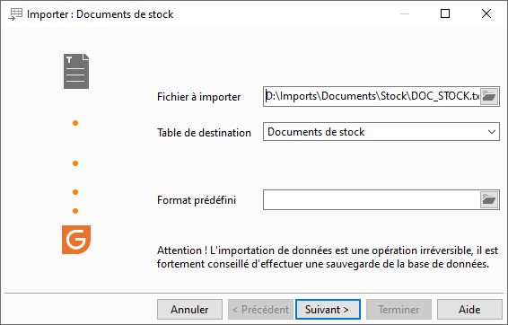
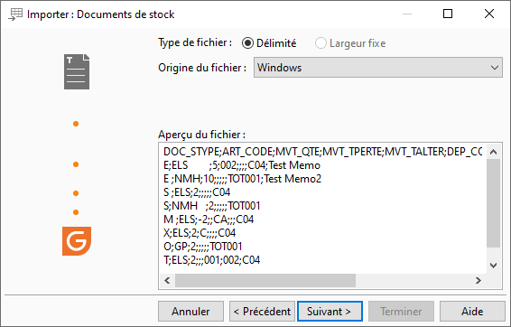
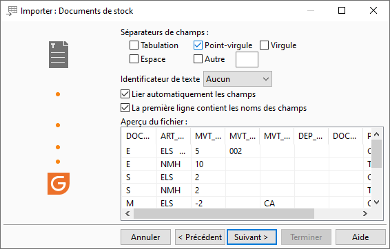
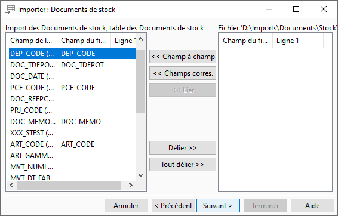
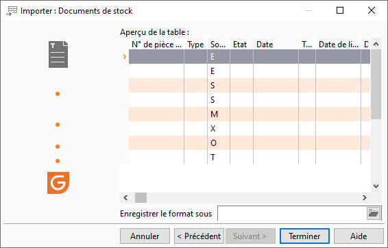

# Exemple d'import de documents de stock
## Fichier à importer

## Type de fichier

## Séparateur de champs

## Correspondance

## Aperçu avant import

## Rapport de fin

Nombre de lignes importées : 1

Nombre de lignes non importées : 6

Le code tiers TOT001 n'existe pas

La pièce ENT19-00008 a été créée

Stock de l'article NMH insuffisant. Stock actuel 
 : 0. Quantité à sortir : 10.

Le document de stock n'a pas été créé.

Le code tiers TOT001 n'existe pas

Stock de l'article NMH insuffisant. Stock actuel 
 : 0. Quantité à sortir : 10.

Le document de stock n'a pas été créé.

Stock de l'article NMH insuffisant. Stock actuel 
 : 0. Quantité à sortir : 10.

Le document de stock n'a pas été créé.

Stock de l'article NMH insuffisant. Stock actuel 
 : 0. Quantité à sortir : 10.

Le document de stock n'a pas été créé.

Le code tiers TOT001 n'existe pas

Stock de l'article NMH insuffisant. Stock actuel 
 : 0. Quantité à sortir : 10.

Le document de stock n'a pas été créé.

Stock de l'article NMH insuffisant. Stock actuel 
 : 0. Quantité à sortir : 10.

Le document de stock n'a pas été créé.

Stock de l'article NMH insuffisant. Stock actuel 
 : 0. Quantité à sortir : 10.

Le document de stock n'a pas été créé.

