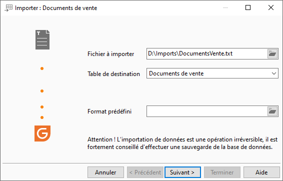
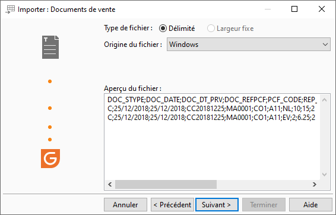
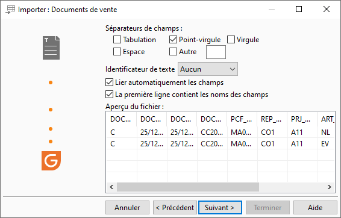
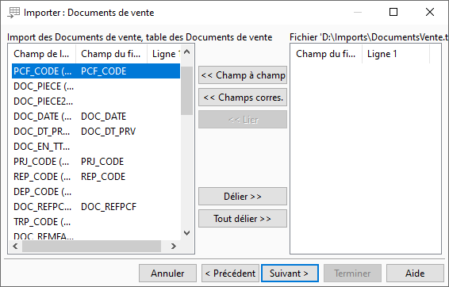
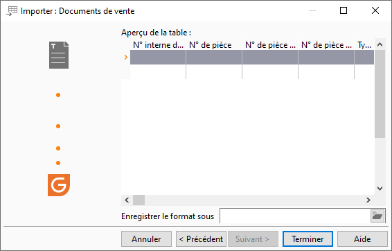

# Exemple d'import de documents de vente
## Fichier à importer

## Type de fichier

## Séparateur de champs

## Correspondance

## Aperçu avant import

## Rapport de fin

L'import a été effectué avec succès.

 

Nombre de lignes importées : 2

Nombre de lignes non importées : 0

 

Ligne 3 : Le prix de vente de l'article est inférieur 
 au prix de revient.

 

La pièce ARC17-00049 a été créée

