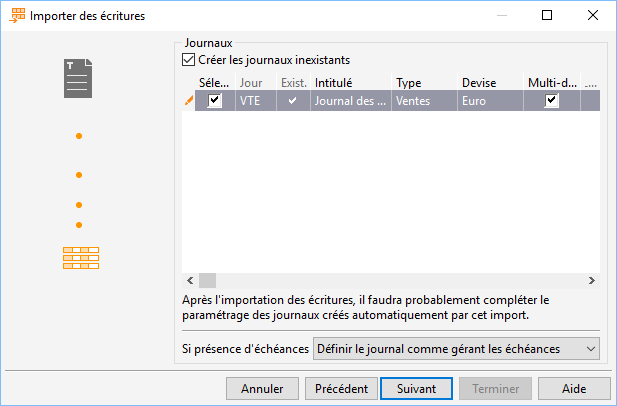

# Exemple d'import d'écritures
## Format et fichier à importer

## Longueur des champs

L'écran ci-dessous n'apparaît que pour les formats suivants :

* Gestimum Gestion Comptable à largeur fixe

* Gestimum Gestion Comptable 1.5 à largeur 
 fixe

 

Il permet de paramétrer la longueur de chaque champ fixe :

 

## Journaux

Cette fenêtre fait un récapitulatif des différents journaux présents 
 dans le fichier.

 

Si une des écritures est dans un journal qui n'existe pas, vous avez 
 la possibilité de le créer lors de l'import.

 

## Comptes

Ensuite, Gestimum Gestion Comptable 
 vous propose différentes options pour cadrer les comptes en fonction de 
 la longueur définit dans les préférences de société. 

 

Vous avez aussi la possibilité de créer les comptes inexistant lors 
 de l'import, attention si cet option est décoché alors l'écriture sera 
 rejetée sauf si l'option "Remplacer les comptes provoquant le rejet 
 ..." est cochée.

 

## Sections analytiques

Dans cette fenêtre, vous avez la possibilité de visualiser toutes les 
 sections analytiques du fichier qui n'existent pas.

 

Vous avez le choix de le créer lors de l'importation. Dans le cas contraire, 
 la ventilation analytique des écritures sera ignorée.

 

## Options supplémentaires

Sur la dernière fenêtre de l'assistant d'import, vous avez la possibilité 
 :

* d'intervenir sur la devise des écritures
* de créer les écritures en simulation
* de créer les libellés automatiquement dans l'onglet Comptabilité 
 des préférences de la société
* d'ignorer le lettrage déséquilibré
* de renuméroter les codes de lettrage en fonction de celui déjà 
 stocké dans Gestimum

 

## Rapport de fin d'import

Suite à l’importation des écritures, vous avez la possibilité de visualiser 
 un rapport d’import.

 

Il vous informe sur :

* les écritures importées 
 ou rejetées
* les lignes analytiques 
 importées ou rejetées
* les lignes d’échéances 
 importées ou rejetées
* les erreurs (nombres 
 et détail)
* les avertissements 
 (nombre et détail)
* le nombre de lettrages 
 réussis ou rejetés
* le nombre de pièces 
 importées avec en détail (le code du journal, la période, le nombre 
 d’écriture, le nombre de pièces, le nombre de pièces déséquilibrées)

 

Si l'option "Autoriser les écritures déséquilibrées" des préférences 
 de société (onglet "Comptabilité") n'est pas coché, les écritures 
 déséquilibrées  ne seront pas importées et une erreur sera noté dans 
 le rapport.

 

Il en va de même pour l'import d'échéances et de ventilations analytiques.

