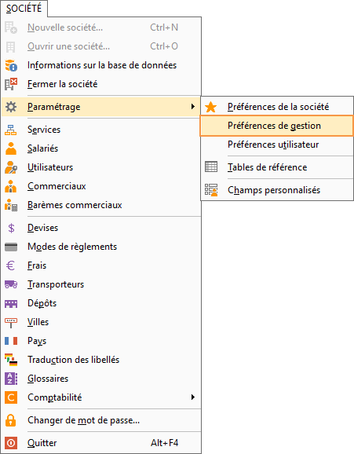
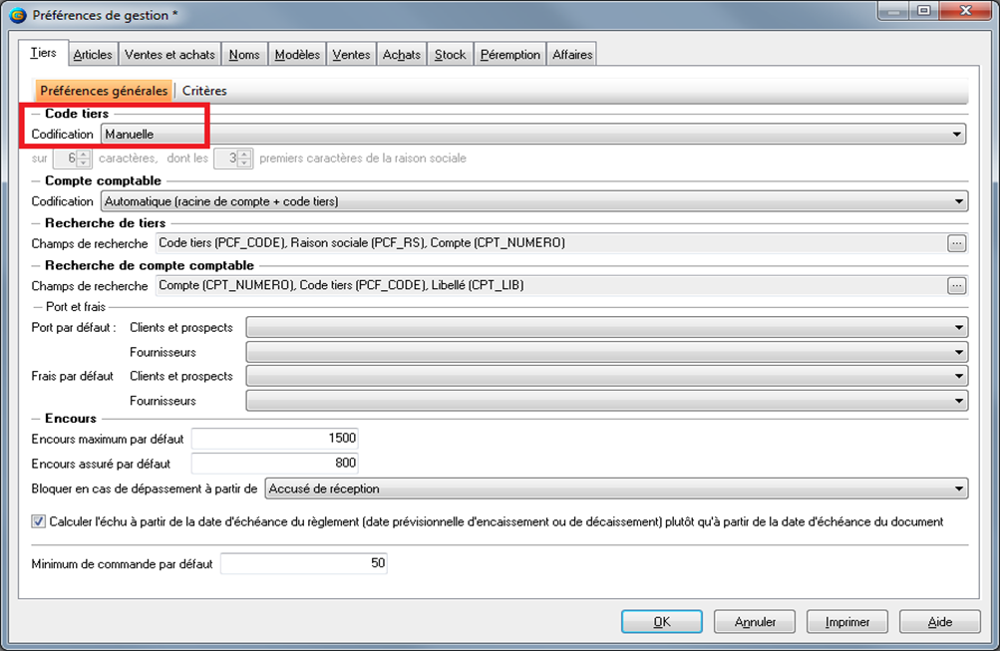
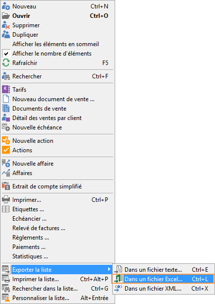
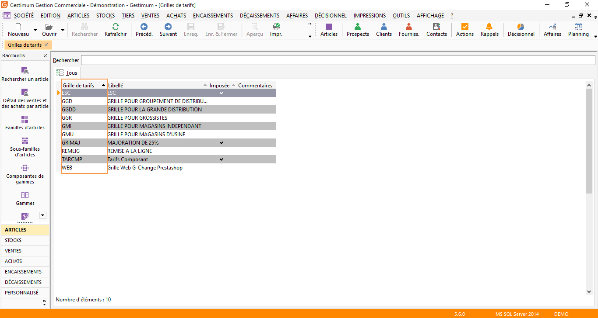
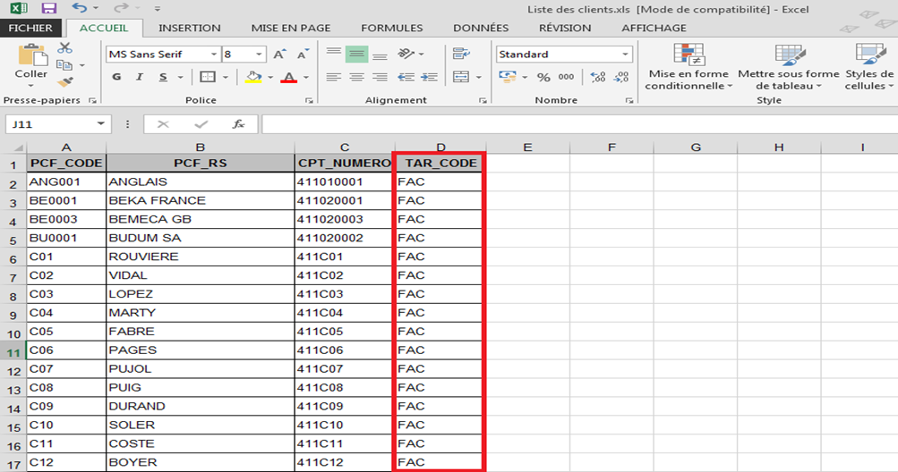
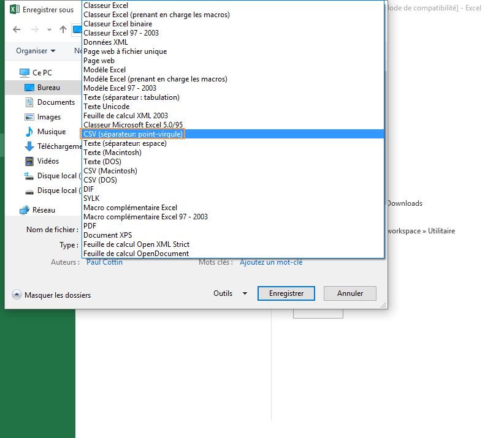
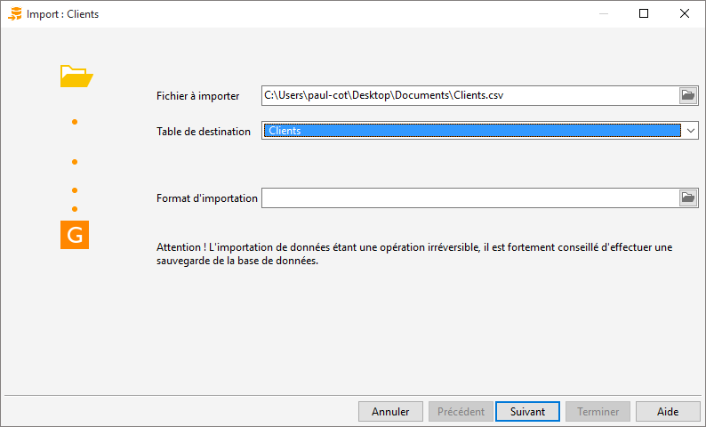
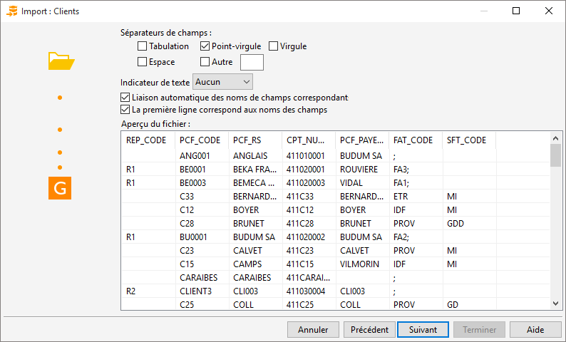

Attribution d'une nouvelle grille de tarifs à l'ensemble des clients

Il est possible d’attribuer une nouvelle grille de tarifs à l’ensemble 
 de vos clients par import.

## Codification des tiers

La codification des tiers dans les Préférences de Gestion doit être 
 "Manuelle".

 

Allez dans Fichier | Paramétrage | Préférences 
 de gestion :

 

 

## Export de la liste des clients

Il faut exporter la liste des clients sous Excel 
 après y avoir inséré la colonne «Grille de tarifs».

 

Sur la liste de vos clients, faites clic droit 
 «Exporter la grille – Dans un fichier Excel» :

 

 

Sur cette fenêtre sélectionner «Exporter sur la première ligne: le nom 
 des champs :

 

 

Sur Gestimum allez sur la liste de vos grilles de tarifs via «Données 
 – Prix – Grilles de tarifs» afin de savoir qu’elle est le code que vous 
 souhaitez appliquer

 

 

Pour l’exemple nous prendre le code «FAC» 
 de facom que nous allons appliquer à chaque tiers

 

Sur notre fichier Excel nous allons modifier le champ «TAR\_CODE» 
 en mettant notre code «FAC»

 

 

Enregistrer ensuite ce document au format CSV (séparateur point-virgule) 
 :

 

## Import du fichier Excel

Sélectionner votre fichier (au format CSV) à importer, puis prendre 
 «Clients» comme table de destination:

 

 

Faire «Suivant» jusqu'à cette fenêtre où vous sélectionnerez «Point-virgule» 
 comme séparateur de champs et cocherez «Liaison automatique des noms de 
 champs correspondants» et «La première ligne correspond aux noms des champs»:

 

 

Faire «Suivant», les champs seront liés automatiquement:

 

Puis faire «Suivant» avant de «Terminer»

## Liste des clients

Allez dans la liste de vos clients et ces derniers ont désormais la 
 grille de Tarifs "FAC".

