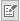
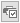

# Impressions

Toutes les boîtes d’impression ont un comportement commun.

## Zones communes

### Nom du rapport à imprimer

Tous les rapports (ou modèles) proposés par le logiciel en standard 
 ou créés par vous avec ReportBuilder apparaissent par simple clic sur 
 la flèche noire basse.

 

Pour modifier un modèle ou en créer un nouveau, vous devez lancer le 
 générateur d’état ReportBuilder en cliquant sur le bouton . Pour l’utilisation de 
 ReportBuilder, consultez la page "Générateur d’états: utilisation" 
 et l’aide en ligne disponible à partir du menu Aide.

### Filtres

Cette zone permet de déterminer les données que vous souhaitez prendre 
 en compte pour l’impression. Lorsque les zones sont vides, cela signifie 
 qu’aucun filtre n’est appliqué concernant ce critère.

 

Exemple : si les zones Du compte et Au compte sont vierges, cela signifie 
 que la totalité des comptes sera prise en compte à l’impression (en supposant 
 qu’aucun autre critère n’ait été défini) mais vous pourriez très bien 
 définir un intervalle de comptes pour par exemple limiter l’impression 
 aux comptes de ventes.

### Imprimer vers

Cette zone permet de choisir un canal de sortie Imprimante ou Fichier 
 en sélectionnant au choix :

* Un pilote parmi 
 les imprimantes Windows installées sur votre poste ou parmi les imprimantes 
 matricielles fournies en standard (LX400, …),
* Un format d'export 
 (Texte, RTF ou HTML),
* Ou encore d’autres 
 formats, fonction des pilotes que vous avez vous même installés (par 
 exemple, le format PDF si vous avez installé Acrobat PDF Writer).

 

Le bouton  permet d’accéder aux options du pilote 
 d’impression. Pour un pilote Windows, vous accédez aux options de configuration 
 d’impression. Pour un pilote matricielle, vous accédez à TurboPrinter. 
 TurboPrinter vous permet de créer un nouveau pilote (menu Fichier + Nouveau) 
 ou de modifier un pilote existant (menu Fichier + Propriétés) pour l’adapter 
 à votre imprimante.

### Pages

Cette zone permet de limiter l’impression à 
 un numéro de page précis ou à une suite de pages en indiquant le premier 
 et le dernier numéro de page séparés par un tiret (1-3).

## Boutons communs

### Bouton Imprimer/Exporter - Option d’exportation

En fonction du choix effectué dans Imprimer vers, ce bouton permet de 
 lancer l’impression ou de générer le fichier au format d’export choisi.

 

En export HTML, vous indiquez un nom de page HTM ou HTML. [Cette option 
 n’est pas disponible actuellement].

 

En export Texte, une boîte s’ouvre qui vous permet de configurer le 
 format du fichier Texte à exporter.

### Bouton Aperçu

Ce bouton permet de lancer un aperçu écran avant de valider éventuellement 
 l’impression ou l’exportation.

### Bouton Annuler

Ce bouton permet de quitter la boîte d’impression.

### Bouton Aide

Ce bouton permet d'accéder à l’aide en ligne de la boite d’impression.

