# Installation de {Microsoft\_SQL\_Server\_Express} en français

L’installation de Microsoft SQL Server Express 
 doit être exécutée sur un seul poste avec le compte administrateur 
 du poste (ayant tous les droits sur le poste et la base de registre).

 

Si vous téléchargez Microsoft SQL Server 2019 Express 
 depuis le site de Microsoft, vous obtiendrez un exécutable intermédiaire 
 permettant d’avoir accès ensuite à l’installation complète. Il y aura 
 un téléchargement d'environ 750 Mo qui se fera pour récupérer la totalité 
 des éléments.

 

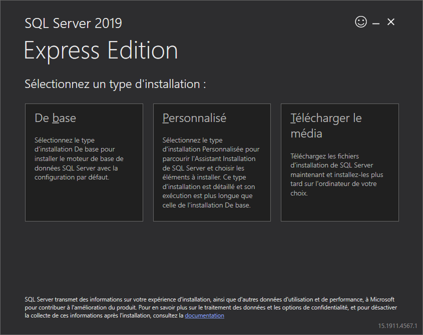

 

Après avoir inséré le DVD Gestimum, cliquez 
 sur l’onglet "Installation" 
 puis lancez l’installation de Microsoft SQL Server 
 Express correspondant au système d'exploitation sur lequel vous êtes.

 

Vous obtiendrez cette fenêtre qui demandera de décompresser les éléments 
 pour l'installation.

 

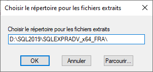

 

Vous aurez ensuite cette fenêtre dans laquelle il faut alors cliquer 
 sur "Nouvelle installation ou ajout 
 de fonctionnalités à une installation existante".

 

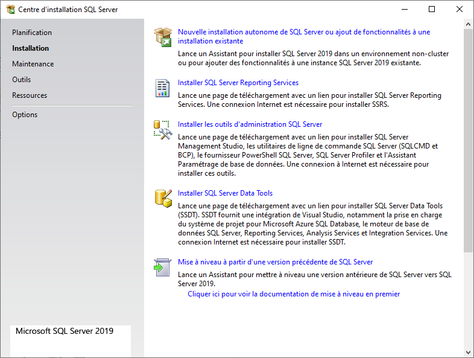

 

* Cochez la case "J’accepte 
 les termes du contrat de licence"

 

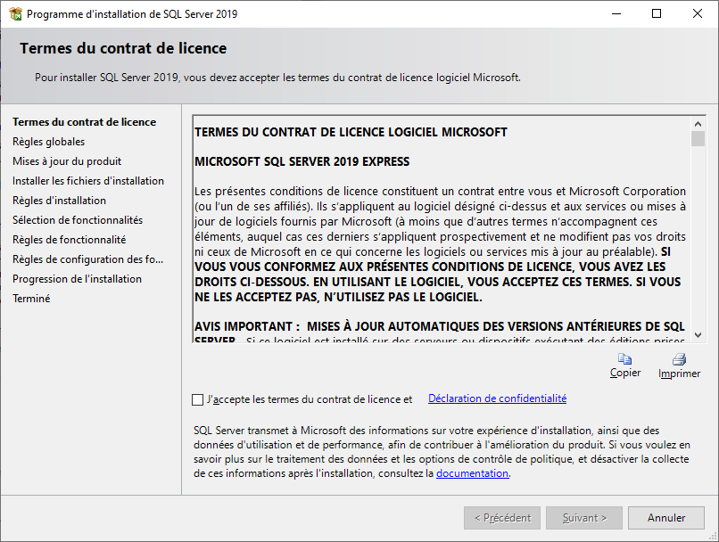

 

* 1 ère Phase de contrôle sur la configuration de l‘OS

 

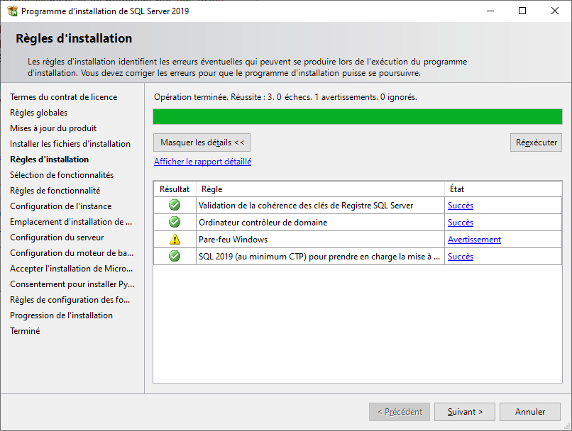

 

Si vous êtes sur un serveur qui a déjà une instance SQL, vous aurez 
 cette étape qui demande soit de faire l'installation d'une nouvelle instance 
 soit de rajouter des options à une instance existante.

 

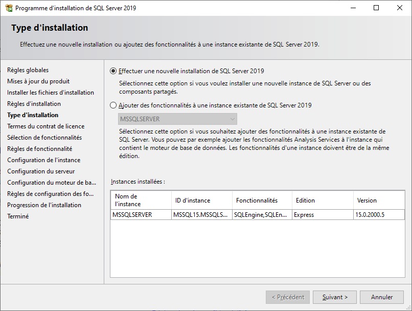

  

* Cochez au minimum la case 
 "Services Moteur de base de données". Les autres fonctionnalités 
 ne sont pas utilisées par Gestimum. Si vous le désirez, vous pouvez 
 changer les chemins d’installation

 

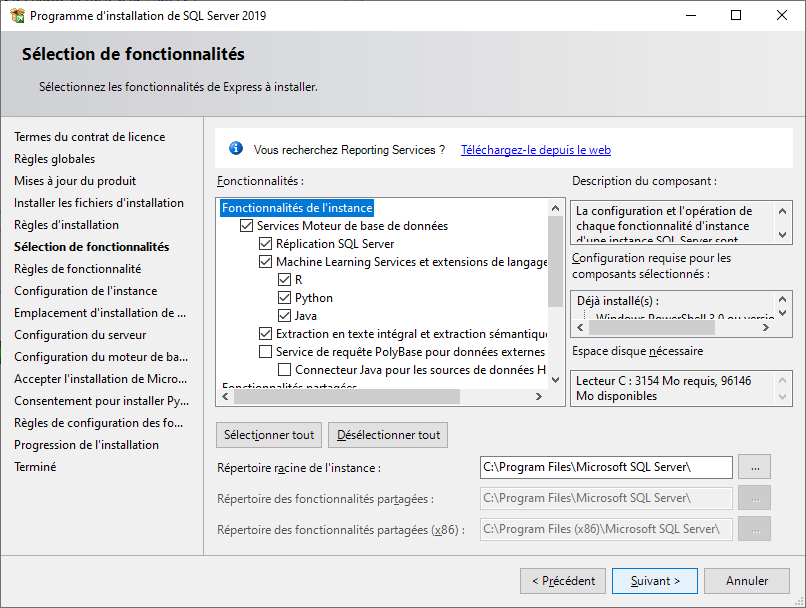

 

* Sélectionnez "Instance 
 par défaut" si aucune autre instance SQL n’est déjà installée. 
 Sinon vous devez nommer votre instance SQL Server.

 

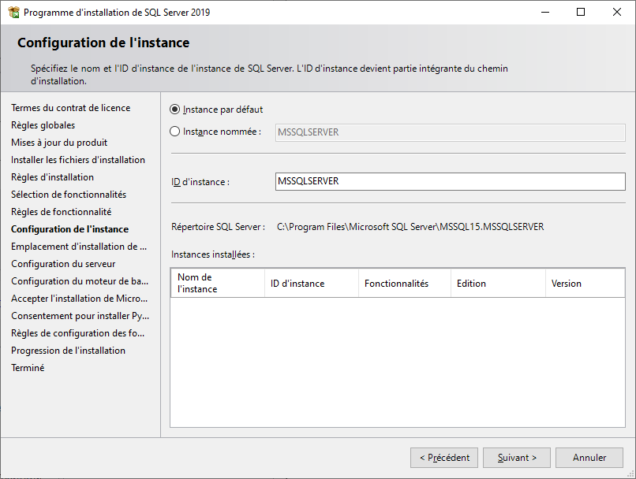

 

S’il existe déjà une instance Microsoft SQL Server, 
 vous devez dans ce cas-là soit installer 
 une nouvelle instance soit utiliser 
 l’instance existante pour Gestimum.

 

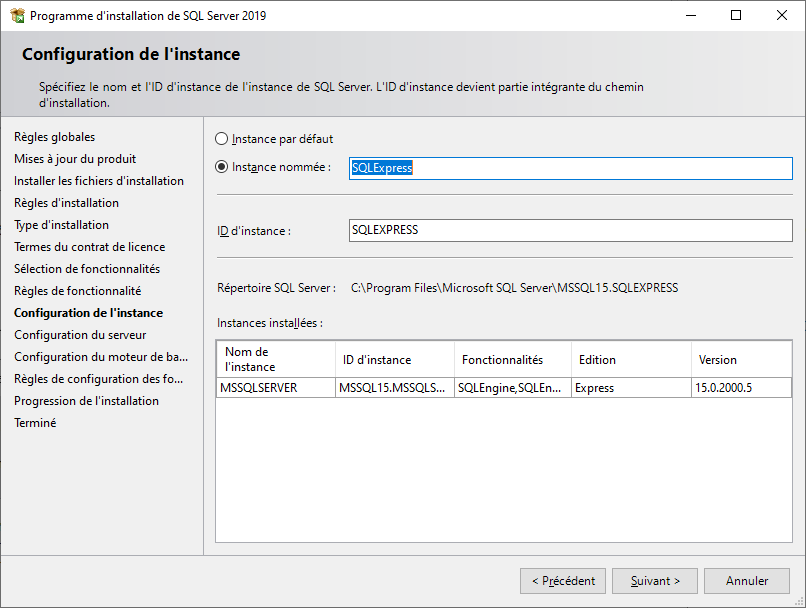

 

* Cette fenêtre apparaît lorsque vous cochez JAVA sur une étape 
 précédente. Si vous disposez déjà de JDK, vous pouvez le sélectionner 
 sinon vous pouvez choisir de l'installer

 

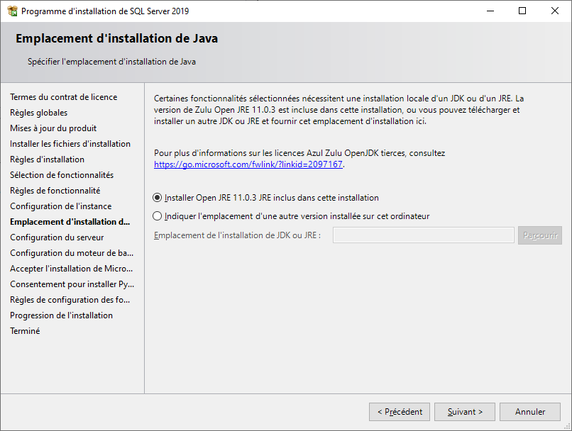

 

* A cette étape, il est important de vérifier 
 le compte sur lequel vont démarrer les services Microsoft SQL Server. 
 Si vous faites une installation sur un contrôleur de domaine, il est 
 important de renseigner un compte 
 administrateur du domaine. Il faut aussi que les services soient 
 en type de démarrage "Automatique".

 

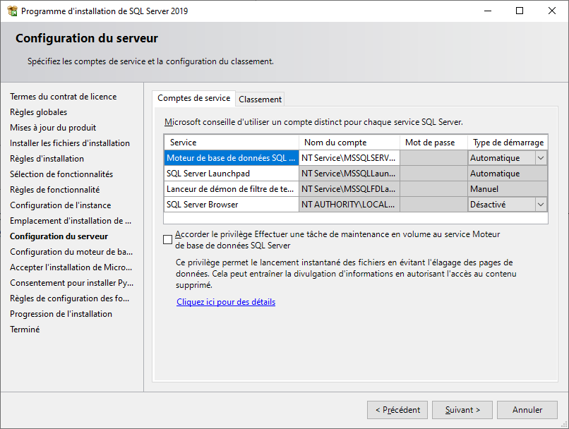

 

* **Cette étape est très importante car elle permet de définir 
 le mode d’authentification au serveur SQL**. Nous vous conseillons 
 de cocher 
 le mode mixte et de définir un mot de 
 passe. Il est important de le conserver car il permettra le cas échéant 
 de se connecter à votre serveur en tant qu’administrateur avec le 
 compte "sa". Vous 
 pouvez utiliser ce mot de passe "**@Gestimum78**" que 
 nous utilisons chez nos clients. Dans un second temps, vous pourrez 
 désactiver le compte  "sa" 
 et créer votre propre compte d'administration.

 

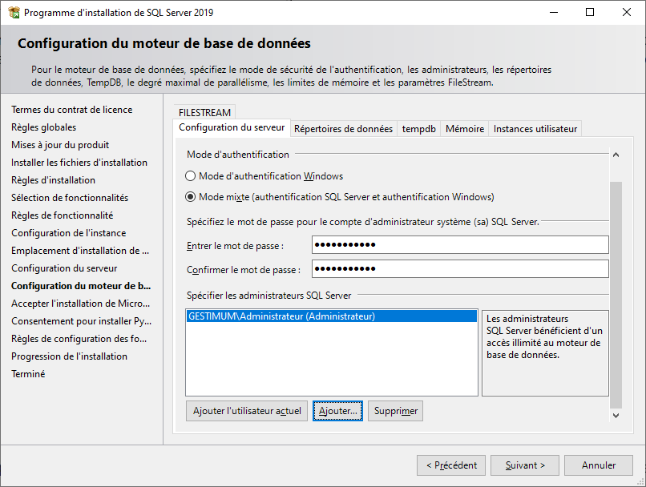

 

* Sur cet onglet, vous pouvez changer 
 les chemins définis par défaut par Microsoft SQL Server 
 notamment les chemins de stockage des données et de sauvegarde de 
 la base de données

 

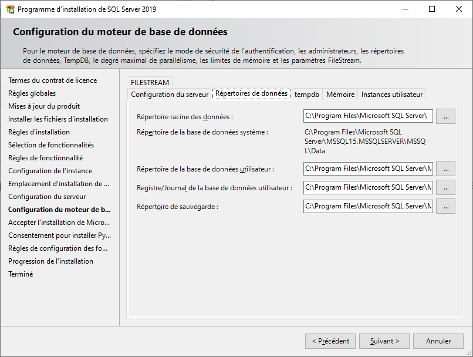

 

L'onglet "tempdb" permet de paramétrer de la base TempDB qui 
 stocke des objets utilisateurs temporaires (par exemple des curseurs) 
 et des objets internes (par exemple certaines requêtes de GROUP BY, ORDER 
 BY ou UNION). Nous laisserons la configuration de base.

 

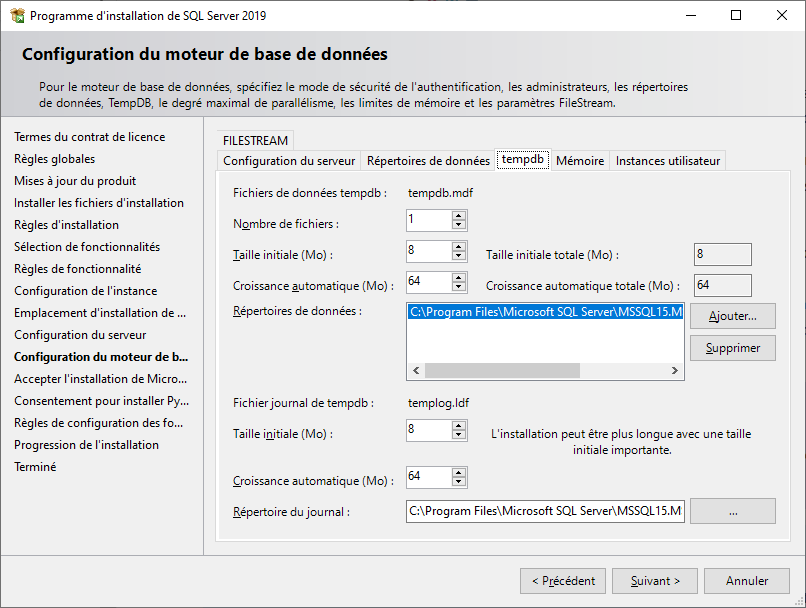

 

Pour en savoir plus sur cette base : <https://docs.microsoft.com/fr-fr/sql/relational-databases/databases/tempdb-database?view=sql-server-ver15>

 

L'onglet Mémoire permet d'ajuster la consommation de mémoire maximum 
 et minimum qu'utilisera SQL Server. Attention la version Express est bridée 
 à 1 Go de mémoire.

 

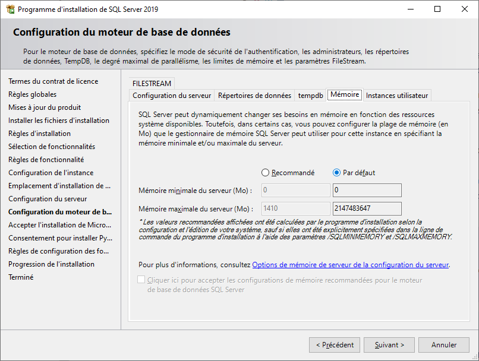

 

Si vous cochez l'installation du langage R et de Python, vous aurez 
 les 2 fenêtres ci-dessous avant de lancer l'installation.

 

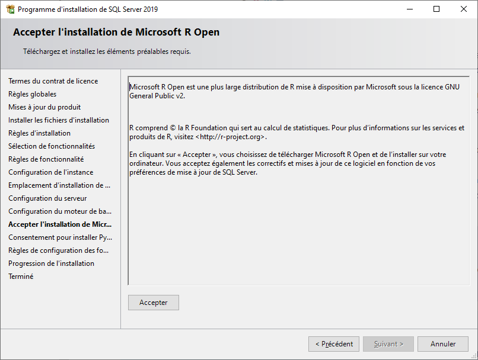

 

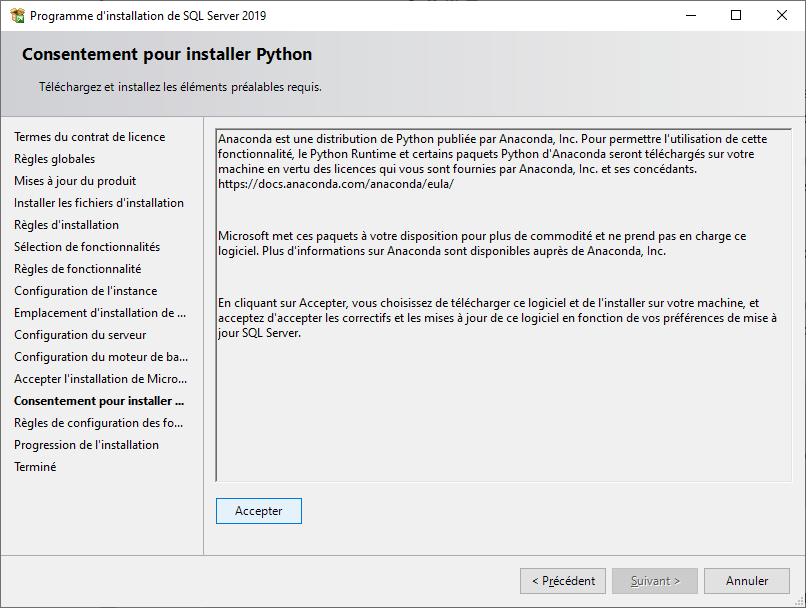

 

S’il n’y a pas d’erreur dans la phase "Règles de configuration 
 des fo…", l’installation se lancera automatiquement.

 

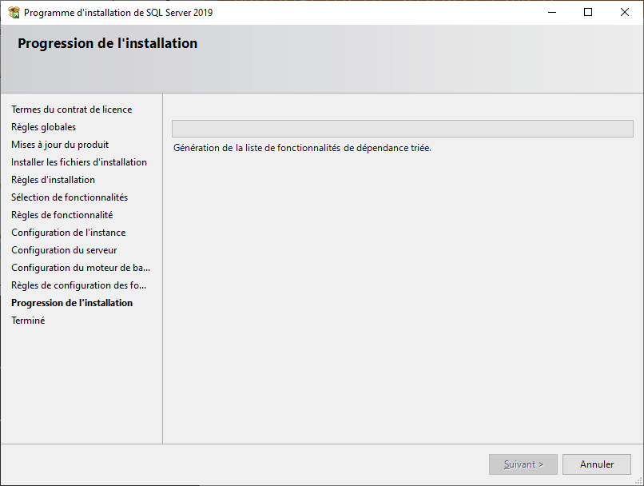

### Source

<https://docs.microsoft.com/fr-fr/sql/database-engine/install-windows/install-sql-server-from-the-installation-wizard-setup>

