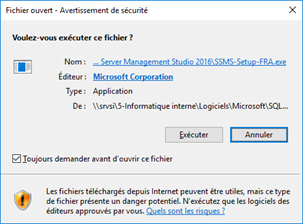
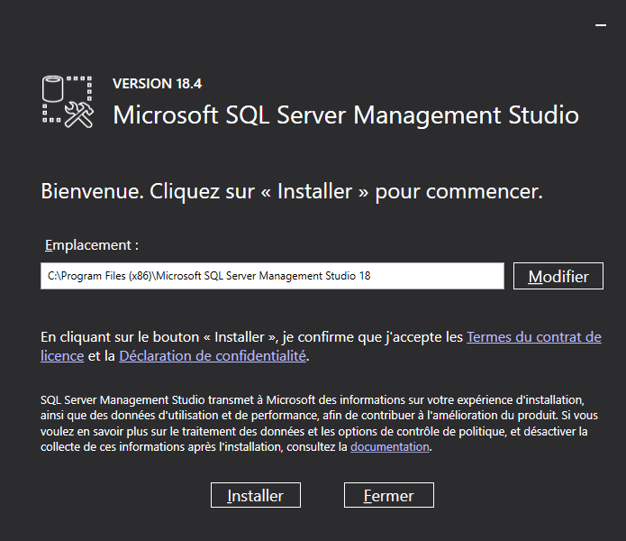
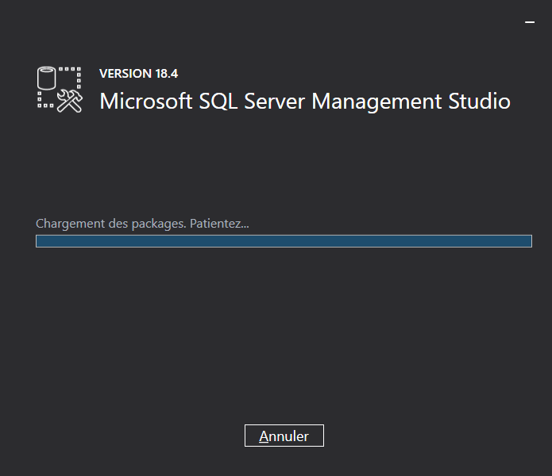
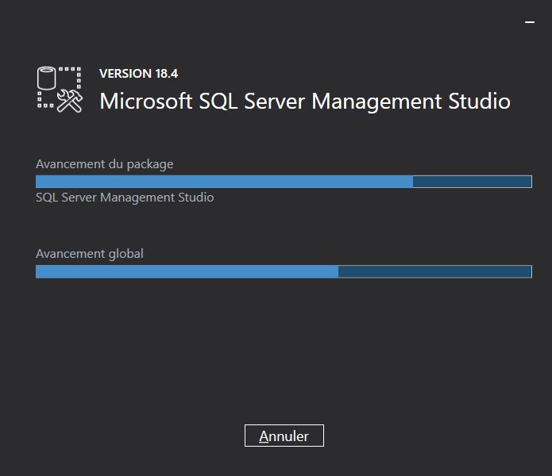
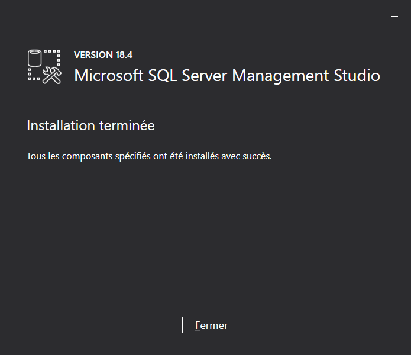

# Installation de {SSMS}

Lorsque vous lancerez l’installation, vous aurez tout d’abord cette 
 fenêtre, il faut cliquer sur "Exécuter".

 

 

Vous devez ensuite cliquer sur  "Installer 
 ".

 

 

 

 

 

Il faudra que vous redémarriez votre machine pour finaliser l’installation.

 

