# Paramétrage du pare-feu

Pour que Microsoft SQL Server 
 soit accessible depuis votre réseau, il faut paramétrer le pare-feu Windows 
 ou autre. Vous devez donc faire comme suit :

 

* Ouvrez le "Gestionnaire 
 de serveur"

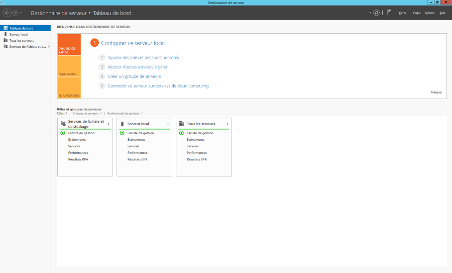

 

* Cherchez dans le menu "Outils" 
 le Pare-feu Windows

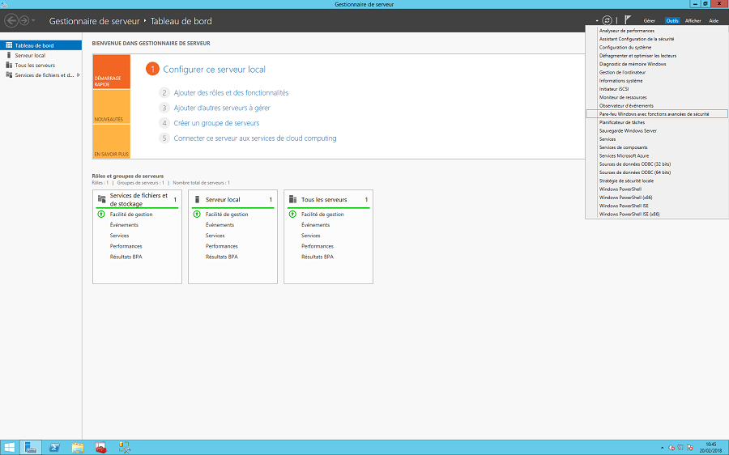

 

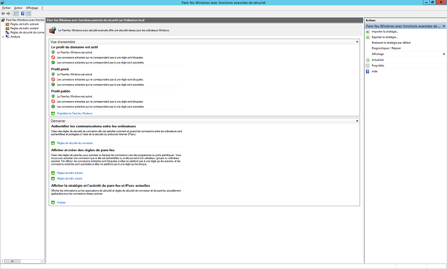

 

* Cliquez sur "Règle 
 de trafic entrant"

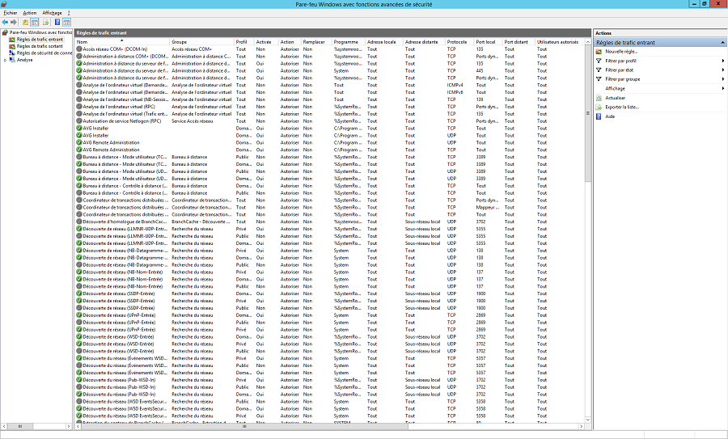

 

* Cliquez ensuite sur "Nouvelle 
 règle…" dans le menu à droite et dans la nouvelle fenêtre sélectionnez dans un premier temps 
 "Programme"

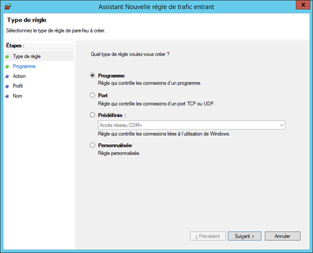

 

* Allez dans parcourir et 
 cherchez "sqlserv.exe" 
 dans ce chemin (C:\Program Files\Microsoft SQL Server\MSSQL14.MSSQLSERVER\MSSQL\Binn)

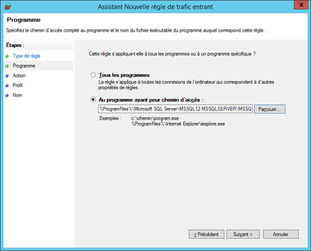

 

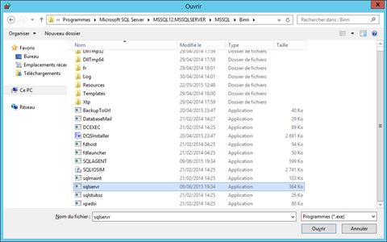

 

* Sélectionnez "Autoriser 
 la connexion"

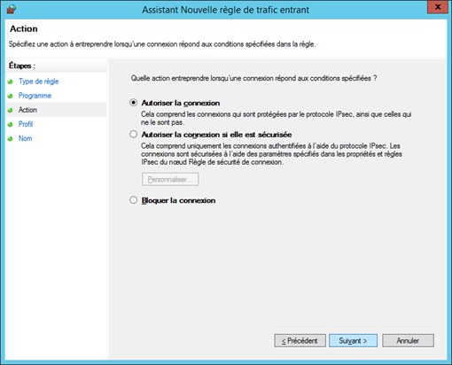

 

* Décochez "Public" 
 pour éviter que le serveur ne soit accessible en dehors de votre réseau

 

* Nommez la règle comme vous 
 le voulez (vous pouvez mettre par exemple SQLServer.exe – Entrant)

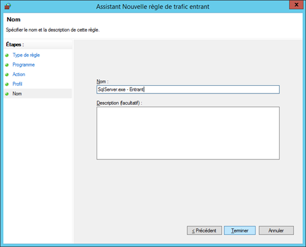

 

* Refaites la même opération 
 mais cette fois en sélectionnant le port

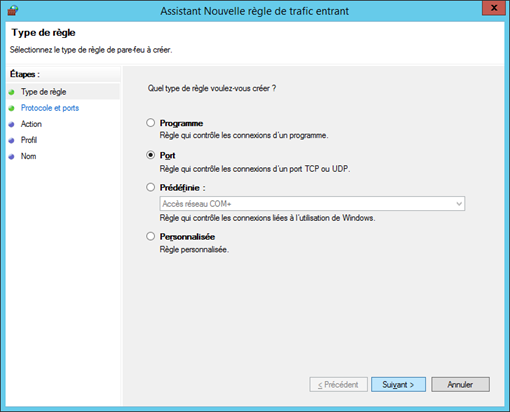

 

* Tapez 1433 dans "Ports 
 Locaux spécifiques" qui correspond au port utilisé par SQL Server 
 pour communiquer en TCP.

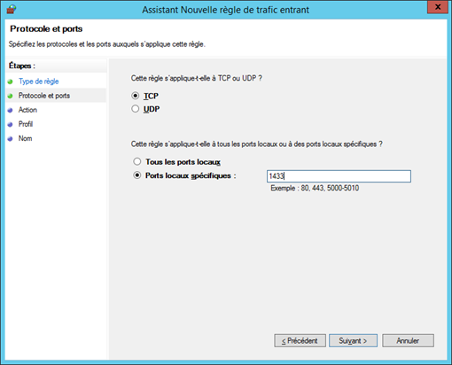

 

* Sélectionnez "Autoriser 
 la connexion"

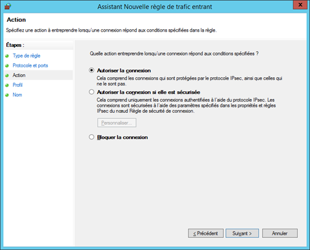

 

* Décochez "Public"

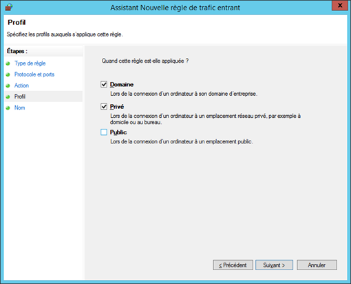

 

* Nommez la règle comme vous 
 le voulez (vous pouvez mettre par exemple Port SQLServer 1433 – Entrant)

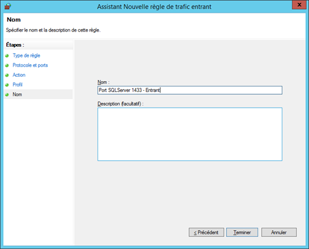

 

Dans la liste des règles entrantes, vous devriez donc retrouver les 
 2 règles que nous venons de créer.

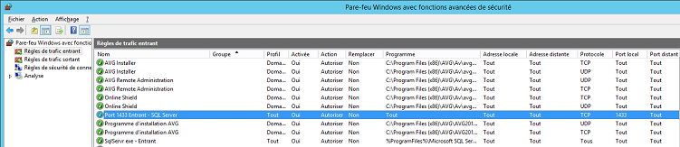

 

 

Il faut refaire les mêmes manipulations au niveau des règles de trafic 
 sortant.

### Source

<https://docs.microsoft.com/fr-fr/sql/sql-server/install/configure-the-windows-firewall-to-allow-sql-server-access> 

