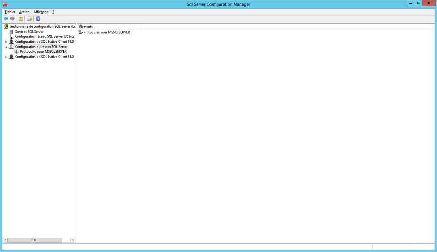

# Activation des protocoles réseaux côté serveur

Vous devez ouvrir le "Gestionnaire de configuration SQL Server" 
 et faire les manipulations suivantes :

 

* Déployez 
 la branche "Configuration du réseau SQL Server"

 

* Cliquez sur "Protocoles 
 pour MSSQLSERVER" et activez 
 les protocoles Canaux nommés et TCP/IP

 

* Redémarrez le service en 
 allant sur "Service SQL Server" puis en faisant clic-droit 
 sur SQL Server (MSSQLSERVER).

 

 

