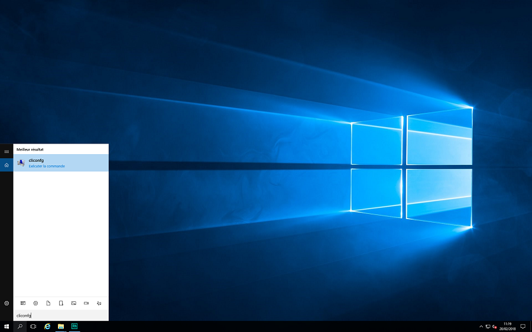
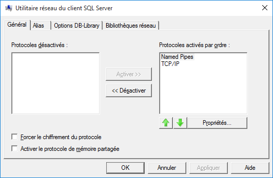

# Activation des protocoles réseaux côté client

Sur les postes clients, vous devez aussi activer les protocoles de communication 
 pour Microsoft SQL Server.

 

Pour se faire, vous devez rechercher 
 l’utilitaire Microsoft Cliconfg.exe. 
 Par exemple en tapant Cliconfg dans la zone de recherche (ici sur Windows 
 10)

 

Vous devez ensuite activer les 
 protocoles « Canaux nommés" (Named 
 Pipes) et "TPC/IP" en 
 les faisant basculer dans la partie de droite de la fenêtre.

 

  

