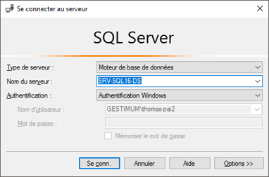
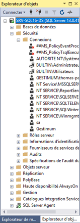

# Paramétrage des connexions à Microsoft SQL Server

Nous allons maintenant paramétrer les connexions à Microsoft SQL Server.

 

Vous devez donc ouvrir 
 l’outil d'administration et de requêtage qui se nomme Microsoft SQL Server Management Studio (SSMS). 
 

 

Lors de la 1ère connexion à cette 
 outil, nous vous conseillons d’utiliser l’authentification 
 SQL Server pour être sûr d’avoir tous les droits.

 

Dans l’explorateur d’objets, vous devez déployer 
 la branche "Sécurité" 
 puis "Connexions". Vous 
 trouverez dans cette branche les connexions déjà crées lors de l’installation. 
 Lorsqu’il y a une flèche rouge qui pointe vers le bas, cela signifie que 
 la connexion est désactivée.

 

Pour vous connecter avec Gestimum au serveur, vous pouvez utiliser 2 
 types de connexion :

* Soit une connexion utilisant les comptes 
 Windows de l’Active Directory (AD)
* Soit une connexion utilisant un compte 
 créé sur SQL Server.

 

Si vous êtes sur un réseau ne possédant pas d’AD, vous serez obligés 
 d’utiliser une connexion liée à un compte SQL Server.

## Paramétrage d’un compte ou groupe existant

Microsoft SQL Server 
 hérite lors de l’installation de 2 groupes d’utilisateurs de votre AD 
 qui sont préfixés par BUILTIN. Le groupe BUILTIN\Utilisateurs 
 correspond au groupe d’utilisateurs pouvant effectuer des tâches courantes 
 sur le domaine. Le groupe BUILTIN\Administrateurs 
 correspond au groupe d’utilisateur faisant partie des administrateurs 
 du domaine.

 

Il faut donc configurer le 1er groupe. 
 Vous pouvez faire 3 types de paramétrage sur ce celui-ci :

* Soit en allant dans "Rôles du serveur" et en cochant « sysadmin", on le déclare alors 
 comme "administrateur" 
 du serveur SQL.

 

* Soit en allant dans "Mappage de l’utilisateur" et 
 en donnant des droits spécifiques 
 base par base. 
 Vous retrouverez plus d’informations sur les rôles de base de données 
 sur ce lien :

<https://msdn.microsoft.com/query/dev10.query?appId=Dev10IDEF1&l=FR-FR&k=k%28SQL12.SWB.LOGIN.DATABASEACCESS.F1%29&rd=true>

 

* Soit en allant dans "Éléments sécurisables" et en 
 octroyant des droits au groupe 
 sur tout le serveur.

<https://msdn.microsoft.com/query/dev10.query?appId=Dev10IDEF1&l=FR-FR&k=k%28SQL12.SWB.SECURABLEANDEFFECTPERMISSIONS.F1%29&rd=true>

 

Vous pouvez aussi faire cette configuration au niveau des propriétés 
 du serveur.

## Création d’un compte ou groupe

Pour créer une connexion, il faut faire clic-droit sur la branche "Connexions" 
 puis "Nouvelle connexion"

Vous avez à ce moment-là possibilité de paramétrer 
 une connexion en liaison avec votre AD ou une connexion propre à SQL Server.

 

Pour les connexions utilisant un compte 
 ou groupe de l’AD, vous pouvez faire une recherche dans votre annuaire 
 et sélectionner ainsi l’élément à reprendre. Quand vous cliquez sur rechercher, 
 vous arrivez sur cette fenêtre. Il faut changer l’emplacement pour effectuer 
 la recherche sur annuaire.

 

Ensuite vous cliquez sur "Avancé…" 
 et "Rechercher", cela va vous donner la liste de vos comptes 
 et groupe de votre AD.

 

Vous pouvez le sélectionner en 
 double cliquant dessus.

 

Le paramétrage est identique ensuite à celui des connexions existantes.

 

L’icône de la connexion créée peut se représenter sous 2 formes :

* Pour un utilisateur
* Pour 
 un groupe

 

Pour créer une connexion SQL Server, vous devez sélectionner 
 "Authentification SQL Server". Puis vous renseignez le nom et 
 le mot de passe de cette connexion.

 

Il est conseillé de garder la stratégie 
 de mot de passe de votre serveur, par contre il faut décocher 
 "Conserver l’expiration du mot de passe" car sinon l’utilisateur 
 devra changer de mot de passe régulièrement.

 

Au final vous pouvez retrouver dans cette situation avec des connexions 
 Windows et des connexions SQL Server (sans le nom du domaine devant).

 

