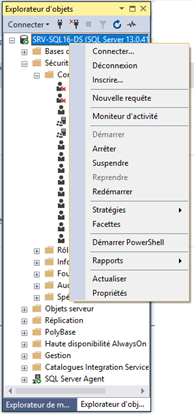
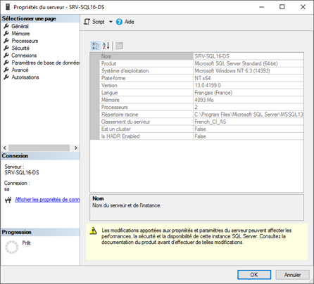
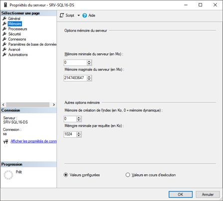
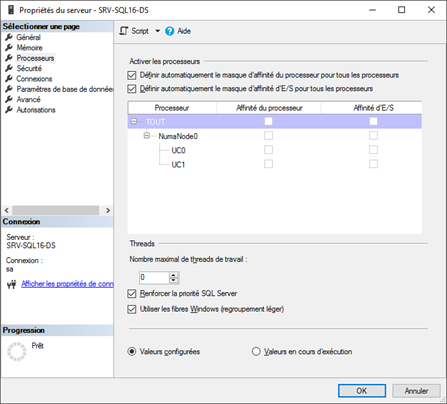
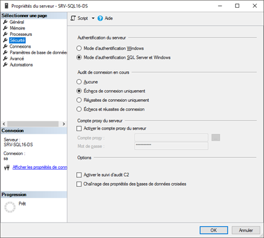
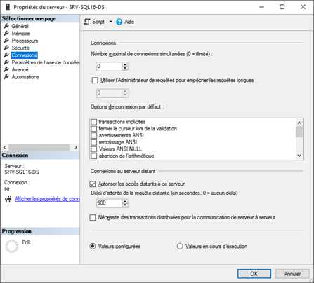
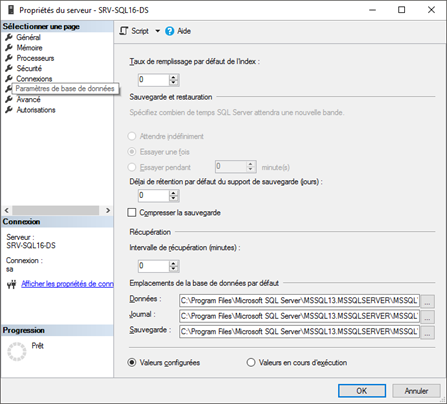

# Paramétrage du serveur Microsoft SQL Server

Vous pouvez faire d’autres paramétrages sur votre serveur Microsoft SQL Server.

 

Pour ouvrir la fenêtre de paramétrage, il faut faire clic-droit sur 
 le nom du serveur puis "Propriétés" 
 en bas du menu contextuel.

 

Cette fenêtre nous donne des informations générales sur le serveur SQL 
 et sur son hôte (version, nom, …).

 

Quand vous cliquez sur "Mémoire", vous accédez au paramétrage 
 qui permettent de limiter ou d’augmenter l’accès à la mémoire du serveur. 
 Attention pour SQL Express, la taille maximale sera de **1Go** de mémoire 
 vive.

 

Le menu processeur permet d’accorder plus de "privilèges" 
 à SQL Server par rapport aux autres applications. Il permet d’augmenter 
 l’affinité cœur par cœur de votre processeur.

 

Le menu "Sécurité" permet de revenir sur le mode d’authentification 
 au serveur. On peut revenir à un mode où on utilise que les comptes Windows 
 comme moyen d’authentification (attention dans le cas d’un réseau en **WORKGROUP** 
 sans AD ).

 

Le menu "Connexions" permet notamment de limiter le nombre 
 de connexion et d’autoriser les accès distants.

 

Le menu Paramètres de base de données nous permet de compresser ou pas 
 la sauvegarde et de changer les chemins de stockage des bases de données 
 et de leur sauvegarde.

