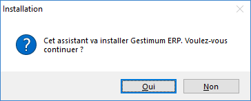
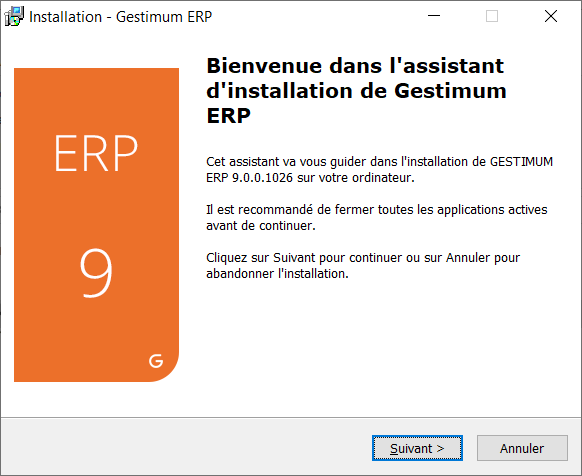
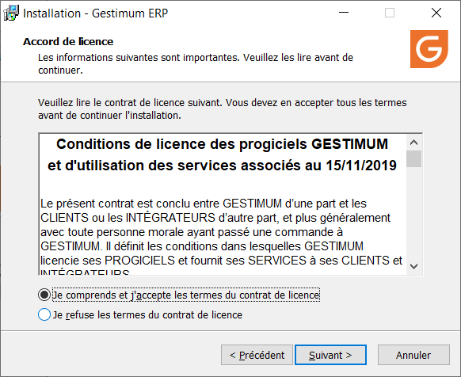
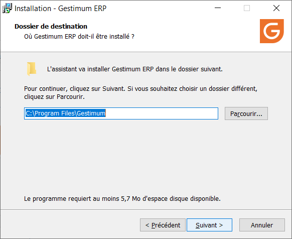
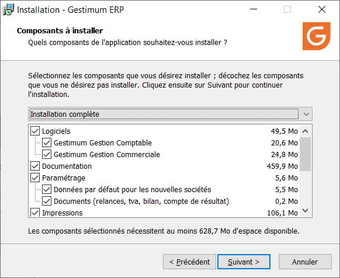
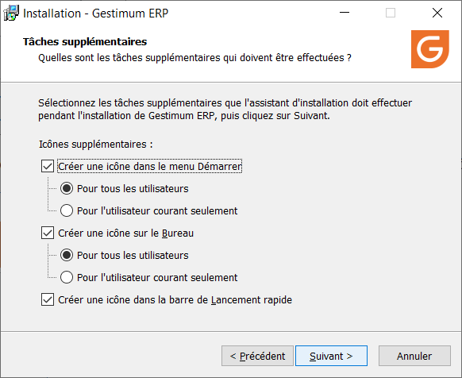
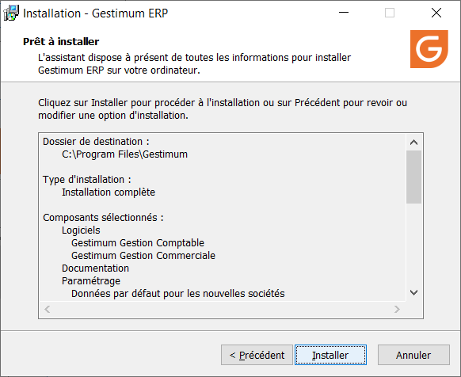
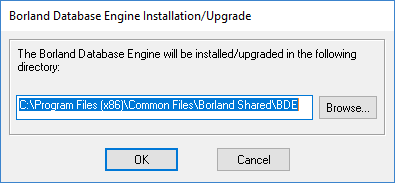
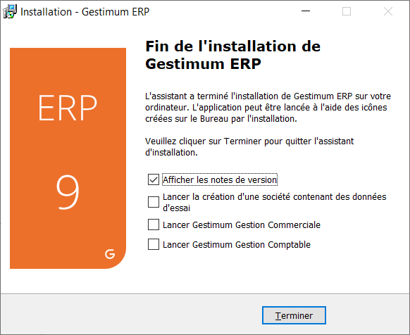

# Installation de {Gestimum\_ERP}

Pour installer Gestimum ERP, vous devez passer les étapes suivantes : 

 

* Lancez l’installateur et confirmer ce message

 

 

* Cliquez sur Suivant

 

 

* Acceptez les conditions de licences

 

 

* Sélectionnez le dossier où sera stockée l’installation de Gestimum ERP

 

 

* Sélectionnez les éléments à installer. Pour une 1ère installation, vous devez faire **une installation complète**. Pour une mise à jour, il faudra adapter en fonction du contenu de la note de version (installer le logiciel, les modèles standards…)

 

 

* Autorisez ou pas la création d’icônes à différents emplacements. Sur une 1ère installation, il est conseillé de créer au moins des icônes sur le bureau.

 

 

Cette fenêtre est un récapitulatif de ce qui va être installé.

 

 

Lors de l’installation, il vous sera demandé de valider l’installation d’un logiciel tiers (Borland Database Engine – BDE) nécessaire au bon fonctionnement de Gestimum ERP. Vous devez l'installer au moins une fois.

 

 

A la fin de l’installation vous avez la possibilité de consulter la note de version et de lancer le logiciel.

 

