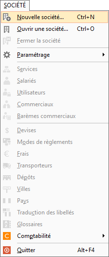
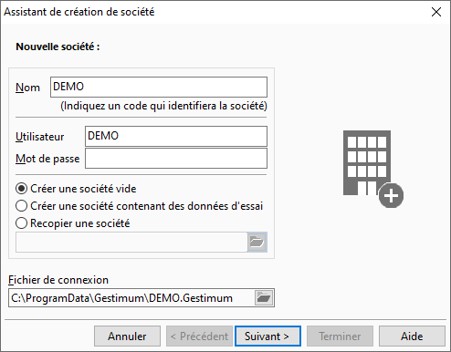
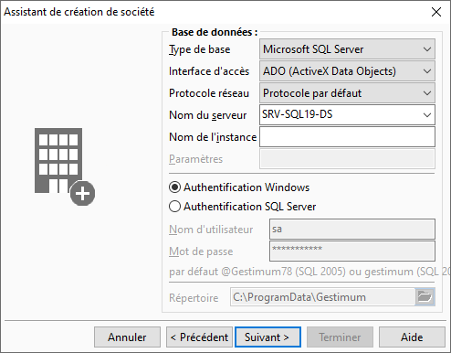
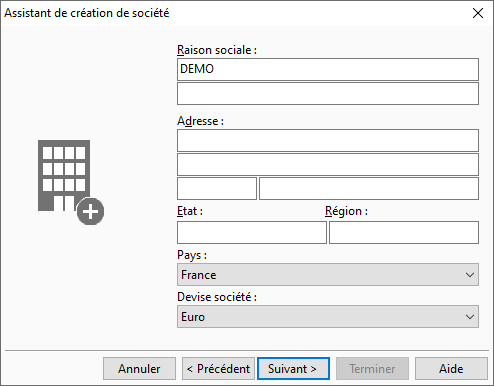
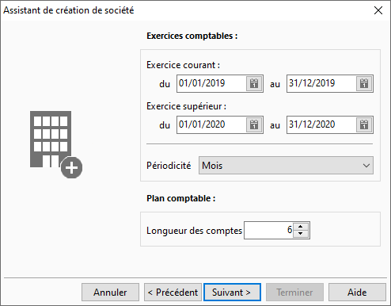
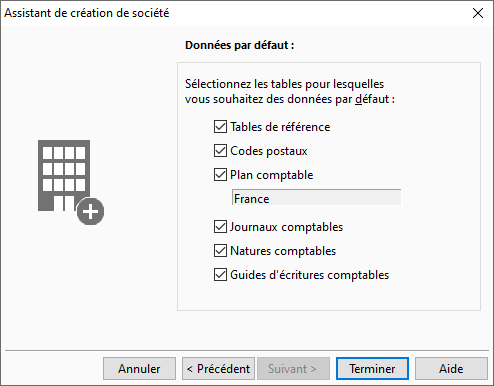
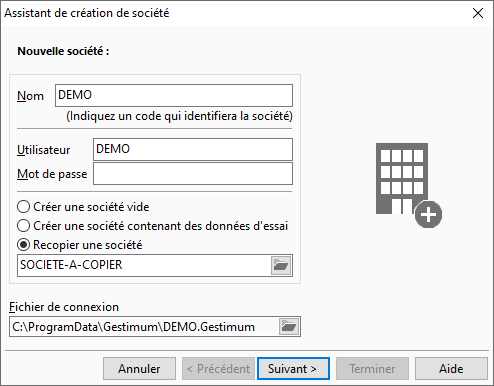
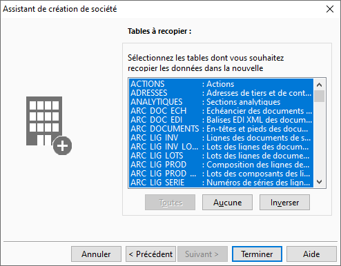

# Création d’une base de données {Gestimum\_ERP}

Pour créer une base de données (BDD) ou société, vous devez dans Gestimum ERP (Gestion Commerciale ou Comptabilité) faire les manipulations suivantes :

 

* Allez dans le menu SOCIETE et cliquez sur Nouvelle société

 

 

* Renseignez les éléments suivants :

 

o Le nom de la société qui sera aussi le nom de la BDD

o Le nom d’utilisateur à créer

o Le type de BDD à créer (avec des données de démonstration ou pas ou en recopiant une base existante

 

 

* Complétez le nom du serveur SQL Server et le mode d’authentification

 

 

Si vous avez décidé de créer une base de démonstration, vous avez fini. Sinon vous devez faire les étapes suivantes.

## Pour une base de données vide :

 

* Renseignez au minimum dans cette étape la raison sociale, les autres éléments étant facilement modifiables par la suite.

 

 

* Mettez les dates d’exercice courant (attention la date de début **n’est plus modifiable** ensuite) et précisez la longueur des comptes

 

 

* Laissez coché toutes les cases ci-dessous car elles servent à créer du paramétrage de base dans la société.

 

## Pour une recopie de société :

 

* Sélectionnez le fichier de connexion de la société à recopier

 

 

* Mettez les dates d’exercice courant (attention la date de début **n’est pas modifiable** ensuite) et précisez la longueur des comptes

 

 

* Sélectionnez les tables que vous voulez recopier

 

