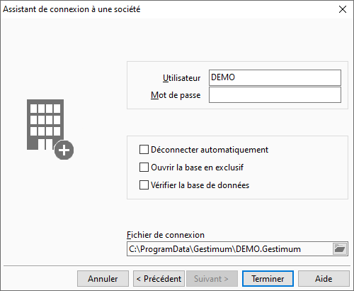

# Connexion à la base de données depuis un poste client

Il vous faut définir la base de données (société) avec laquelle vous 
 allez travailler. Lancer l’une des applications Gestimum ERP 
 (Gestion Commerciale ou bien Gestion Comptable) depuis vos icônes sur 
 le bureau.

 

La fenêtre de dialogue ne vous propose pas de nom de société à laquelle 
 vous pouvez vous connecter. Cliquez 
 sur l’icône de l’assistant de connexion situé tout à fait à droite du 
 champ "Société".

 

* Nommez la base de données 
 à laquelle vous voulez vous connecter.

 

* Sélectionnez (en cliquant 
 sur la liste déroulante) ou taper 
 le nom de votre serveur Microsoft SQL Server 
 hébergeant votre base de données.

 

* Déterminez si vous voulez 
 utiliser l’authentification Windows 
 ou bien celle de SQL Server 
 pour vous connecter à la base. Si votre choix se porte sur l’authentification 
 SQL Server, indiquez le login 
 et mot de passe d’un utilisateur avec des droits conséquents.

 

 

Sur l’étape d’après, vous devez renseigner 
 votre nom d’utilisateur et votre mot de passe Gestimum.

 

 

En cas de problème de connexion, vous pouvez utiliser un utilitaire 
 Microsoft qui permet de tester les connexions au serveur SQL. Vous devez 
 faire comme suit :

 

* Créez un fichier texte 
 sur le bureau ou dans un dossier quelconque

 

* Changez l’extension \*.txt 
 en \*.udl

 

 

* Validez ce message

 

 

* Lancez l’utilitaire

 

 

* Allez sur l’onglet Fournisseur 
 et sélectionner "Microsoft OLE DB Provider for SQL Server"

 

 

* Cliquez sur "Actualiser" 
 et sélectionner votre serveur. Vous pouvez aussi taper son nom directement.

 

 

* Changez le mode d’authentification 
 en le passant sur Windows.

 

 

* Cliquez sur "Tester 
 la connexion". Si cela réussit, vous aurez ce message.

 

 

Sinon, vous changez le mode d’authentification 
 en le mettant sur "Utiliser un nom d’utilisateur et …".  Il 
 faut à ce moment-là remplir les zones avec un utilisateur SQL et le mot 
 de passe qui lui est rattaché.

 

 

Si la connexion échoue encore, vous devez vérifier toutes les étapes 
 de la configuration du serveur :

* [Paramétrage du pare 
 feu](../07/1/ParametragePareFeu.md)
* Activation des protocoles pour SQL côté [serveur](../07/2/ActivationProtocolesReseauxCoteServeur.md) 
 et côté [client](../07/3/ActivationProtocolesReseauxCoteClient.md)
* [Paramétrage 
 des utilisateurs](../07/4/ParametrageConnexionsSQLServer.md)

 

Si vous obtenez l’avertissement suivant "Impossible 
 de générer le contexte SSPI", il s’agit d’un problème d’association 
 entre le nom du serveur et son adresse IP. Ce n’est pas un message bloquant, 
 vous pouvez quand même vous connecter en passant par l’adresse IP du serveur 
 SQL. 

Pour solutionner le problème, vous pouvez suivre ce guide : <https://support.microsoft.com/fr-fr/help/811889/how-to-troubleshoot-the-cannot-generate-sspi-context-error-message>

