# Sauvegarder la base de données

**Attention** : il est déconseillé de faire des sauvegardes en **arrêtant 
 le service SQL Server** et en copiant les fichiers MDF et LDF de la 
 base de données. En effet lorsque le service SQL Server fonctionne, il 
 collecte des informations qui sont mis en mémoire et qui vont améliorer 
 les temps de réponse des bases de données. En arrêtant le service, vous 
 perdez ces informations et donc 
 le serveur aura des temps de réponse plus longs.


## Sauvegarde automatisée


Les versions payantes du logiciel Microsoft SQL Server intègrent le 
 Plan de maintenance, utile pour planifier des tâches pour la sauvegarde 
 automatique des bases de données. Cette fonction n’est pas disponible 
 sur la version Express de SQL Server mais il est possible de créer un 
 **script pour 
 sauvegarder ces bases**.


* Adaptez et enregistrez 
 cette commande dans un fichier **.bat**.


```
sqlcmd -S**SERVEURSQL\INSTANCE** -E -Q "BACKUP DATABASE **COMPTA** TO  DISK = N'**D:\Sauvegarde\COMPTA.BAK**' WITH NOFORMAT, INIT,  NAME = N'**COMPTA**-Complète Base de données Sauvegarde', SKIP, NOREWIND, NOUNLOAD,  STATS = 10"

```

o    -**SSERVEURSQL\INSTANCE** 
 ou **SERVEURSQL** est le nom de votre serveur suivi du nom de l’instance


o    La 
 base de données est ici nommée "**COMPTA**"


o    **D:\Sauvegarde\COMPTA.BAK** 
 est le chemin où sera stockée la sauvegarde de la base de données


 


* Utilisez le **Planificateur de tâches** 
 de Windows pour l’exécution automatique à intervalle régulier.


## Sauvegarde ponctuelle


Vous pouvez faire des sauvegardes de manière occasionnelle soit en passant 
 par Gestimum ERP soit 
 par l’outil d’administration Microsoft SQL Server Management Studio (SSMS).


 


Dans Gestimum, vous avez 2 possibilités pour faire une sauvegarde :


 


* Soit en faisant une sauvegarde 
 de la base de données seule et qui peut être faite depuis n’importe 
 quel poste client (Menu Outils/Sauvegarder 
 la base de données). Vous pouvez ensuite modifier le nom du fichier 
 de sauvegarde ainsi que le lieu où il sera stocké sur le serveur (D:\BACKUP\) 
 ou sur le réseau (\\MON\_POSTE\_CLIENT\PARTAGE\).


 


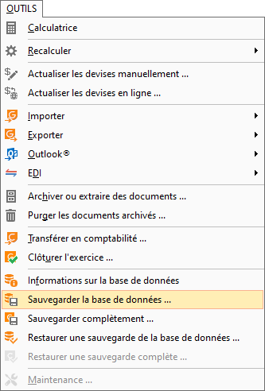


 


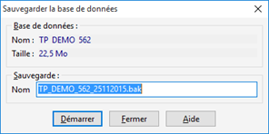


 


* Soit en faisant une sauvegarde 
 complète mais qui ne peut être faite que depuis le serveur 
 (Menu Outils/Sauvegarder complètement). Cette sauvegarde reprendra 
 en plus de la base de données tous les éléments de paramétrage de 
 Gestimum (modèles d’impression, de document …)


 


o    Cliquez sur "Suivant" sur 
 cette étape


 


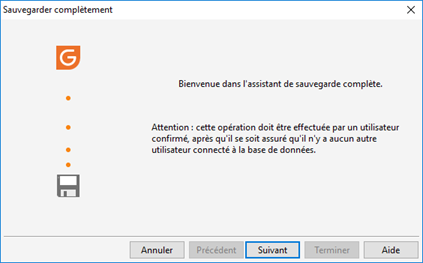


 


o    Sélectionnez les éléments que vous 
 voulez sauvegarder


 


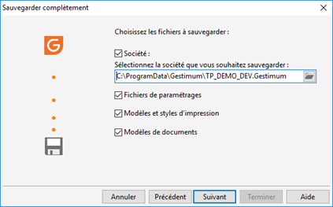


 


o    Renseignez un nom de connexion et un 
 mot de passe si vous ne disposez pas de ce droit au niveau du serveur 
 SQL


 


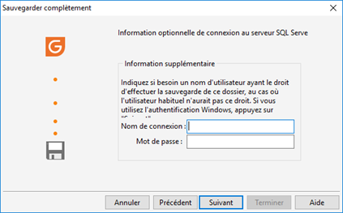


 


o    Sélectionnez un emplacement pour stocker 
 le fichier de sauvegarde


 


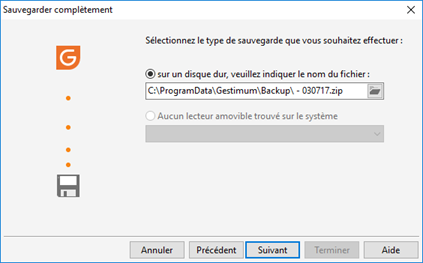


 


o    Cliquez sur "Terminer"


 


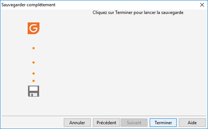


 


Dans Microsoft SQL Server Management Studio (SSMS), 
 vous devez faire comme suit :


 


* Faites clic-droit sur la 
 base à sauvegarder dans l’explorateur d’objets


 


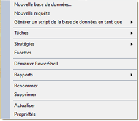


 


* Allez sur "Tâches" 
 et cliquez sur "Sauvegarder"


 


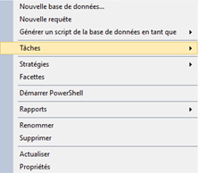 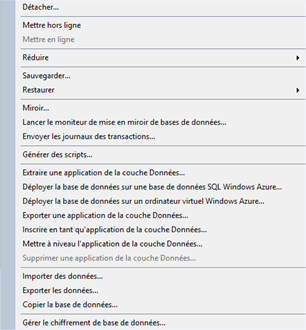


 


* Cliquez sur "Ajouter" 
 pour sélectionner le fichier sur lequel la base sera sauvegardée


 


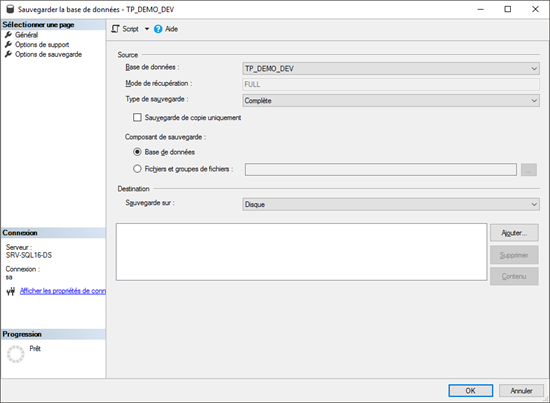


 


* Tapez le nom de votre fichier 
 au bout du chemin ou sélectionnez un fichier existant. Si le fichier 
 n’existe pas, il sera créé lors de la sauvegarde. Sur un fichier existant, 
 Microsoft SQL Server 
 fera soit une sauvegarde incrémentielle soit remplacera le fichier 
 de destination en fonction des paramètres défini dans les options 
 de sauvegarde (par défaut c'est une incrémentielle)


 


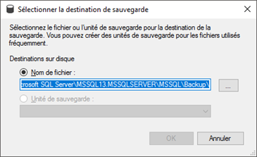


 


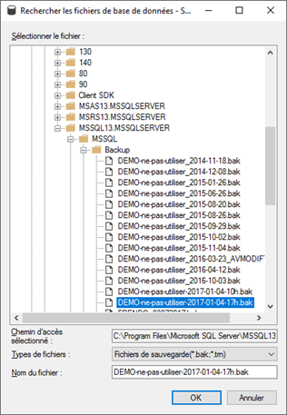


 


* Cliquez sur "OK"


 


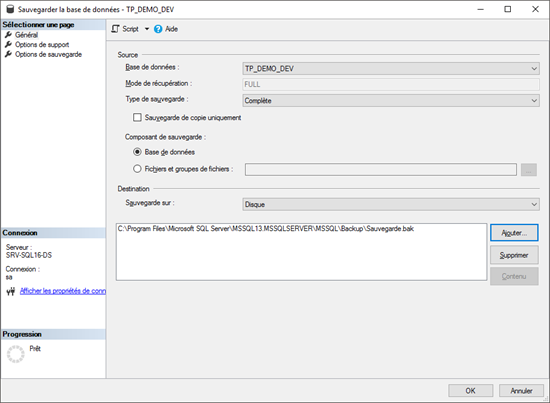


