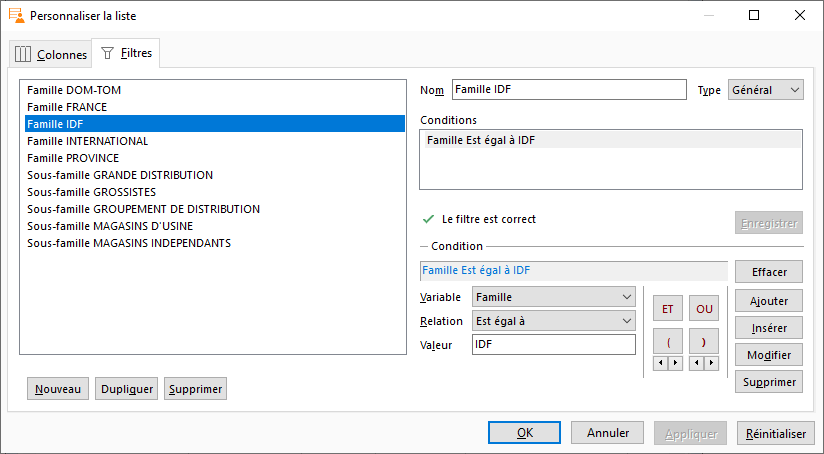

# Personnalisation d'une liste

Il est possible de paramétrer à partir du menu contextuel de chaque 
 liste :

 

- les colonnes à afficher, leur apparence et 
 leur ordre :

 

 

- définir des filtres afin d'obtenir des onglets 
 en entête de liste :

 

