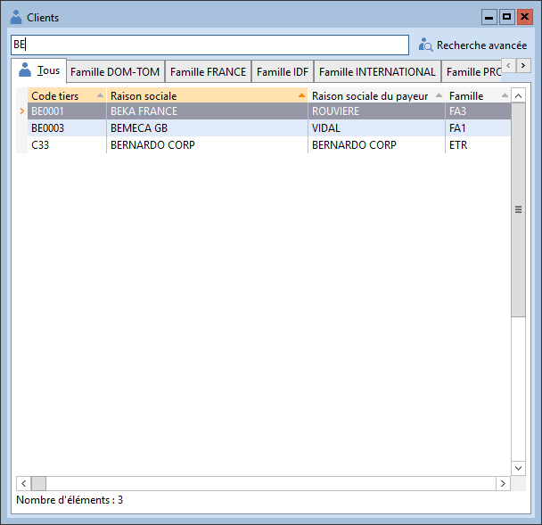
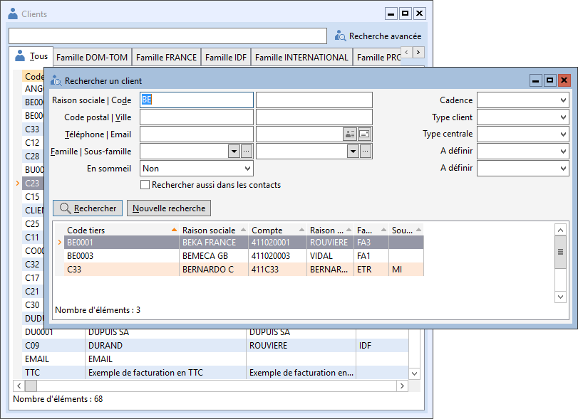

# Recherche dans les listes

## Zone de recherche

La zone de recherche permet de saisir les premiers caractères d'une donnée à rechercher :

 

 

La recherche s'effectue suivant le critère de tri courant.

 

Le logiciel positionne automatiquement la ligne active sur la donnée la plus proche (mode Normal) ou extrait les données répondant à cette recherche (modes Rapide et SQL).

 

De plus en mode SQL avec moteur SQL, vous pouvez utiliser le signe % qui remplace une chaîne de caractère inconnu.

 

Exemple : %BE extrait toutes les données contenant "BE"

## Recherche avancée

Dans la liste des articles, des clients, des fournisseurs et des prospects, l’appel à la recherche avancée via Ctrl + F ouvre une fonction de recherche particulière différente de la recherche standard (Ctrl + G).

 

## Recherche simple

## 

