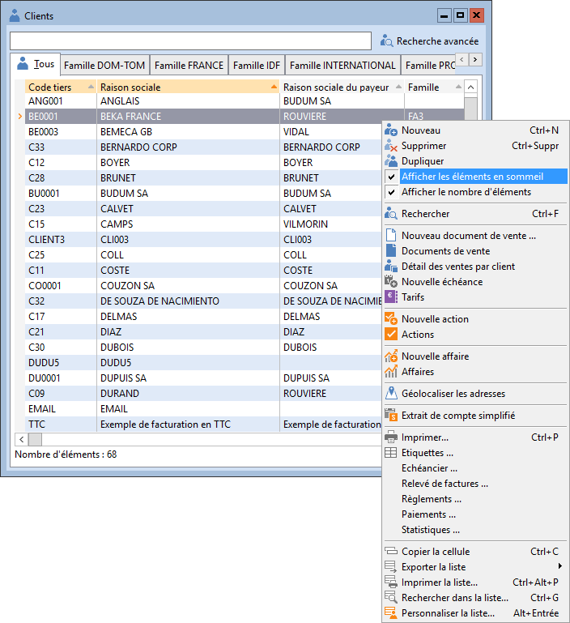

# Eléments en sommeil dans les listes
Dans la plupart des fonctionnalités, par exemple les articles, les clients ou les comptes, vous pouvez mettre en sommeil certains éléments.

 

Ces éléments en sommeil sont par défaut masqués dans les listes.

 

Vous pouvez les afficher si vous le souhaitez, en cochant l'option "Afficher les éléments en sommeil" dans le menu contextuel.

 

