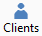

# Onglets et colonnes des listes

## Onglets

Lorsque des filtres ont été définis, la liste affiche des onglets complémentaires.

## Colonnes

Les colonnes de tri sur lesquelles il est possible de trier la liste font apparaître un petit triangle. Un clic sur le titre de la colonne permet de trier la liste suivant ce critère (croissant/décroissant).

 

Vous pouvez une colonne en drag and droppant le titre de celle-ci à l’emplacement souhaité. Pour ajouter ou supprimer une colonne, voir les Propriétés de la liste/grille.

## Images au début des lignes

Pour faciliter le travail dans la grille, les icônes suivantes apparaissent sur le bord gauche des lignes en fonction de l’opération en cours :

 

*  Sélection de la ligne
*  Saisie de la ligne
*  Modification d’une ligne

## Déplacement dans la liste

Le déplacement dans une liste de données / de document ou de fiche en fiche peut se faire par les touches de clavier, la souris ou la barre d'outils :

 

* Flèche basse : déplace le curseur sur la ligne inférieure
* Flèche haute : déplace le curseur sur la ligne supérieure

* Ctrl + Début : déplace le curseur sur la première ligne

* Ctrl + Fin : déplace le curseur sur la dernière ligne (Attention ! ! à éviter en mode SQL)

## Création, modification, consultation, impression

La création, la modification, la consultation et l'impression s'effectuent à partir de la barre d'outils, ou à partir des combinaisons de touches claviers.

## Menu contextuel

Sur toutes les listes, un menu contextuel est accessible par simple clic droit ou par appui sur la touche Menu.

 

Ce menu propose les fonctions classiques accessibles par la barre d'outils ainsi que les fonctions spécifiques à la liste/grille/fiche courante, la duplication de fiche, l'export des données, l'impression d'une ou des données de la liste, la recherche standard de la grille, l'accès aux propriétés de la liste/grille.

 

Ce menu est très utile et très facile d'accès

## Personnalisation

La personnalisation des listes est accessible depuis partir le menu contextuel.

 

Elle permet de paramétrer les colonnes et le contenu de la liste.

