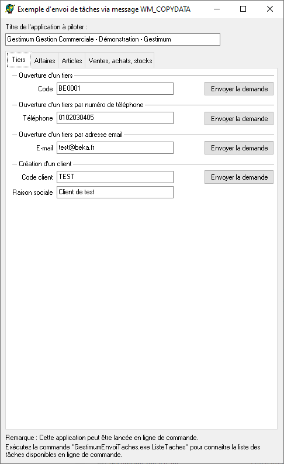
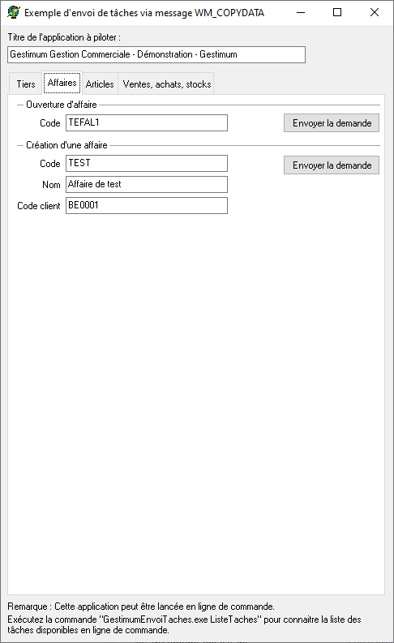
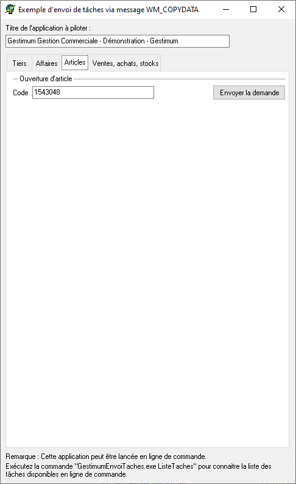
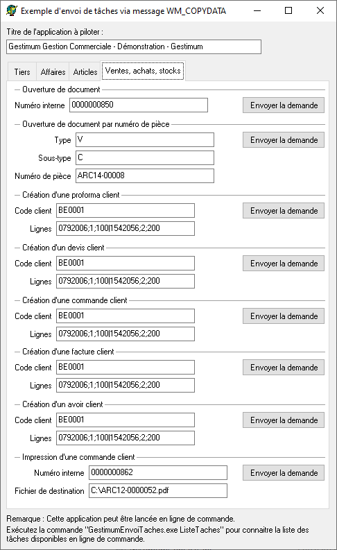

# Application "Exemple d'envoi de tâches via message WM\_COPYDATA"
Cet application est un exemple d'implémentation d'envoi de tâches via 
 message WM\_COPYDATA.

## Tiers

## Affaires

## Articles

## Ventes, achats et stocks

## Code Delphi

Vous trouverez le code Delphi lancé par les boutons de cette application 
 dans l'exemple de code fourni dans la documentation de chaque tâche.

