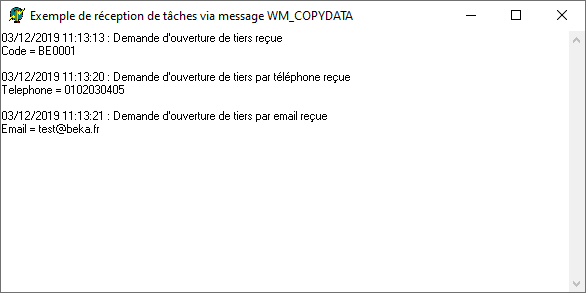
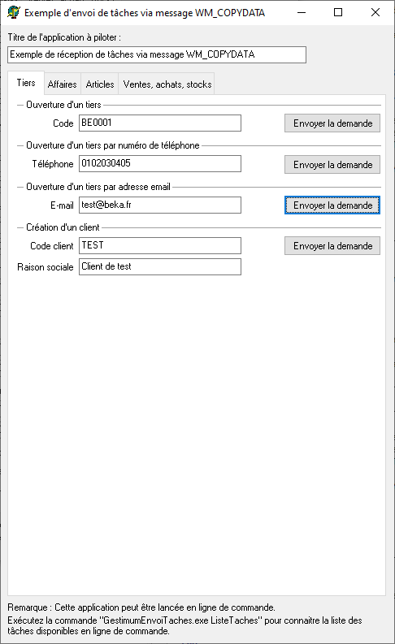

# Application "Exemple de réception de tâches via message WM\_COPYDATA"

Cet application est un exemple d'implémentation de réception de tâches via message WM\_COPYDATA.

 

 

Elle peut permettre de tester que l'envoi de tâches depuis une application tiers fonctionne bien.

 

L'exemple au dessus a été obtenu en utilisant l'application ["Exemple d'envoi de tâches via message WM\_COPYDATA"](../7/ApplicationExempleEnvoiTaches.md) comme ceci :

 

