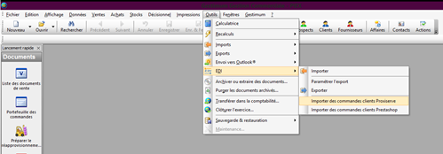
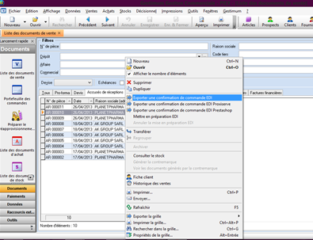
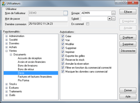
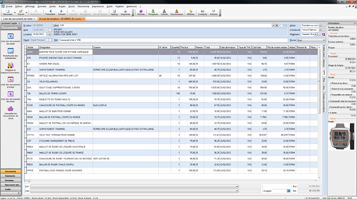
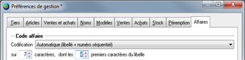
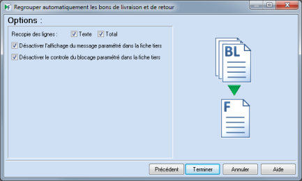
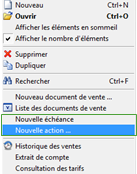
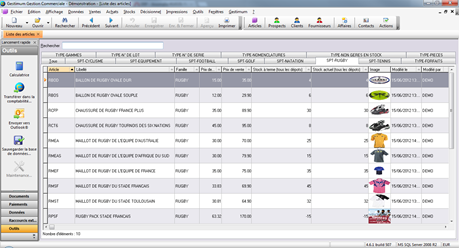
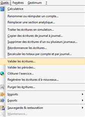
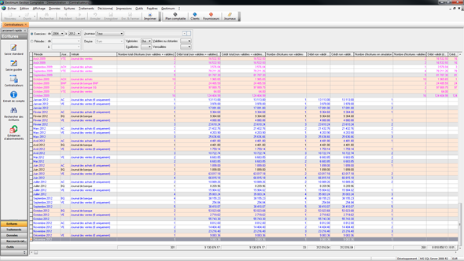

Version 4.7.13 build 568 du 26/03/2013

/\*<![CDATA[\*/
A:visited {
 color: #0E7EB1;
}
A:link {
 color: blue;
}
/\*]]>\*/

 

Pour les utilisateurs de versions antérieures à la 4.6, un nouveau code 
 de débridage est nécessaire : Pour l’obtenir, solliciter debridage@gestimum.com 
 via le menu "Gestimum\Débrider mon ERP".

 

Gestimum Erp a été testé avec succès sous Windows 8 Release Preview.

 

 

## Gestimum Gestion commerciale PME - Evolutions

 

#### Gestion des flux de commandes EDI au format Proxiserve

 

Il est désormais possible d’importer les commandes client aux formats 
 Proxiserve et d’exporter les confirmations (ou accusés réception)

 

 

 

Contacter l’Assistance Gestimum pour obtenir la fiche thématique

 

#### Commentaires à la ligne de la grille de tarif

Un champ « Commentaire » texte a été ajouté à la fiche Grille de tarif 
 au niveau de l’entête et des lignes [14853-16269]

#### Filtrer les données de vente en fonction du commercial connecté

La fonction « Sélection tiers limitée au commercial » disponible 
 dans les préférences de gestion (Onglet Tiers) est remplacée par un droit 
 utilisateur étendu aux données suivantes  [Disponible en gamme 
 PME] [14020-14676-14677-12423-14684] :

-       Liste 
 des Affaires : filtre sur le commercial du Tiers de l’affaire

o   Onglet 
 Budget – Ventes : lors de l’ajout de lignes ou de pied de documents, 
 filtre sur le commercial du document (Attention dans le cas de commerciaux 
 différents à la ligne de document, la restriction n’est pas gérée).

o   Onglet 
 Réalisé – Achats, ventes : filtre sur le commercial du document et de 
 la ligne.

o   Le 
 cas de plusieurs commerciaux sur la même affaire n’est pas filtré pour 
 le moment ; utiliser la restriction « Voir » en décochant 
 la case.

-       Liste 
 des Contacts : filtre sur le commercial du Contact du Tiers.

-       Liste 
 des documents de vente : filtre sur le commercial du document.

o   Attention 
 dans le cas de commerciaux différents à la ligne de document, la restriction 
 n’est pas gérée.

-       Liste 
 des Actions : filtre sur le commercial de l’action du Tiers.

-       Historique 
 de ventes par article : filtre sur le commercial du document et de 
 la ligne.

-       Historique 
 des ventes par clients : filtre sur le commercial du document et 
 de la ligne.

 

Cette évolution permet notamment de traiter le cas des Commerciaux Managers 
 (visualisation des données de leurs commerciaux).

Les droits permettent également de masquer les listes et fiches sans 
 commercial attribué : La case « Masquer les données sans commercial » 
 ne fonctionne que si la case « Filtrer les données en fonction du 
 commercial connecté » est cochée.

 

Pour compléter le filtrage des données en fonction du commercial connecté, 
 il faut restreindre également les droits suivants :

·         Décisionnel\Statistiques 
 de vente

·         Décisionnel\Tableaux 
 de bord

·         Ventes\Encaissements\Echéances

·         Ventes\Encaissements\Relances

·         Impressions\ 
 …

  

 

#### Stock réservé & Stock disponible

Possibilité de réserver un stock d’articles 
 (de type pièce ou nomenclature géré en stock, avec ou sans gamme / n° 
 de lot) à partir d’un devis ou d’une commande client (clic droit à 
 la ligne de document : Réserver le stock / Annuler la réservation) [Disponible 
 en gamme PME] [14404-14166-14608]

 

Attention, lors d’un transfert de devis en commande client, le recalcul 
 de la quantité disponible peut engendrer une quantité négative si l’utilisateur 
 effectue une sortie de stock entre le devis et la commande. Il n’y a pas 
 de contrôle sur le stock disponible lors de mouvements opérés à partir 
 des documents de stock.

 

 

 

 

o   Ajout 
 d'une option (Préférences de gestion) permettant la réservation automatique 
 sur stock disponible à la commande client.

o   Ajout 
 de droits utilisateurs spécifiques (Ventes\Devis et Commande) à la Réservation 
 du stock et à l’Annulation du stock.

 

o   Ajout 
 de champs complémentaires à la ligne de document [14014] 
 :

- Stock actuel (dépôt du document),

- Stock actuel (tout dépôt),

- Stock actuel réservé au devis en cours (du dépôt du doc),

- Stock actuel réservé au devis en cours (tout dépôt),

- Stock actuel réservé à la commande en cours (du dépôt du doc),

- Stock actuel réservé à la commande en cours (tout dépôt),

- Stock actuel disponible (dépôt du document) = Stock actuel – 
 Réservation (Devis + Commande),

- Stock actuel disponible (tout dépôt),

- Commande clients en cours (dépôt du document),

- Commande clients en cours (tout dépôt),

- Commande fournisseurs en cours (dépôt du document),

- Commande fournisseurs en cours (tout dépôt),

- Stock à terme (dépôt actuel) = Stock actuel – Commandes clients + 
 Commandes fournisseurs,

- Stock à terme (tout dépôt),

- Réservé le,

- Réservé par,

- Réservation annulée le,

- Réservation annulée par,

 

Les colonnes contenant les noms des dépôts sont maintenant personnalisables 
 dans la liste des articles. Le nom du dépôt est représenté sous forme 
 de variable #NomDepot [14628-14678]

 

o   Evolution 
 des listes d’affichage suivantes en conséquence :

- Liste des articles,

- Fiche article (onglet stock),

- Consultation du stock, consultation du stock d'un article et de ses 
 équivalences,

- Outil de recalcul des stocks,

- Portefeuille des commandes,

- Archivage.

 

o   Evolution 
 du volet d’informations (documents achats & ventes + lignes de documents) 
 [14392-14400-14402] 
 :

- Ajout de bulles d'aide au-dessus de chaque étiquette et chaque information

- Allégement des textes en supprimant les redondances suite à l'ajout 
 de titres :

"Marge du document" devient "Document"

"Taux de marge" disparait

"Stock actuel" devient "Actuel"

"Stock réservé au devis" devient "Réservé au devis"

- Dans le volet d'informations de la fiche 
 du document de vente [14402] :

Ajout d'un "+" devant "Stock réservé au devis"

Ajout d'un "+" devant "Stock réservé à la commande"

Ajout d'un "=" devant "Stock disponible non réservé"

Ajout d'un "+" devant "Stock commandé chez les fournisseurs"

Ajout d'un "-" devant "Stock commandé par les clients"

Ajout d'un "=" devant "Stock à terme"

 

Les informations qui concernent les réservations sont indentées, pour 
 montrer qu'elles n'entrent pas dans le calcul du stock à terme, mais uniquement 
 dans le calcul du stock disponible non réservé.

 

#### Codification automatique des affaires

 

Ajout dans les préférences de gestion – onglet Affaires [14238-14553-14579-14603]

 

 

Codification code affaires : Manuelle, Automatique (raison sociale + 
 n° séquentiel), Automatique (compteur), sur « n » caractères 
 dont « n » premiers caractères de la raison sociale.

 

 

Dans le même temps, les droits Utilisateurs 
 « Affaires », « Entête », « Général » et 
 « Champs personnalisés » ont été séparés.

#### Contrôle des doublons sur raison sociale lors de la création d’un tiers

 

Dans le cas d’un doublon, le message suivant s’affiche « Attention, 
 il y a un autre tiers avec la même raison sociale ». Le critère de 
 recherche est insensible à la Casse [15026]

 

#### Appel de l’article à partir de la référence client ou la référence 
 fournisseur à partir d’une ligne de document d’achat, de vente ou de stock

 

Ajout des champs de recherche dans les préférences de gestion\Préférences 
 générales\Recherche d’article [16173]

 

#### Import des champs personnalisés dans les documents et les lignes de 
 vente et d’achat

[15539]

 

Il est également possible d’importer le 
 code transporteur TRP\_CODE

  

 

#### Ajout de la date de livraison dans l'historique des achats/ventes des 
 articles

[16178]

 

A partir du menu contextuel, propriété 
 de grilles, possibilité d’ajouter la date de livraison dans l’historique 
 des achats/ventes des articles. 

#### Evolution du regroupement des BL en facture pour exclure du process 
 les clients « bloqués »

 

 

 

Ajout d’une case à cocher en page 3 du regroupement des BL/BR pour ignorer 
 l’option « Bloquer la fiche client » [15945]

 

 

 

 

 

#### Image 
 de l’article visualisable dans le volet d’informations

 

Ajout de l’image de l’Article (onglet Infos) dans le volet d’informations 
 du document (achat ou vente) [14395]

 

#### Ajout d’une option dans la préparation de Déclaration d’Echanges de 
 Biens (DEB) permettant de choisir le sous type de document

**Â**[15085-15128-15130-15152-15166]

 

Initialement, seuls les Factures / Avoirs / Factures financières / Avoirs 
 financiers étaient intégrés dans le calcul de la préparation. Il est maintenant 
 possible de sélectionner l’option « Calculer à partir des bons de 
 livraison & réceptions / bons de retour au lieu des factures 
 et avoirs ».

Pour faciliter la préparation de la DEB, lorsque l’option « Afficher 
 la totalité des lignes sans les regrouper par article » est cochée, 
 nous avons ajouté les colonnes :

·         Types 
 (achat ou vente) de document,

·         Sous-types 
 (bon de livraison, bon de retour, facture, avoir, avoir financier, facture 
 financière) de document,

·         Etats 
 (Transféré, En cours, Comptabilisé, Transféré partiellement),

·         Date 
 de document.

 

 

 

Les lignes détaillées ayant un sous-type Avoir, Avoir financier, 
 Bon de retour sont affichées en rouge pour repérer les natures de la DEB 
 à saisir (11 : Achat/vente ferme, 21 : Retour de biens, … se 
 référer à la douane & Pro-Douane pour plus d’informations)

  

 

#### Affichage des totaux en bas des colonnes quantité en stock et quantité 
 inventoriée dans les documents d’inventaire

**Â**[15878]

#### Affichage des totaux en bas des colonnes des montants en devise société 
 et en euro dans la génération des relances et dans les onglets de consultation 
 de relances

**Â**[15875]

#### Réordonnancement des lignes de document d’achat et de vente par code 
 article et par gamme

**Â**[15916]

 

#### Menu contextuel des listes & des fiches enrichi

                       [15121]

 

·         Tiers 
 : Possibilité de créer directement à partir du tiers une « Nouvelle 
 action »

·         Contacts : 
 Possibilité de créer directement à partir du contact une « Nouvelle 
 action »

 

D’autres enrichissements à suivre dans les versions suivantes.

 

 

 

 

#### Nouvelle base de données d’essais

 

 

 

 

Cette nouvelle base d’essais présente une entreprise fictive de vente 
 en gros et au détail commercialisant principalement des articles :

·         de 
 jardinage

·         de 
 sport

En préparation de l’API Gestimum (connecteur e-commerce, liaisons avec 
 applications externes…), nous avons intégré un catalogue d’images articles.

 

  

 

## Gestimum Gestion comptable PME - Evolutions

 

#### Distinction entre « Validation des écritures » comptables et « Clôtures 
 des périodes »

                        [14362-14420-14431-14432-14434-14438-14444-14446-14465-14475-14544-14592-14593-14601-14613]

 

 

 

 

Attention : Le terme de « Clôture » sous-entendu mensuelle 
 est remplacé par « Validation » :

- Centralisateurs : liste déroulante « Clôturés » pour filtrer, 
 clic droit « Clôturer », colonne « Clôturé », champ 
 dans la base de données,

- Clôture mensuelle : devient « Validation de périodes » 

- Clôture d'écritures : devient « Validation d'écritures »

- Saisie d'écritures (entête du journal) : 2 étiquettes « Clôturée » 
 et « Non clôturée » changées

- 159 occurrences modifiées dans l’application en dehors des fenêtres 
 (messages ou titres ou étiquettes).

 

 

 

Plusieurs types de validation et clôtures sont maintenant disponibles 
 dans l’application :

- Validation individuelle des écritures comptables permettant la saisie 
 complémentaire ou la modification d’écritures non validées sur la même 
 période (nouvelle fonctionnalité).

- Validation de période(s) permettant de verrouiller toutes saisies, 
 modifications ou suppressions sur le ou les périodes sélectionnées (fonction 
 existante – anciennement clôture de période).

- Clôture d'exercice annuelle (fonction existante).

 

Ajout des champs suivants (Ecritures et centralisateurs) : « Validé 
 le », « Validé par ».

Ajout des champs suivants dans la Validation de période : « Type 
 de journal ».

 

Attention le champ « ECR\_CLOT » est renommé « ECR\_VLDEE » ; 
 ce renommage de champs dans la base de données est exceptionnel, il impacte 
 les états et tableaux de bord que vous auriez réalisés. Pour plus d’informations, 
 contacter l’assistance.

 

#### Remplacement de la terminologie « Pièce » par Ecritures

 

Attention : Le terme de « Pièce » sous-entendu comptable 
 est remplacé par « Ecriture » plus adapté et « Ecriture » 
 est remplacé par « Ligne » d’écriture. [14472]

 

#### Refonte de la fenêtre Centralisateurs

                              [14414-14417-14415-14469-14479-14497-14613]

 

Lors de la migration de la base, un recalcul des totaux par comptes 
 et par journal (tous les centralisateurs) est automatiquement effectué 
 suite à l’ajout des nouvelles colonnes suivantes :

-       Montant 
 Débit, Crédit (dans la devise du journal, en euro),

-       Montant 
 Débit, Crédit (total, validées, non validées, en simulation),

-       Nombre 
 d’écritures (total, validées, non validées, en simulation),

-       Nombre 
 de lignes d’écritures (total, validées, non validées, en simulation),

-       « 
 Prochain n° de pièce »,

-       « 
 Prochain n° d’ordre »,

-       « Validé 
 le » : période validée le,

-       « Validé 
 par » : utilisateur ayant fait la validation de la période.

 

Possibilité d’accéder, depuis le menu contextuel des centralisateurs, 
 directement aux menus Outils :

-       « 
 Traiter les écritures en simulation »,

-       « Valider 
 les écritures » (individuellement) de la période concernée,

-       « Valider 
 la période » de la période concernée.

 

 

Dans la consultation des centralisateurs, les colonnes suivantes ont 
 été renommées :

-       « Réservé 
 par » est remplacée par « Verrouillé par »,

-       « Débit brouillard 
 » et « Crédit brouillard » sont remplacés par « Débit non 
 validé » » et « Crédit non validé ».

  

 

## Autres évolutions & correctifs ERP

 

| CIBLE | CATEGORIE | SUJET | N° |
| 4.7.15 | G-Achats et Ventes | Le montant de l’acompte en 
 pied est de nouveau correctement transféré de la commande vers 
 le bon de livraison | 16734 |
| 4.7.15 | G-Achats et Ventes | La deuxième ligne de la TPF 
 dans la grille de TPF dans une facture ne disparaît plus lors 
 d’un transfert de document | 16883 |
| 4.7.15 | ERP-Encaissements & Décaissements | La fenêtre d’impression « Impressions : 
 Paiement » ne retourne plus de valeur inattendue si la sélection 
 est faite pour les paiements « Non remis en banque » | 16215 |
| 4.7.15 | G – Achats et Ventes | Lors du transfert d’une commande 
 en BL, le stock réservé à la commande est bien mis à jour : après 
 le transfert, le stock réservé-commandé et le stock à terme (réel) 
 sont diminués de la quantité transférée. | 16243 |
| 4.7.15 | G – Import & Export | Correction de la correspondance 
 des champs dans l’import des prospects et tiers | 14845 |
| 4.7.15 | G – Transfert Comptable | Le transfert comptable de 
 facture incluant une TPF utilisant le coefficient 2 dans sa formule 
 s’effectue correctement lorsque qu’un prorata 2 a été paramétré 
 dans les préférences | 16222 |
| 4.7.14 | Achats-Ventes | Perte d'échéance sur transfert partiel (commande 
 client) corrigée. | 16176 |
| 4.7.14 | Achats-ventes | Un n° de lot contenant une apostrophe générait 
 un message d’erreur. | 16224 |
| 4.7.14 | Tiers | L’apostrophe contenue dans la raison sociale 
 ne permettait plus d’enregistrer la fiche tiers. | 16046 |
| 4.7.14 | Stocks | Un article non géré en stock n’affiche plus 
 de stock à terme dans « consulter le stock d'un article et 
 de ses équivalences ». | 16179 |
| 4.7.14 | ERP-Encaissements & Décaissements | Il n’y a plus de message d’erreur en cliquant 
 sur le bouton « Imprimer échéances » dans la fenêtre 
 règlements et remises des échéances. | 16174 |
| 4.7.13 | Ecritures | Impression du journal des écritures : 
 le correctif permettant l’impression du journal des écritures 
 a été réalisé. | 16027 |
| 4.7.13 | Achats-Ventes | Ajout du stock disponible dans la liste déroulante 
 de sélection des lots dans les documents d’achats et ventes. | 17329 |
| 4.7.13 | Affaires | Augmentation du code Affaires sur 20 caractères | 17323 |
| 4.7.13 | Import Tarifs | Autoriser les remises en cascade dans l’import 
 des grilles de tarifs | 17326 |
| 4.7.12 | Tiers | L’encours client échu tient compte maintenant 
 des échéances marquées comme soldées. | 15871 |
| 4.7.12 | Affaires | Le tableau de bord ne tient plus compte des 
 informations de conditionnement de la fiche article pour le calcul 
 de la marge, mais bien de celles de la ligne du document. | 14881 |
| 4.7.12 | Affaires | Le tableau de bord prend bien en compte la 
 case à cocher « TTC » du tiers et calcul correctement 
 la marge en HT. | 14993 |
| 4.7.12 | Achats-Ventes | La quantité est de nouveau correcte dans le 
 mouvement de stock des composants de niveau supérieur ou égal 
 à 2 quand on vend un article nomenclaturé ou un forfait non géré 
 en stock. | 15704 |
| 4.7.12 | Assemblage | L’enregistrement d’une fiche d’assemblage est 
 de nouveau possible après création/modification. | 15879 |
| 4.7.12 | Ecritures | L’impression du journal d’un exercice n’affiche 
 plus en dernière page, une période comptable erronée, mais bien 
 les bornes de l’exercice concerné. | 15746 |
| 4.7.12 | Outils Comptabilité | Il est de nouveau possible de copier les écritures 
 d’un journal à un autre sans message d’erreur « Syntaxe incorrect 
 vers le mot from ». | 15793 |
| 4.7.12 | Tarifs et Promotions | Les grilles de tarif en sommeil ne sont plus 
 prises en compte dans les documents d’achat et de vente. | 15872 |
| 4.7.12 | Import d’écritures | Renforcement du contrôle du format des échéances 
 lors des imports. Ceci ne génère plus d’erreur de règlement ou 
 de lettrage. | 14605 |
| 4.7.11 | Achats-Ventes | Le code affaire en entête de document n’est 
 plus un élément bloquant pour regrouper des documents. | 15475 |
| 4.7.11 | Achats-Ventes | Il est maintenant possible de transférer une 
 facture en avoir pour conserver l’origine des documents. | 15585 |
| 4.7.11 | Achats-Ventes | Le message d’erreur « Champ LIG\_FRENDU 
 non trouvé » lors de la saisie d’un document est maintenant 
 traité. | 15672 |
| 4.7.11 | Ecritures | Les écritures sont de nouveau triées par date 
 dans l'impression du journal des écritures. | 15475 |
| 4.7.11 | EDI-Ventes | Il est maintenant possible de transférer une 
 facture en avoir pour conserver l’origine des documents (N° de 
 facture associée notamment). | 15585 |
| 4.7.11 | EDI-Ventes | 3 informations ont été revues dans les exports 
 EDI au format XML, dans UNB\e01\_0020 et UNH\e01\_0062 et RFF\ON. | 15616 |
| 4.7.11 | ERP-Utilisateurs & Salariés | Les droits utilisateurs sont bien pris en compte 
 lors de modifications après enregistrement. | 15622 |
| 4.7.11 | Stocks | Lorsqu'un AR client était supprimé avec des 
 articles en stock réservé, la réservation restait effective. C’est 
 maintenant corrigé. | 15630 |
| 4.7.10 | Achats-Ventes | Possibilité de modifier les quantités & 
 les prix des composants d’un article de type Forfait après validation. 
 Conditions : les composants ne doivent pas être gérés en 
 stock. | 15363
15468 |
| 4.7.10 | Achats-Ventes | Possibilité de sélectionner une nomenclature 
 non gérée en stock ou article de type Forfait dans un document 
 d'achat. | 15470 |
| 4.7.8 | Achats-Ventes | L'historique des achats et des ventes affiche 
 de nouveau tous les documents reliés à l'article. | 15268 |
| 4.7.8 | Achats-Ventes | La suppression d’un AR avec des articles en 
 stock réservé ne mettait pas à jour le stock disponible. La réservation 
 restait effective. | 15323 |
| 4.7.8 | EDI-Ventes | Un nouveau format d'export EDIFACT sous forme 
 CSV est disponible à partir du menu contextuel de la liste des 
 documents ou de l'entête du document. | 15247 |
| 4.7.8 | Stocks | Lorsqu'un AR client était supprimé avec des 
 articles en stock réservé, la réservation restait effective. C’est 
 maintenant corrigé. | 15323 |
| 4.7.7 | Contacts | Le message « ‘’ n’est pas une valeur entière 
 correcte » ne s’affiche plus lors de l’ouverture d’une fiche 
 contact. | 15142 |
| 4.7.7 | Centralisateurs | Mise des centralisateurs de nouveau opérationnel 
 après la clôture annuelle. | 14983 |
| 4.7.7 | Clôtures & Validations | Le message d'erreur lors du lancement du recalcul 
 « Objet Parameter défini de manière incorrecte. Des informations 
 incohérentes ou incomplètes ont été fournies. » est maintenant 
 corrigé. | 15056 |
| 4.7.7 | Ecritures | Saisie est de nouveau possible dans un journal 
 lorsque la numérotation de pièce de ce journal est en continue 
 ou périodique. | 15181 |
| 4.7.7 | Erp-Infra | Icônes « Suivant »  « Précédent » : 
 Possibilité de naviguer de fiche en fiche en ayant établi un filtre  au 
 préalable. | 11186 |
| 4.7.6 | Achats-Ventes | La quantité réservée se met correctement à 
 jour si le livré est supérieur à la quantité en reliquat. | 15000 |
| 4.7.5 | Stocks | Le message d’Erreur "Paramètre pDoc non 
 trouvé" lors de l'enregistrement d'un document d'inventaire 
 est corrigé. | 14995 |
| 4.7.4 | Achats-Ventes | Les documents d’achat n’affectent plus la réservation 
 de stock. | 14960 |
| 4.7.4 | ERP-Encaissements & Décaissements | Il est de nouveau possible de saisir un règlement 
 supérieur au montant total de 2 factures ; La règle d'écart de 
 règlement est de nouveau respectée : il n'y a plus de message 
 : "Le montant de ce règlement n'est pas entièrement affecté". | 14914 |
| 4.7.4 | ERP-Utilisateurs & Salariés | Lors du filtrage des données de ventes au commercial 
 connecté, l’historique des ventes n’était plus filtré. | 14933 |
| 4.7.3 | Stocks | Correctif concernant le calcul du DPA & 
 PMA dans un cas particulier si le BLF est entré de manière rétroactive. | 14656 |
| 4.7.2 | EDI-Ventes | L’import des commandes EDI sous forme EDIFACT-XML 
 est de nouveau opérationnel. | 14727 |
| 4.7.1 | ERP-Encaissements & Décaissements | Le lancement de la recherche dans l’historique 
 des impayés n’affiche plus de de message d’erreur « Nom de 
 colonne PCF\_CODE ambigu ». | 14688 |
| 4.7.1 | ERP-Propriété des grilles | Dans les listes, il n'y a plus de message d'erreur 
 lorsqu'une colonne contenant un champ de type image ou texte illimité 
 est sélectionnée. | 14671 |
| 4.7.1 | Rapprochement bancaire | Dans la liste des rapprochements bancaires, 
 le code interne de l’état est remplacé par « En cours » 
 pour A et  « Validé » pour T. | 14313 |
| 4.7.0 | Achats-Ventes | Réorganisation de l'ordre des colonnes des 
 lignes de document de vente et d'achat, par sujet, pour une meilleure 
 compréhension. Valable :
- dans les propriétés de grilles des lignes de document de vente 
 et d'achat
- dans la documentation XML de la base de données
- dans SQL Server Management Studio (pour les nouvelles bases 
 de données). | 14361 |
| 4.7.0 | Achats-Ventes | Clarification du titre de la table "Stock 
 temporaire" dans la documentation de la base de données, 
 et aussi dans les fenêtres affichant à l'utilisateur le titre 
 de cette table comme l'export de données, etc... Le logiciel gère 
 dans cette table les réservations de stock des commandes clients 
 et fournisseurs en cours de saisie pas encore enregistrées. Par 
 exemple, s'il reste seulement 1 en stock et qu'une commande client 
 est en cours de saisie mais pas encore enregistrée, il ne sera 
 pas possible à un autre utilisateur de créer en parallèle une 
 autre commande client avec le même code article. | 14370 |
| 4.7.0 | Achats-Ventes | « Consulter le stock » du document dans la 
 liste des documents dans le menu contextuel -> Fonction disponible 
 maintenant pour tous les documents (Achats & Ventes). | 14451 |
| 4.7.0 | Achats-Ventes | Les cases à cocher "Non réglées" 
 "Réglées entièrement" et Réglées partiellement" 
 des documents de vente et "Non payés" "Payés entièrement" 
 et "Payés partiellement" des documents d'achat tiennent 
 compte maintenant des échéances soldées manuellement « Marquer 
 comme soldé » et « Soldées avec ». | 9214
13766
14121
14454 |
| 4.7.0 | Achats-Ventes | A l'appel d'un article gammé ou lotté à la 
 ligne de document, le volet d'informations affiche maintenant 
 les stocks : actuel, disponible et à terme de tous les articles 
 puis lorsque la gamme ou le lot est sélectionné, les informations 
 affichées dans le volet d'informations se réduisent à la gamme 
 ou au lot concerné. | 14658 |
| 4.7.0 | Affaires | Le message "Opération en virgule flottante 
 incorrecte" est corrigé lorsqu'une fiche Actions est créée 
 à partir de la fiche Tiers elle-même issue de la fiche Affaire 
 (Ouverture en fenêtre modale). | 14623 |
| 4.7.0 | Articles | Clarification des noms de la fiche Article 
 – onglet Compta : Dans la liste de formules de calcul de 
 TPF, remplacement de "Valeur" par "Prix brut" 
 et "Valeur nette" par "Prix net".  La 
 différence entre le prix brut et le prix net, ce sont les remises. 
 On peut demander un calcul de TPF sur le prix avant remise ou 
 sur le prix après remise. | 14317 |
| 4.7.0 | Contacts | Possibilité de sélectionner une des adresses 
 de la fiche tiers au contact de nouveau opérationnel. | 14075 |
| 4.7.0 | Clôtures & Validations | Ajout de la date de validation de la période 
 comptable et de l’utilisateur ayant fait la validation. Informations 
 disponibles dans :
- les centralisateurs,
- la recherche d'écritures,
- l'extrait de compte,
- l'extrait de compte simplifié,
- la saisie d'écritures (standard, au kilomètre). | 14417 |
| 4.7.0 | Déclaration de TVA | L'impression de la TVA sur encaissement est 
 maintenant triée, par compte et par date d'échéance (Correctif 
 sur modèle d’impression : TVA encaissee.TVAEnc – fichier 
 RPM). | 13761 |
| 4.7.0 | Ecritures | Ajout de la colonne ECR\_NUMERO (numéro interne 
 de la ligne d’écriture) permettant de créer des zones de texte 
 calculées par sous-requête utilisant le numéro interne d'écriture 
 et renvoyant d'autres champs qui n'ont pas été prévus dans la 
 requête initiale. Ceci permet notamment de personnaliser les éditions 
 en ajoutant les champs personnalisés à la ligne d’écriture. | 14405 |
| 4.7.0 | Ecritures | Le volet d’informations indique maintenant 
 pour chaque ligne d’écriture, la date de création, le traitement 
 (transfert comptable, saisie standard, …), le nombre de lignes 
 composant l’écriture, si la ligne est validée ou non, la date 
 de validation et la personne qui a validé l’écriture. | 14455 |
| 4.7.0 | Ecritures | La saisie au kilomètre est de nouveau disponible 
 sur l’exercice supérieur. | 14650 |
| 4.7.0 | ERP-Création de société | Le message « La tentative de connexion 
 a échoué » a été précisé en fonction du type d'erreur remonté 
 :
Exemples d'erreurs possibles :
- Erreur dans le nom de serveur,
- Erreur dans le nom de la base de données,
- L'accès au serveur ou à la base de données n'est pas autorisé 
 (par le pare-feu, SQL Server, etc.). | 14365 |
| 4.7.0 | ERP-Aide | L’aide est de nouveau consultable dans la Gestion 
 comptable. | 14374 |
| 4.7.0 | ERP-Encaissements & Décaissements | Module relances : « Exclure les échéances lettrées 
 » fonctionne de nouveau correctement. | 14345 |
| 4.7.0 | Erp-Infra | Lors de la création d'une nouvelle société, 
 la Table ECR\_BUDGET dans la base de données est supprimée car 
 non utilisée par le logiciel. Pas de changement sur les bases 
 existantes. | 14381 |
| 4.7.0 | ERP-Préférences | Les onglets des fiches Articles, Tiers, Affaires  peuvent 
 maintenant être affichées sur plusieurs lignes (option Préférences 
 utilisateurs – onglet options). | 13747 |
| 4.7.0 | Etats Financiers | SIG : Correctifs divers. | 14283
14386 |
| 4.7.0 | Import d’écritures | Un nouveau type de message d’anomalie a été 
 ajouté lors de l’import d’écritures : Rejet sur incident 
 : écriture correspondante non importée ! (Mémoire insuffisante). | 14356 |
| 4.7.0 | Import d’écritures | L’import des écritures et des comptes en ligne 
 de commande est de nouveau opérationnel. | 14494 |
| 4.7.0 | Import Tiers | Il est maintenant possible d’importer les champs 
 suivants en Import de Tiers :
- PCF\_BLOQUE
- PCF\_CASOC
- PCF\_CMPAPE
- PCF\_USRCRE
- PCF\_DATIMM
- PCF\_TC\_DA
- PCF\_EFF
- PCF\_AFFMES
- PCF\_MESSAG
- PCF\_ACCISE
- PCF\_RS2 | 14246 |
| 4.7.0 | Import Tiers | Les colonnes non présentes dans le fichier 
 lors de l'import ne sont plus effacées dans la fiche tiers. | 13934
14590
14246 |
| 4.7.0 | Outils Comptabilité | Réorganisation du menu Outils pour une 
 meilleure compréhension :
- Suppression du sous-menu Outils\Ecritures,
- Suppression du sous-menu Outils\Clôtures,
- Descente des fonctions moins métiers comme les imports/exports,
- Regroupement en haut des outils de gestion des écritures,
- Regroupement des clôtures (y compris pour la regénération 
 des à-nouveaux). | 14433 |
| 4.7.0 | Rapprochement bancaire | Evolution de la fenêtre en préparation d’un 
 nouveau module d’import des relevés de compte et de rapprochement 
 bancaire automatique. | 14587
14618 |
| 4.7.0 | Réapprovisionnement | L'étiquette "Stock réel" est remplacée 
 par "Stock actuel". | 14626 |
| 4.7.0 | Tiers | La géolocalisation est de nouveau opérationnelle 
 lorsqu'un caractère apostrophe est présent dans le champ rue de 
 l'onglet général de la fiche tiers. | 13615 |
| 4.7.0 | Transferts comptables | Le transfert d'une facture contenant un article 
 de type forfait ou nomenclature avec tous les composants avec 
 des quantités à zéro est de nouveau opérationnel. | 13786 |

 

