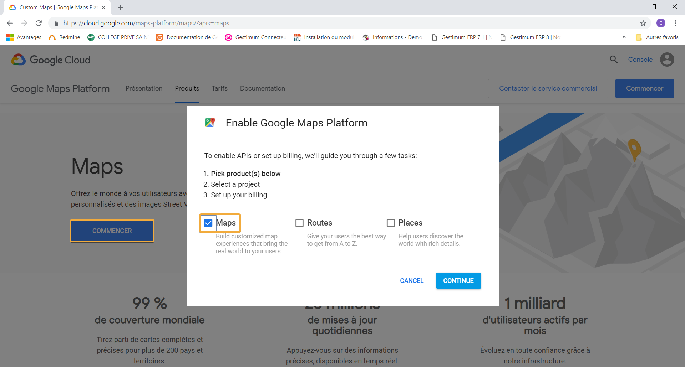

Version 8.1.0 build 822 du 10/01/2019

 

\* Les numéro de ticket en orange 
 correspond à des évolutions de l'ERP

 

### GEOLOCALISATION

#24763 - Mise en place dans 
 les préférences de gestion / Onglet Tiers / Adresses, d'une zone de saisie 
 'Clé Google Maps pour la géolocalisation multi-tiers', permettant d'utiliser 
 l'API Javascript Google Maps depuis l'ERP. Vous 
 pouvez vous procurer une clé API Javascript, depuis le site de Google <https://cloud.google.com/maps-platform/maps/> , 
 cliquez sur 'Commencer', puis cochez Maps dans la fenêtre de sélection 
 :

 

 

Puis 
 suivez les instructions, jusqu'à la génération de la clé API Javascript. 
 Un compte de facturation Google sera nécessaire.

 

Attention ! Depuis le 16 juillet 
 2018, l'utilisation des API de la plate-forme  Google Maps est devenu 
 payante. Google Maps Platform vous offre 200 $ d'utilisation mensuelle, 
 au delà une facturation sera effectuée. Vous pouvez définir des plafonds 
 d'utilisation pour faire en sorte de ne pas dépasser ce montant. 
 
  
### STOCKS

#24913 - Le type 
 d'inventaire est bien pris en compte lors de l'initialisation d'un nouvel 
 inventaire. 

 

 

 

 

