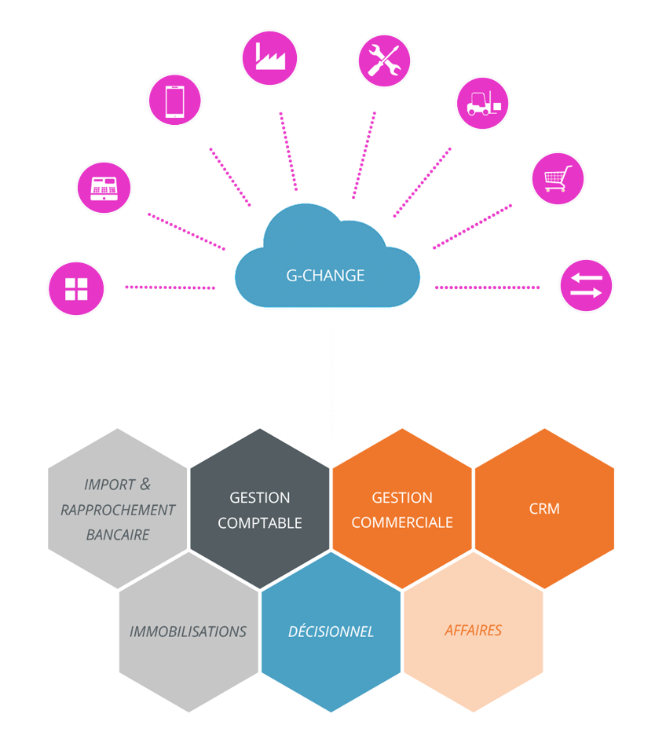

Version 9.4

# Version 9.4.3 Build 1153 du 17/10/2022

Cette version apporte des corrections dans les environnements suivants :

 

### ACHAT ET VENTE

#28494 - Les modifications opérées dans une commande issue d'un devis, impactant la valeur du document, entraîne l'actualisation du montant restant sur le total des échéances initiales du devis d'origine.

#28517 - Le changement du type d'échéance, dans l'échéancier d'un document d'achat ou de vente, actualise le montant restant sur le total des échéances initiales.

#28552 - Le regroupement d'un ensemble d'accusés de réceptions contenant chacun un ensemble d'échéances en un seul accusé de réception, tient compte des différents montants, types et modes de règlements présents dans l'échéancier des documents d'origine.

#28597 - Le montant restant sur le total des échéances initiales de la commande s'actualise après modification des quantités présentes dans le bon de livraison issu de cette commande.

### STOCK

#26121 & #28153 - Correction du message "Conversion de type variant incorrecte" lors de la validation d'inventaire, pendant le calcul des quantités commandées à partir des composants de lignes de type Nomenclature ou Forfait.

### IMMOBILISATIONS

#28571 - L'absence de compte fournisseur dans l'onglet "Entrée" de la fiche immobilisation ne bloque pas la comptabilisation de la cession de l'immobilisation.

 

# Version 9.4.2 Build 1143 du 13/01/2022

Cette version apporte les corrections suivantes :

### ACHAT ET VENTE

#28045 - Correction de l'erreur "Erreur lors de la lecture de l'échéance 0." à l'enregistrement d'une modification dans un BL issu d'un regroupement d'AR dont 1 AR avec une valeur totale de 0.

#28073 - Lors de la duplication d'un document dans un même sous-type de document, l'option "Sélectionner manuellement les quantités à copier" est disponible.

#28106 - Lors d'un regroupement de plusieurs commandes en bon de livraison, si l'une des commandes est au statut "transféré partiellement", cette dernière sera également regroupée.

#28117 - Le statut d'une commande passée au statut "Transféré" suite à un abandon de reliquat après avoir été transférée partiellement en bon de livraison, ne s'actualise pas lors de la mise à jour du bon de livraison associé. 

#28122 - L'échéance du document s'actualise après modification des lignes dans une facture issue d'un regroupement de bons de livraison.

### ENCAISSEMENTS ET DÉCAISSEMENTS

#28058 - La colonne "Devise" des échéanciers reprend le code devise du document associé.

### REPORTBUILDER

#28128 - La fonction CalculTVAPied prend en charge la case à cocher "En TTC" présente dans les documents d'achats / ventes.

### EXTRAITS DE COMPTES

#27948 - La case à cochée "Exclure les comptes non mouvementés" n'exclut plus les comptes mouvementés, entièrement lettrés et avec un solde égal à 0 sur le même exercice. Le filtre sur le lettrage présent dans la fenêtre est maintenant pris en compte.

 

# Version 9.4.1 Build 1140 du 07/10/2021

Cette version apporte les corrections suivantes :

### ACHAT ET VENTE

#27994 - L'échéance de la facture n'est plus supprimée lors de la saisie d'une retenue de garantie si un document d'acompte est présent dans le chaînage de document.

#27997 - L'échéance de la facture issue d'un regroupement de bons de livraison contenant des échéances antérieures se calcule correctement.

#28012 - La date d'échéance de la retenue de garantie se calcule bien à J + 1 an.

### ÉCRITURES

#27995 - Correction de l'affichage de l'échéancier de l'écriture comptable issue d'un transfert de facture associée à une échéance d'acompte.

#27996 - Correction de l'affichage de l'échéancier de l'écriture comptable issue d'un transfert de facture associée à une échéance de retenue de garantie.

 

# Version 9.4.0 Build 1136 du 15/09/2021

### ÉVOLUTIONS PRINCIPALES

Cette version intègre :

* une quasi refonte du module immobilisations
* de nouveaux composants ReportBuilder

### Autres évolutions & correctifs (n° de ticket)

\* Les numéros de tickets en orange correspondent à des évolutions de l'ERP

### ACHAT ET VENTE

#27187 - Correction de la violation d'accès présente dans la suppression d'un document d'acompte depuis un document d'achat vente, lorsque l'acompte a un montant égal à celui du document auquel il est rattaché.

#27188 - L'actualisation de l'échéance à la facture, lors de l'affectation d'un acompte sur un bon de livraison s'effectue correctement.

#27189 - La création / affectation d'une facture d'acompte égale à 100% du document supprime bien l'échéance sur un document de sous-type facture issu d'un transfert.

#27265 - Intégration de la gestion du regroupement partiel de commandes dans le nouveau mode de gestion des échéances.

#27309 - Il n'est plus possible de regrouper partiellement des commandes en une seule commande en achat et en vente.

#27317 - L'objet (FAA\_OBJET) et les commentaires (FAA\_MEMO) des documents d'acomptes s'affichent dans l'onglet "Échéances / Acomptes" des documents d'achat / vente.

#27402 - La division sélectionnée dans les documents est conservée lors d'un transfert, regroupement ou duplication. 

#27405 - La facture d'acompte impacte bien l'échéance d'un document issu d'un transfert.

#27406 - Mise en place d'un contrôle dans l'onglet échéance & acomptes des documents d'achat / vente, pour ne pas que le total des échéances et acomptes dépasse le montant du document.

#27421 - Amélioration de l'affectation des factures d'acompte depuis la liste de sélection des factures d'acompte.

#27422 - Les totaux de pied de l'onglet Échéances des documents se mettent correctement à jour lors de la suppression de toutes les lignes des tableaux.

#27428 - Les échéances de retenue de garantie, sont totalisées avec les autres échéances dans les documents Achat / Vente.

#27435 - Lors d'un regroupement de documents, une seule ligne d’échéance est créée dans le document de destination par mode de règlement. Les critères de regroupement sont : le mode de règlement, la date d'échéance et le type d'échéance.

#27447 - Correction du mode d'actualisation du "montant restant sur le total des échéances initiales" lors de la modification des quantités dans un Bon de Livraison. 

#27449 - Mise en place de l'actualisation du montant restant sur le total des échéances initiales lors de l'ajout d'une ligne article dans un bon de livraison créé par transfert.

#27450 - Le montant restant sur le total des échéances initiales n'est plus impacté par le modification d'une date d'échéance ou la saisie de texte dans les lignes du document.

#27452 - Mise en place d'un contrôle sur le montant total des échéances à la facture afin que l'ajout d'échéance sur une facture issue d'un transfert, ne puisse pas fausser le total des échéances du document.

#27493 - Le montant restant sur le total des échéances initiales du devis est actualisé lorsque les lignes d'accusé de réception issues de ce devis sont modifiées.

#27644 - L'annulation du transfert d'une commande en bon de réception pour code affaire manquant n'alimente plus le stock des articles de manière artificielle.

#27689 - Le montant de l'échéance de retenue de garantie se met à jour en cas de modification de la valeur du document et il est également possible d'en modifier le montant via la ligne d'échéance. Dans ce cas le pied de document sera mis à jour.

### ACTIONS

#27435 - On peut accéder à l'affaire depuis une action ou la liste des actions à partir du menu contextuel.

### ARTICLES

#27364 - Mise à disposition, en lecture seule, des 20 zones de l'onglet "Conditionnement" ainsi que la zone de commentaires de l'onglet "Infos" des articles, dans l'affichage de la liste des composants d'un article composé.

#27386 - Ajout d'une colonne "Commentaires" (PRD\_MEMO) de type "texte illimité" saisissable à la ligne de composant dans les fiches article.

### IMPORTS

#25620 - Le mode de règlement (REG\_CODE) est importable dans les documents de vente et d'achat.

#27773 - Le champs référence (DOC\_REFPCF) s'importe correctement lorsque un n° de pièce (DOC\_PIECE) est imposé dans le fichier d'import de documents d'achat / vente.

#27774 - Lors de l'import de documents, les numéros de pièce sont transformés en majuscules.

#27775 - Il n'y a plus de message d'avertissement lors de l'import de documents si la date de livraison n'est pas présente dans le fichiers d'import.

### REPORTBUILDER

#27846 - Ajout d'une fonction "SelectFromTableAsCurrency" dans ReportBuilder pour récupérer par requête un montant dans la base de données.

#27905 - Ajout d'une fonction "DateToSQL" dans ReportBuilder pour passer en paramètre une date au bon format dans une requête SQL dynamique.

#27907 - Ajout d'une fonction "StrToSQL" dans ReportBuilder pour passer en paramètre une chaîne de caractères au bon format dans une requête SQL dynamique.

#27914 - Ajout d'un composant dans la palette ReportBuilder permettant d'afficher le n° de page courant et le nombre total de pages.

#27917 - Ajout d'un composant dans la palette ReportBuilder permettant d'afficher "Dossier en ..." avec le nom de la devise société.

#27918 - Ajout d'un composant dans la palette ReportBuilder permettant d'afficher "Imprimé le ... par ...".

#27919 - Ajout d'un composant dans la palette ReportBuilder permettant d'afficher la raison sociale de la société.

#27925 - Les boutons "Suivant" et "Précédent" dans l'aperçu avant impression d'un modèle ReportBuilder ne sont pas accessibles quand on est sur la dernière page ou la 1ère page de l'édition.

### TARIFS

#27645 - Harmonisation du mode d'alimentation du champs "Modifié le" (TAR\_DTMAJ) des grilles de tarifs, que la modification soit faite manuellement ou par import.

### VILLES

#27738 - Suppression des doublons dans la dernière version du fichier des villes du 13/01/2020, utilisé lors de la création de société.

#27831 - Ajout de la latitude et la longitude dans le fichier des villes utilisé par la création de société.

#27840 - Mise à disposition avec le fichier "Villes.fr" d'un script "Villes.fr.sql" permettant dans les bases de données existantes d'effacer et recréer toutes les villes avec les dernières mises à jours.

### ÉCRITURES

#27267 - Les écritures correspondantes aux remises en banque et Emissions de paiements sont accessibles depuis la comptabilité, via un clic droit | Ecriture(s) de remise en banque ou Ecriture(s) d'écart(s) sur le remise en banque ou l'émission de paiement concernée.

#27404 - Modification de la fenêtre de gestion des échéances dans les écritures afin de faire apparaître tous les éléments issus de la Gestion Commerciale, suite à la refonte de des échéances effectuée en Gestion commerciale.

#27721 - Les centralisateurs et cumuls de comptes ne sont plus mis à jour en cas d'erreurs lors de la création d'écritures d'immobilisations.

### ERGONOMIE

#27873 - Homogénéisation du vocabulaire dans les menus contextuels permettant de voir l'écriture comptable correspondante. (Échéances & Immobilisations).

### GUIDES

#27951 - L'analytique du compte est repris dans l'écriture créée à l'aide d'un guide, directement utilisé dans un journal ou par génération d'abonnement.

### OUTILS

#27747 - Actualisation des contrôles effectués dans l'outil de "traitement des écritures en simulation", lors du lancement de la suppression d'écritures de simulation.

### IMMOBILISATIONS

#21483 - Le bouton "Comptabiliser la dotation" dans l'onglet Amortissement, est grisé lorsqu'une ligne de dotation déjà comptabilisée est sélectionnée.

#22040 - Il est possible d'effectuer une sortie d'immobilisation alors que la dotation de l'année a déjà été comptabilisée.

#22920 - Les immobilisations dont l'acquisition a déjà été comptabilisée, sont exclues de la fenêtre "Comptabiliser les acquisitions".

#25344 - Correction du calcul de la première dotation en amortissement linéaire avec un exercice de 18 mois.

#25457 - Mise en place d'un modèle d'impression "État des immobilisations".

#25488 - Refonte du calcul du prorata temporis en mode 360 jours.

#25584 - Refonte du calcul du prorata temporis en mode 365 jours.

#25983 - Correction de l'erreur "Argument incorrect pour l'encodage de date" lorsque l'on change le mode d'amortissement d'une immobilisation avec une date de fin d'exercice au 29/02/N.

#27093 - Ajout d'un contrôle sur le paramétrage du journal des dotations pour qu'il refuse la génération des écritures si ce dernier n'est pas conforme.

#27354 - Dans le cas d'une mise en service d'une immobilisation sur un exercice clos, il faut maintenant passer par un import de tableau d'amortissement.

#27368 - La date de fin d'amortissement est recalculée lors de la modification de la date de mise en service.

#27378 - Il n'est pas possible de saisir une date de mise en service antérieure au 1er jour d'un exercice comptable de - de 12 mois.

#27392 - Mise en place d'un import des tableaux d'amortissement.

#27396 - La génération du tableau d'amortissement  est bloquée dans le cas où :

*  l'exercice en cours fait plus de 12 mois, et que les exercices sont décalés par rapport à une année civile,Â
*  la date de mise en service est antérieure à la date de début de l'exercice en cours.Â

Dans ces cas, il faudra passer par un import de tableau d'amortissement. Le logiciel n'a pas assez de données pour calculer un plan d'amortissement cohérent. Vous devez alors passer par l'import de lignes d'amortissement.

#27403 - Le mode d'amortissement ne peut plus être modifié dès lors qu'une dotation a été comptabilisée.

#27420 - Les dotations aux amortissements peuvent être comptabilisées en masse quand l'immobilisation est une reprise.

#27437 - Mise en place d'un modèle d'impression "Sorties de l’exercice".

#27438 - Mise en place d'un modèle d'impression "Acquisitions de l’exercice".

#27507 - Correction du message "Aucune donnée à imprimer" quand on choisit "Toutes les périodes" dans la fenêtre d'impression "Dotations des immobilisations".

#27508 - Mise en place d'une nouvelle fenêtre d'impression "Etat des immobilisations" accessible depuis le menu IMPRESSIONS|IMMOBILISATIONS ou le menu contextuel de la liste des immobilisations.

#27565 - L'écriture de dotation complémentaire générée lors de cession d'une immobilisation est accessible depuis l'onglet "Sortie" à l'aide du bouton "Voir l'écriture de sortie".

#27566 - Les notions de +/- value ne sont plus mises à 0 après la comptabilisation de la cession et la sortie d'une immobilisation.

#27571 - Ajout d'une zone de saisie du Numéro de pièce dans la boite de dialogue de comptabilisation des acquisitions.

#27572 - Ajout d'une zone de saisie du Numéro de pièce dans la boite de dialogue de comptabilisation des sorties.

#27581 - Mise en place de la comptabilisation de l'acquisition des immobilisations financières.

#27585 - Les immobilisations dont la sortie a déjà été comptabilisée, sont exclues de la fenêtre "Comptabiliser la sortie et la cession".

#27586 - La comptabilisation de la sortie d'une immobilisation n'est plus bloquée lorsque le montant de l'amortissement complémentaire trouvé est nul.

#27590 - L'import d'immobilisations ne permet plus l'utilisation de minuscules dans les numéros de pièces.

#27595 - La comptabilisation de sortie d'immobilisation utilise le paramétrage du journal de dotation sélectionné dans l'immobilisation pour intégrer un N° de pièce dans l'écriture d'amortissement complémentaire.

#27598 - Ajout de la fonction "Voir l'écriture de sortie" dans le menu contextuel de la liste des immobilisations.

#27600 - La préférence de comptabilité "Périodicité de comptabilisation" pour les dotations aux amortissements s'initialise à "Annuelle" lors de la création d'une société.

#27605 - Le module immobilisation ne génère plus de lignes sans montant dans les écritures.

#27606 - Mise en place de la comptabilisation de sortie d'immobilisation Financière ayant fait l'objet d'une comptabilisation d'acquisition ou d'une reprise.

#27608 - Mise en place de contrôles lors de l'import de lignes d'amortissement visant à vérifier la présence des éléments suivants dans la fiche immobilisation :

* la date d'acquisition
* la date de mise en service
* le mode d'amortissement
* le nombre de mois d'amortissements
* la base amortissable
* l'état de l'immobilisation

#27609 - Mise en place d'un contrôle de cohérence dans l'import de lignes d'amortissements entre le nombre de lignes importées la durée d'amortissement du bien.

#27610 - Mise en place d'un contrôle de cohérence dans l'import de lignes d'amortissement, entre la date de fin d'amortissement présente dans la fiche de l'immobilisation et la date de fin de la dernière ligne de dotation importée.

#27617 - Mise en place de cession d'immobilisation non amortissable.

#27632 - Modification du visuel du tableau d'amortissement dans la fiche d'immobilisation.

#27651 - Actualisation du modèle d'impression de dotations aux amortissements par compte.

#27653 - Actualisation du modèle d'impression de dotations aux amortissements par code.

#27657 - Le calcul des +/- values de cession s'appuie sur la date d'acquisition, afin de déterminer le court ou long terme, peu importe le mode d'amortissement.

#27659 - Refonte du mode de calcul des +/- values de cessions d'immobilisations.

#27662 - Modification du calcul de la +/- value de cession des biens non amortissables.

#27665 - Mise à jour du modèle d'impression des dotations par compte d'immobilisation.

#27666 - Le mode d'amortissement d'un bien non amortissable est figé après une sortie du bien.

#27671 - Les filtres ajoutés dans les 2 listes déroulantes d'immobilisations, dans les comptabilisations en masse sont respectés quand on clique directement sur "Comptabiliser".

#27680 - Une immobilisation ne peut pas être mise en sommeil tant qu'elle n'a pas fait l'objet d'une sortie du patrimoine de l'entreprise.

#27704 - Lors de la comptabilisation d'une cession, si la date d'écriture de cession n'est pas comprise dans la période saisissable, les écritures ne sont pas générées et le tableau d'amortissement n'est plus grisé (soldé).

#27705 - La comptabilisation des dotations tient compte de la date de mise en service lors de l'éclatement de son montant, avec un paramétrage de périodicité de comptabilisation mensuelle.

#27714 - Modification du calcul de prorata temporis sur la dotation de cession d'immobilisation.

#27743 - Mise en place d'un log d'import de lignes d'amortissement.

#27749 - Mise en place d'un contrôle de cohérence dans l'import d'immobilisations sur les montants HT, TVA et TTC.

#27772 - On ne peut plus supprimer un journal comptable qui est utilisé dans une immobilisation.

#27792 - La sélection d'un journal de dotation n'est plus attendue lors de la comptabilisation de la sortie d'une immobilisation financière.

#27801 - Il n'est plus possible de supprimer une fiche d'immobilisation ayant déjà fait l'objet d'une comptabilisation, depuis la fiche elle même.

#27813 - Les 3 comptabilisations en masse des immobilisations fonctionnent lorsque l'on renseigne un code immobilisation de début ou de fin.

#27818 - La comptabilisation en masse des dotations ne traite que les lignes dont la date de début est supérieure ou égale à l'exercice en cours.

#27819 - La comptabilisation en masse des immobilisations ne s'arrête plus après l'erreur "Aucun exercice et aucune période trouvés pour la date du ...".

#27824 - La comptabilisation en masse des immobilisations ne s'arrête plus après l'erreur "Vous n'avez pas l''autorisation de créer". Les éléments sont détaillée à l'utilisateur dans le log de fin de traitement.

#27834 - Mise en place d'une nouvelle fenêtre d'impression "Acquisitions d'immobilisations" accessible depuis le menu IMPRESSIONS | IMMOBILISATIONS ou le menu contextuel de la liste des immobilisations.

#27835 - Mise en place d'une nouvelle fenêtre d'impression "Sorties d'immobilisations" accessible depuis le menu IMPRESSIONS | IMMOBILISATIONS ou le menu contextuel de la liste des immobilisations.

#27898 - Correction de la Violation d'accès lors de la comptabilisation en masse d'acquisitions d'immobilisations quand il y a une date APRÈS l'exercice supérieur.

#27899 - Refonte du rapport de comptabilisation des acquisitions d'immobilisations.

#27906 - Les acquisitions et les sorties sont imprimables depuis le menu contextuel de la fiche immobilisation.

#27911 - Harmonisation du visuel des éditions dans les immobilisations.

 

 

 

 

 

