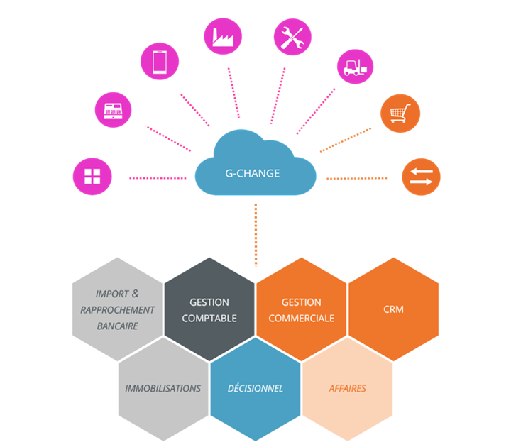

# Version 7.1.1 build 805 du 12/07/2018

 

#### STOCK

`#24175` – La valorisation du stock FIFO 
 lors du transfert de BL/BR en Facture avec un article en FIFO sans n° 
 de lot se fait correctement.

`#24190` - La génération de la facture suite 
 au transfert d'un BL contenant au moins 2 articles composés non gérés 
 en stock, contenant des composants mouvementés sur plusieurs dépôts et 
 au moins 1 composant commun mouvementé sur un dépôt unique n'est plus 
 abandonnée.

 

 

 

 

