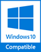
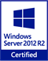

# Préconisations d'utilisation et d'installation

## Débridage

Un nouveau code de débridage est nécessaire.

 

Pour l’obtenir, solliciter debridage@gestimum.com via le menu Société | Paramétrage | Débrider mon ERP.

## Compatibilité

 

 

Gestimum ERP a été 
 testé avec succès sous Windows 10, 
 Windows 8.1 et Windows 8.

Gestimum ERP a été 
 testé avec succès sous Windows Server 2016, 
 Windows Server 2012 R2 
 et Windows Server 2008 R2.

Gestimum ERP est 
 certifié Windows Server 2012 R2.

 

ReportBuilder est 
 compatible avec Windows 10, 
 Windows 8.1, Windows 8 et Windows XP.

 

Gestimum ERP a été 
 testé avec succès avec SQL Server 2017, 
 SQL Server 2016 
 et SQL Server 2014.

## Mise en garde

* Pour 
 les clients utilisant le connecteur 
 e-commerce Gestimum, contactez-nous 
 avant migration.

 

* Les 
 tâches en ligne de commande 
 et les tâches via message Windows 
 WM\_COPYDATA font désormais partie du module optionnel G-Change. 
 Si vous les utilisez, contactez-nous 
 avant migration.

 

* Attention, 
 depuis la version 5.6.0 de nombreux changements dans 
 la gestion des numéros de lots ont été apportés. Pour les clients 
 gérant les numéros de lots et utilisant une version 4.8 ou 5, une 
 intervention sur la base peut être nécessaire avant utilisation des 
 versions 5.6 et supérieures, dans ce cas
contactez-nous 
 avant migration.

 

* Si vous utilisez 
 un système d’exploitation Windows XP 
 ou antérieur, vous devez installer la police d’écriture Segoe UI pour 
 utiliser Gestimum ERP. 
 Sans cette police d’écriture vous risquez de rencontrer des anomalies 
 d’affichage.

## Options activées par défaut lors de la migration

 

Gestion 
 Commerciale

 

* Nous proposons un fonctionnement 
 mono lot à la ligne de document (fonctionnel similaire à la 4.7.13) 
 et en option la possibilité de sélectionner plusieurs lots dans la 
 sélection à partir du stock avec création ou non d’autant de lignes 
 que de lots sélectionnés. La fenêtre de sélection à partir du stock 
 étant également utilisée pour les gammes, cela permet soit la sélection 
 d’une gamme par ligne de document, soit une sélection de plusieurs 
 gammes, ce qui va créer autant de lignes que de gammes sélectionnées.

 

* Le géocodage des adresses de tiers 
 est désactivé. Vous avez la possibilité d'activer l'option, après 
 migration, dans les préférences de gestion, onglet tiers 'Géocoder 
 automatiquement les adresses de tiers'. Il vous est également possible 
 de lancer un géocodage des adresses de tiers depuis le menu Tiers | Mettre à jour les tiers.

 

* La gestion des natures comptables 
 des articles de type forfaits et nomenclatures non gérés en stock 
 est paramétrée pour des articles composés ayant un prix de vente égal 
 au total des prix des ventes des articles qui le compose. Si ce mode 
 de fonctionnement ne correspond pas aux besoins de votre entreprise, 
 nous vous conseillons d'activer l'option présente dans les Préférences 
 de gestion, Onglet 'Ventes et Achats', rubrique 'Forfaits et nomenclatures 
 non gérés en stock' et activer l'option 'Prendre en compte la nature 
 comptable des forfaits et nomenclatures non gérés en stock au lieu 
 de celle des composants'.

 

Comptabilité

 

* La saisie du numéro de pièce et 
 du libellé dans les écritures comptables est obligatoire. Cela permet 
 de s'assurer de la conformité de vos écritures pour la génération 
 du fichier des écritures comptables (FEC). Cependant, vous pouvez 
 désactiver ces options depuis le menu 'Préférences de comptabilité, 
 Onglet 'Fiscalité'.

 

