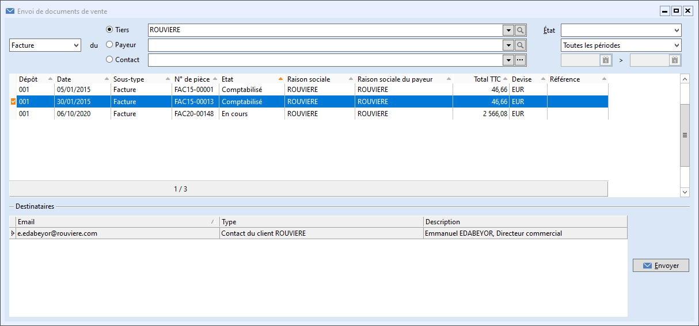

# Version 9.1 build 1051 du 15/10/2020

### ÉVOLUTIONS PRINCIPALES

Cette version intègre : 

 

* Une nouvelle fenêtre d'envoi par mail des documents d'achat et de vente :

 

Il vous est maintenant possible d'envoyer plusieurs documents d'achat ou de vente d'un même tiers, et de même type, qui ne se suivent pas, à un ou plusieurs contacts. Pour cela une nouvelle fenêtre a été mise en place. Elles est accessible depuis le menu "VENTES | Envoyer des documents de vente" ou "ACHATS | Envoyer des documents d'achat" mais également à partir d'un clic droit dans la liste des documents, des tiers et des contacts.

 

 

* Mise en place de champs obligatoires :

 

Vous pouvez désormais activer l'obligation de remplir certains champs standards des tables articles, tiers et des documents. Ce paramétrage est disponible dans les Préférences de gestion. 

 

 

### Autres évolutions & correctifs (n° de ticket)

#### ACHAT ET VENTE

`#25946` - Passage à 30 lignes de TPF par document.

`#26408` - Correction de l'erreur : "Indice de liste hors limites (1)" en ajoutant le champs "Montant réglé" dans la grille d’échéance du document de l'onglet "Échéance/ Acomptes d'une facture de vente".

`#26174` - Mise en place d'une option en Achat et en vente, permettant de rendre modifiable les dates de livraisons au document et à la ligne de document en BL, facture & avoir.

`#26329` - Mise en place d'un nouvelle fenêtre d'envoi par mail des documents d'achat et de vente, permettant d'envoyer des documents dont les numéros ne se suivent pas et à plusieurs contacts.

`#26600` - La modification du payeur dans un document, ne crée plus une seconde échéance.

`#26630` - Modification du libellé "Raison Sociale" par "Payeur" dans les filtres des documents achat / vente.

`#26637` - Le taux de TVA des documents d'acompte accepte la saisie de décimales. 

`#26671` - Correction de l'outil de regroupement automatique des bons de livraison en factures.

`#26685` - Correction de l'erreur  "tblLignes : Enregistrement non trouvé" après la suppression de la dernière ligne d'un document existant via "Ctrl + Suppr".

`#26712` - L'échéancier s'actualise correctement après modification de la devise dans un document de vente avec au moins 2 lignes d'articles.

`#26722` - L'acompte affecté sur une commande est repris sur la facture lors du transfert de document quand celui-ci est du même montant que le montant total dû.

`#26747` - Correction de l'erreur empêchant d'imprimer ou de créer un document Report Builder dans la fenêtre des relevés de factures.

`#26880` - Correction du transfert de bon de livraison en facture à partir d'une sélection multiple dans la liste des documents.

`#26881` - Correction du message d'erreur "Champ 'TIERS.PCF\_TYPE" non trouvé après clic droit "Transfert" dans la liste des documents - quand la mise en mémoire des listes déroulantes est activée.

#### ACTIONS

`#26364` - Le clic droit sur un contact présent dans la liste des contacts d'un tiers, permet d'ouvrir la liste des actions du contact.

`#26681` - La colonne "Tiers" (PCF\_CODE) de la liste des actions d'un contact s'alimente.

#### CONTACTS

`#26598` - La modification d'un contact depuis la fiche tiers met à jour les champs "modifié le" "modifié par" et "Nombre de modifications" de la fiche contact.

#### ENCAISSEMENTS ET DÉCAISSEMENTS

`#26510` - Modernisation de la boite de dialogue "Régler" accessible entre autre depuis les échéances à recevoir.

`#26632` - Modification du libellé "Code tiers" par "Code payeur" dans les liste des échéances.

`#26693` - Le module de relance ne remplace plus la raison sociale du tiers par la raison sociale du payeur lors de la modification de la date d'échéance.

`#26705` - Le mode de règlement présent dans l'échéancier d'un document d'achat ou de vente est conservé lors de la modification de la devise du document.

#### ERGONOMIE

`#25819` - Réduction de la hauteur de la fenêtre des préférences de gestion.

`#26746` - Mise à jour du paramétrage du fichier "Gestimum.Partenaire".

#### IMPORTS

`#26147` - L'import d'un document de vente unique de plusieurs lignes comprenant un Code commercial (REP\_CODE) qui n'existe pas ne génère plus un document de vente par ligne.

`#26589` - L'import de SIRET dans un tiers, crée automatiquement le SIREN si ce dernier n'est pas présent dans le fichier d'import.

#### LISTES & PERSONNALISATION

`#26754` - Les libellés des différents types de stock dans la personnalisation de la liste des articles indiquent bien le nom du dépôt concerné.

#### PRÉFÉRENCES DE GESTION

`#26429` - Mise en place d'options dans les préférences de gestion permettant de rendre obligatoire des champs standards des tables : tiers, articles, documents d'achat & vente.

#### STOCK

`#26224` - Les lignes de mouvement de stock de bons de livraison antérieurs à un inventaire ne sont plus dégrisées lors du transfert du bon de livraison en facture. Dans les factures, il n'est plus possible de modifier la quantité d'une ligne issue d'un BL antérieur à un inventaire.

`#26640` - Correction de l'import des numéros de lots dans les documents de transfert de stock.

`#26699` - Le stock des quantités commandées client s'actualise lors d'un transfert partiel sans reliquat.

#### TIERS

`#26751` - Les liens présents dans un champ personnalisé de type Lien dans les actions et les affaires sont maintenant cliquables depuis l'onglet des actions et des affaires, de la fiche tiers. 

#### AFFAIRES

`#26762` - Le libellé de l'affaire est repris dans le libellé de la section analytique au lieu du code, lorsque l'on coche la préférence "Créer automatiquement une section analytique ...".

`#26764` - Lors de la duplication d'une affaire, le section analytique est créée, quand la préférence "Créer automatiquement une section analytique ..." est cochée.

#### EDI @GP

`#26620` - Mise à jour de l'export des factures au format @GP ; Mise en place d'un contrôle de cohérence entre le total des lignes arrondies de l'export et le montant total brut du document. En cas d'écart d'arrondi, ce dernier est imputé sur la première ligne du fichier et l'utilisateur est informé du montant dans le log.

#### G-CHANGE

`#26579` - Ajout de l'option "CalculerNumeroCompte" dans l'import de tiers en ligne de commande.

`#26580` - Ajout de l'option "CalculerCodeTiers" dans l'import de tiers en ligne de commande.

`#26593` - Le n° interne de l'action créée est renvoyé dans le log de fin d'import.

#### ANALYTIQUE

`#26585` - Le paramétrage de la répartition analytique dans les comptes comptables est pris en compte lors de la génération d'écritures de lettrage approché et d'écart de règlement. 

#### ÉCRITURES

`#26254` - Le numéro de la pièce d'origine n'est pas repris dans la nouvelle écriture lors de la génération d'une extourne ou d'une contre-passation d'écriture.

`#26716` - Actualisation du contrôle présent dans l'export du fichier des écritures comptables (FEC), sur le numéro de compte comptable qui doit commencer par trois chiffres. 

#### PRÉFÉRENCES DE COMPTABILITÉ

`#26586` - Il n'est plus possible de mettre à vide la zone "journal des à-nouveaux" dans les préférences de comptabilité dès lors qu'une première clôture a été générée.

 

 

 

