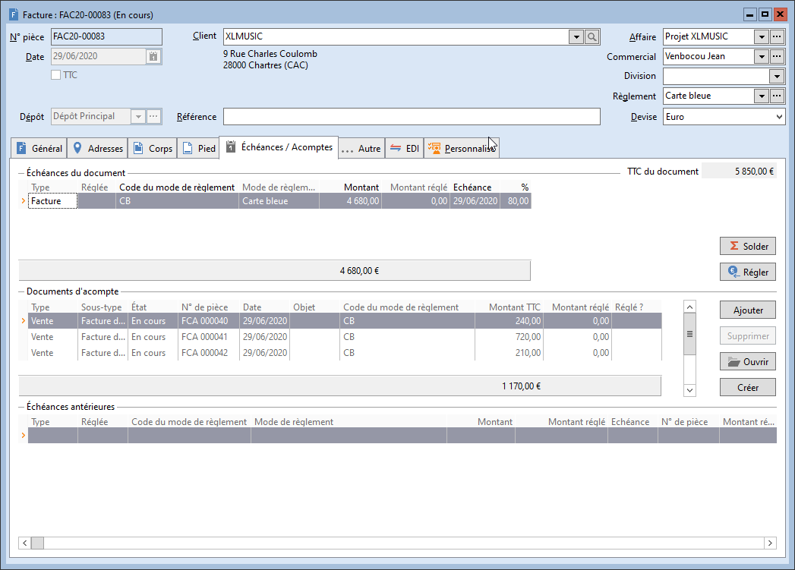

# Version 9 build 1026 du 30/06/2020

### ÉVOLUTIONS PRINCIPALES

Cette version intègre :

 

* une refonte de la gestion des échéances 
 dans les documents d'achats et de ventes :

 

Les montant des échéances des documents d'origine, 
 ne sont plus transférés partiellement sur les documents suivants.

Chaque document est propriétaire de son ou 
 ses échéances, seule la facture peut porter les échéances des documents 
 qui lui sont rattachés, en plus de ses propres échéances.   

* la mise en place des documents d'acompte 
 en achats et en ventes :

 

Il est maintenant possible de créer des documents 
 d'acomptes directement depuis les documents d'achats et de ventes, ou 
 de manière séparée depuis la liste des documents d'acomptes.

Une zone dédiée est présente dans le nouvel 
 onglet "Échéances / Acomptes" des documents d'achats et de ventes. 
 

Il est possible d'affecter N documents d'acomptes 
 à un document d'achat /vente.

 

Pour cela, nous avons revu le visuel de l'échéancier 
 des documents, qui est maintenant un onglet constitué de 3 zones : Échéances 
 du documents, Documents d'acompte et Échéances antérieures. 

 

 

### Autres évolutions & correctifs (n° de ticket)

\* Les numéros de tickets en orange 
 correspondent à des évolutions de l'ERP

#### DOCUMENTATION ERP

`#25624` 
 - Mise en place d'une documentation au format HTML 5 utilisant le navigateur 
 par défaut du poste utilisateur, lors de son ouverture.

#### ACHAT ET VENTE

`#18323` - Les documents à '0' ne génèrent plus d'échéance à '0'.

`#19647` - Réactivation de l'alerte à mi-vie des lots sur les composants 
 d'articles composés.

`#25811` - Ajout du champ LIG\_LIB "Désignation" dans la personnalisation 
 de la liste du détail des ventes et des achats par article.

`#25874` -
Refonte du fonctionnement des échéances dans les transferts de 
 documents d'achats et de ventes.

`#25882` - Refonte du visuel de la 
 gestion des échéances dans les documents d'achats et de ventes avec la 
 création d'un onglet "Échéances / acomptes".

`#25896` - Mise en place des documents 
 d'acompte en achats et en ventes.

`#25907` - Mise en place d'une liste 
 de documents d'acompte en achats et en ventes.

`#26059` - Les frais de port par 
 paliers se cumulent dans le pied du document lors d'un regroupement.

#### CHAMPS PERSONNALISÉS

`#23532` - Correction du mode de fonctionnement des conditions de visibilité 
 des champs personnalisés, sur les sous-types de documents.

`#25884` - Les nouvelles adresses de tiers s'enregistrent lors de l'utilisation 
 de champs personnalisés dans les adresses de tiers.

`#25964` - Le menu contextuel dans les conditions de visibilité des champs 
 personnalisés permet de tout sélectionner ou de tout désélectionner.

`#25965` - Refonte du fonctionnement des conditions de visibilité sur 
 les champs personnalisés des achats et des ventes.

`#26066` - Les filtres contenant un champ personnalisé en première position, 
 ne sont plus impactés par la création de nouveaux champs personnalisés.

`#26242` -
Mise en place de la sélection Ctrl+A dans les zones de texte illimité 
 des champs personnalisés.

#### ENCAISSEMENTS ET DÉCAISSEMENTS

`#25469` - La modification d'une échéance d'avoir par la fenêtre de relances 
 n'en modifie plus son sens dans l’échéancier.

`#25646` - Correction de l'erreur "Les données de chaînes ou binaires 
 seront tronquées" dans toutes les générations d'écritures de comptabilisation 
 automatique, si le code journal contient plus de 4 caractères.

`#26385` - Mise en place de 3 champs 
 supplémentaires dans les échéances (ECH\_DATINI "Echéance initiale"; 
 ECH\_DTMJPR "Échéance initiale modifiée par" ; ECH\_DTMJLE "Échéance 
 initiale modifiée le") permettant d’historiser la date d'échéance 
 d'origine du document lorsque cette dernière est modifiée à l'aide du 
 module de relance.

#### ERGONOMIE

`#25990` - Ajout du niveau de compatibilité 150 
 de SQL Server 2019 dans la fenêtre "Informations sur la base de données".

`#25989` 
 - Affichage "SQL Server 2019" tout en bas à droite de la fenêtre 
 principale, lorsque l'on utilise SQL Server 2019.

`#25481` - Prise en compte des libellés avec 
 apostrophe dans les listes déroulantes.

`#25887` 
 - Le texte de la zone "Client" dans les documents de vente est 
 affichée en rouge lorsque l'encours maximum est dépassé, plutôt que le 
 fond de la zone.

`#26199` 
 - Affichage des noms des fichiers de configuration dans les préférences 
 utilisateurs.

`#26201` 
 - L'onglet "Avancé" des préférences utilisateur est maintenant 
 séparé en 2 onglets distincts : "Fichiers de configuration" 
 & "Base de données".

`#26430` 
 - Mise en place de la sélection Ctrl+A dans les zones de textes multi-lignes 
 comme dans les zones de textes simples.

#### EXPORT XML

`#25790` 
 - Ajout des codes de types de coordonnées bancaires dans le schéma de 
 tables exportables depuis l'ERP.

#### IMPORTS

`#25415` - Ajout des champs d'adresses 
 de facturation et de livraison dans l'import de documents d'achats et 
 de ventes.

`#25703` - Ajout du champs DOC\_PIECE 
 "N° de pièce" dans l'import de documents de stock.

`#25708` - Suppression du champ DOC\_TYPE 
 de la liste des champs importables des achats et ventes.

`#25972` - Correction de l'intégration des valeurs de gammes dans l'import 
 de documents de stock.

#### IMPRESSIONS

`#24562` - Correction des modèles d'impressions des préférences de gestion.

#### MODES DE RÈGLEMENTS

`#25894` 
 - Suppression de l'option de calcul des échéances sur le HT dans les modes 
 de règlement.

#### PORTEFEUILLE DES COMMANDES

`#24069` 
 - Reprise du N° de pièce d'origine lors d'un transfert d'Accusé de Réception 
 en Bon de Livraison, en passant par le portefeuille des commandes.

#### STOCKS

`#25839` - Lors de la suppression d'un document d’écart de stock, les 
 mouvements de stocks s'actualisent correctement.

#### TARIFS ET PROMOTIONS

`#25486` - Lors de l'utilisation de l'outil de diminution ou d'augmentation 
 de prix en pourcentage dans les grilles de tarifs et promotions, le résultat 
 est arrondi à 2 décimales.

#### TRANSFERT COMPTABLE

`#26341` - Correction de l'erreur bloquante lors du transfert en comptabilité 
 de remises en banque ou émissions de paiement contenant uniquement plusieurs 
 factures, vers un fichier au format QuadraCompta.

#### TIERS

`#25833` - Mise en place d'une nouvelle 
 option dans les préférences utilisateurs permettant de choisir soit d'afficher 
 le code soit le libellé.

`#25852` - Correction de la recherche de tiers sur la raison sociale.

`#26082` - Correction de l'erreur "Nom de colonne PCF\_TYPE ambigu 
 " en ouvrant la recherche de tiers depuis la duplication  d'un 
 document d'achat / vente.

#### VILLES

`#25818` - Mise à jour de la liste 
 des codes postaux.

#### EDI CHORUS

`#24514` - L'export d'une facture au format CHORUS 
 peut s'effectuer depuis le menu contextuel des factures de vente et celui 
 de la liste des documents de vente.

`#25830` 
 - Mise en place d'un contrôle sur la présence du code pays dans l'adresse 
 de livraison des documents de vente lors de l'export au format CHORUS.

`#25914` 
 - Ajout d'une zone "N° d'engagement" permettant de saisir le 
 N° d'engagement Chorus dans les documents de vente.

`#25915` 
 - Ajout d'une zone "N° de bon de commande" permettant de saisir 
 le n° de bon de commande Chorus dans les documents de vente.

`#25917` 
 - Mise en place d'un nœud XML "ContractDocumentReference" dans 
 le fichier d'export au format CHORUS avec le N° d'engagement et le type 
 "Engagement".

`#25918` 
 - Mise en place d'un nœud XML "ContractDocumentReference" dans 
 le fichier d'export au format CHORUS avec le N° de bon de commande et 
 le type "Bon de commande".

`#25919` 
 - Mise en place d'un contrôle sur le n° d'engagement et le n° de bon de 
 commande dans la fenêtre d'export des factures et avoirs clients au format 
 Chorus, permettant de s'assurer que seule l'une des 2 occurrences est 
 remplie. 

`#25922` 
 - Le nœud XML "Billingreference" du fichier au format Chorus 
 apparaît uniquement pour les avoirs afin d'y renseigner le n° de la facture 
 d'origine quand cette information des connue.

`#25924` 
 - Mise en place dans le fichier d'export au format CHORUS d'un nœud "InvoiceLine" 
 avec un sous-noeud "AdditionalItemProperty" ayant la valeur 
 "Regroupement", permettant de remonter les lignes de sous-total 
 ou total.

`#25949` 
 - Le nœud XML "Invoice\BillingReference" n'est pas créé dans 
 le fichier au format Chorus s'il est vide.

#### G-CHANGE

`#25265` - Le numéro de lot est importé lors d'un transfert de document 
 avec un import de fichier contenant le champs LIG\_NUMERO en tâche en ligne 
 de commande ou par transfert avec import de quantités, si le dossier est 
 paramétré en multi-lots.

`#25622` 
 - Import des immobilisations par tâche en ligne de commande et Web Service.

`#25793` - Correction de l'erreur "'' 
 n'est pas une valeur en virgule flottante correcte" quand on crée 
 une grille de tarifs avec des remises par import en ligne de commande.

`#25835` - La demande d'impression de commande 
 client via message Windows WM\_COPYDATA ne provoque plus de violation d'accès.

`#25741` - Correction de la tâche en ligne 
 de commande d'import de contacts.

`#26207` - Correction du blocage dans l'import 
 de comptes de tiers contenant des champs personnalisés non présents dans 
 les tiers.

`#26335` 
 - Dans l'import de compte, la valeur contenue dans le champs PCF\_RS "Raison 
 sociale" ne se substitue plus à la valeur contenue dans le CPT\_LIB 
 "Libellé du compte".

`#26337` - En l'absence de valeur dans les 
 différents champs importables dans le fichier de mise à jour de compte, 
 l'import ne remplace plus la valeur présente dans le compte par la valeur 
 par défaut du champ.

`#26409` - La mise à jours du champ CPT\_ECH 
 des comptes comptables est maintenant prise en compte via import, tâche 
 en ligne de commande et Webservice.        

#### ÉCRITURES

`#25657` - Le traitement "Générer les 
 écritures de conversion..." ne modifie plus le cours enregistré dans 
 le Report à nouveau.

`#25849` - La mise à jour d'un champ d'une 
 ligne d'écriture avec une date d'échéance ne supprime plus la date d'échéance 
 de celle-ci.

`#26343` - Le journal de trésorerie en devise 
 n'est plus déséquilibré lorsqu'une écriture de plus de 2 lignes est saisie.

#### GUIDES D'ÉCRITURES

`#25649` - La répartition analytique saisie dans 
 un guide d'écriture est bien prise en compte en saisie guidée.

#### IMPORT DES ÉCRITURES COMPTABLES

`#25309` - La phase de test d'analyse de l'analytique dans l'import d'écriture 
 n'incrémente plus les n° de pièce et n° d'ordre.

`#25766` - Il est possible d'importer plusieurs plans pour une même ligne 
 dans une écriture.

`#25952` - La numérotation automatique des écritures, paramétrée dans 
 les journaux ne s’incrémente plus lors du test d'importation.

#### IMPRESSIONS

`#24562` - Correction des modèles d'impressions des préférences de comptabilité.

#### LETTRAGE

`#25688` - Activation par défaut 
 de l'option 'Solder automatiquement les échéances correspondantes" 
 dans les fenêtre de lettrage, et de l'option "Désolder automatiquement 
 les échéances" dans les fenêtres de délettrage.

`#26339` - Correction des problématiques de lettrage issues du transfert 
 en comptabilité des encaissements / décaissements depuis la Gestion Commerciale, 
 sur des écritures ayant fait l'objet d'au moins 2 reports à nouveau.

#### SOLDES INTERMÉDIAIRES DE GESTION (SIG)

`#25534` - Correction du modèle détaillé des SIG 
 afin qu'il puisse interpréter les soldes de comptes négatifs par rapport 
 à leur sens d'origine.

#### IMMOBILISATIONS

`#25687` 
 - Mise en forme du format d'impression du plan d'amortissement, accessible 
 via clic droit dans l'onglet amortissement de l'immobilisation.

 

 

 

 

 

