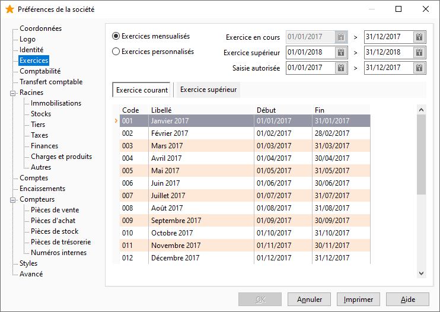

# Exercices

Cet onglet permet de paramétrer la fin d’exercice, l’exercice supérieur ainsi que la période de saisie autorisée et les périodes de l’exercice.

 

## Exercice comptable - exercice supérieur

Le logiciel propose par défaut un exercice comptable allant du premier au dernier jour de l'année courante. Il propose également un exercice supérieur permettant d'enregistrer des écritures même si l'exercice comptable courant n'est pas encore clôturé.

 

La période de saisie permet de délimiter la période sur laquelle la saisie est autorisée. Cette période s'affichera dans la barre de titre de la fenêtre courante, en saisie d'écritures

## Type de comptabilité (périodicité)

En comptabilité française, les périodes de référence sont calquées sur les mois de l'année : "Exercices mensualisés".

 

Pour d'autres pays, ces périodes peuvent être différentes. Choisir dans ce cas : "Exercices Personnalisés" afin d’accéder à la modification des périodes proposées par défaut. Pour modifier la date de début et de fin d'une période, il suffit de cliquer dans la cellule et de saisir la nouvelle date ou d’utiliser la flèche basse pour accéder au calendrier.

## Tableau des périodes

En "Exercice Personnalisé", le tableau des périodes propose par défaut 13 périodes de 28 jours pour l'exercice en cours et l'exercice supérieur, ce qui permet de traiter la comptabilité sur d'autres périodes que le mois. Il est toutefois possible de modifier le nombre de périodes et de définir manuellement le premier et dernier jour de chacune des périodes.

 

 

