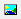

# Comment ajouter une image dans une impression ?
Pour ajouter une image, il faut d'abord cliquer sur l'icône  et ensuite cliquer dans la zone où vous voulez placer l'image.

 

 

Vous aurez alors une nouvelle zone Image1. Pour affecter une image à cette zone, vous devez faire un clique droit dessus puis sélectionner Photo.

 

 

Une fenêtre de sélectionne s'ouvre et vous permet de choisir votre image.

 

 

 

Maintenant il faut que votre image s'ajuste à la taille de votre champ. Pour cela, vous devez cocher 2 options (ConserverLeRatioVisuel et Etirer) en faisant un clique droit sur la zone. ConserverLeRatioVisuel permet de garder le proportion de votre image. Etirer va adapter la taille de l'image à celle de la zone.

 

 

Vous pouvez ensuite agrandir le champ et la taille de l'image s'adaptera.

 

 

Attention il ne faut pas cocher l'option "Mise en forme automatique" car c'est la zone qui prendra alors la taille de l'image et si vous avez une image en haute définition, elle prendra toute la place.

