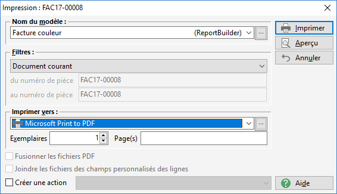
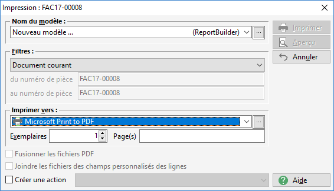
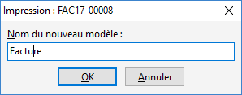
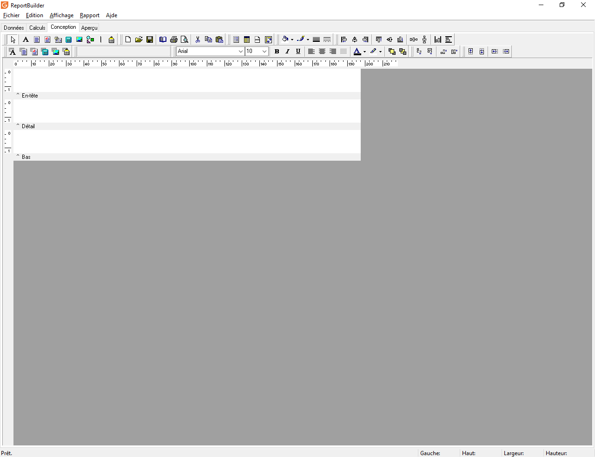
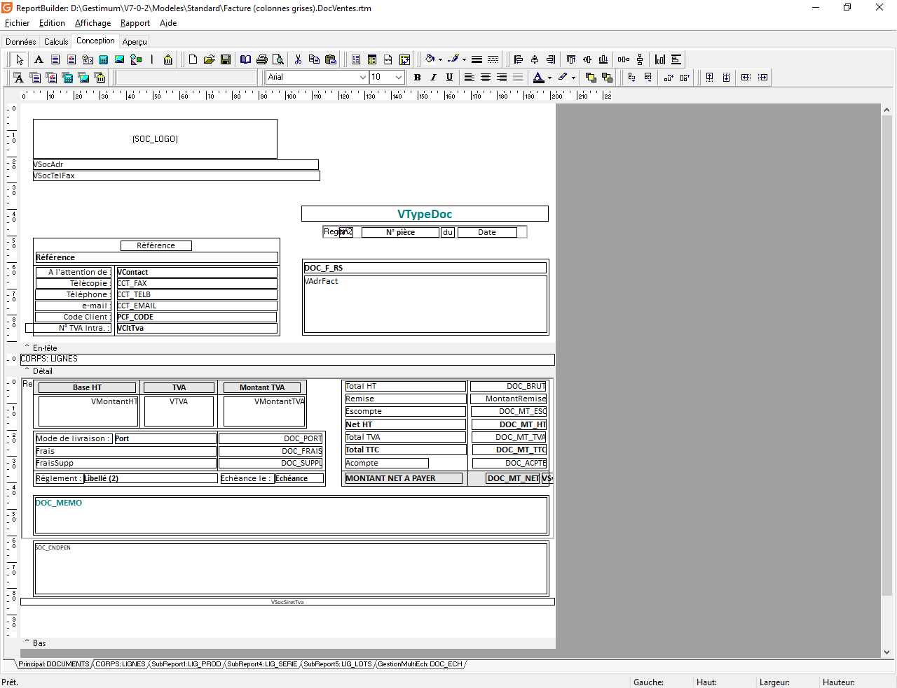

# Introduction

Bienvenue dans cette documentation qui va vous permettre de maîtriser l'outil ReportBuilder .

 

ReportBuilder est un outil intégré à Gestimum ERP qui permet de créer et modifier les modèles d'impression de Gestimum ERP.

 

Pour le lancer, il faut vous rendre dans n'importe quelle fenêtre d'impression.

 

Vous avez ensuite le choix de :

 

* soit ouvrir un modèle existant qui a la mention "(ReportBuilder)" à droite de son nom :

 

 

* soit créer un modèle en sélectionnant "Nouveau Modèle..." avec la mention ("ReportBuilder") à droite :

 

 

Il faut ensuite cliquer sur le bouton "...".

 

Si vous avez choisi de créer un nouveau modèle, vous aurez cette fenêtre intermédiaire qui vous permet de nommer le modèle :

 

 

Ensuite soit le nouveau modèle s'ouvre :

 

 

soit le modèle existant s'ouvre :

 

 

L'outil s'organise en 3 onglets principaux :

* l'onglet [Données](../OngletDonnées/OngletDonnees.md) permet de créer les vues pour collecter les données à imprimer
* l'onglet [Calculs](../OngletCalculs/OngletCalculs.md) permet d'intervenir dynamiquement sur les éléments de la conception
* l'onglet [Conception](../OngletConception/OngletConception.md) permet de gérer la mise en forme de l'impression

 

Il y a aussi un onglet Aperçu qui permet juste d'avoir un rendu à l'écran de l'impression. Attention il se peut qu'il y ai des différences entre l'impression et l'aperçu qui peuvent être lié notamment aux marges d'impression physiques des imprimantes.

