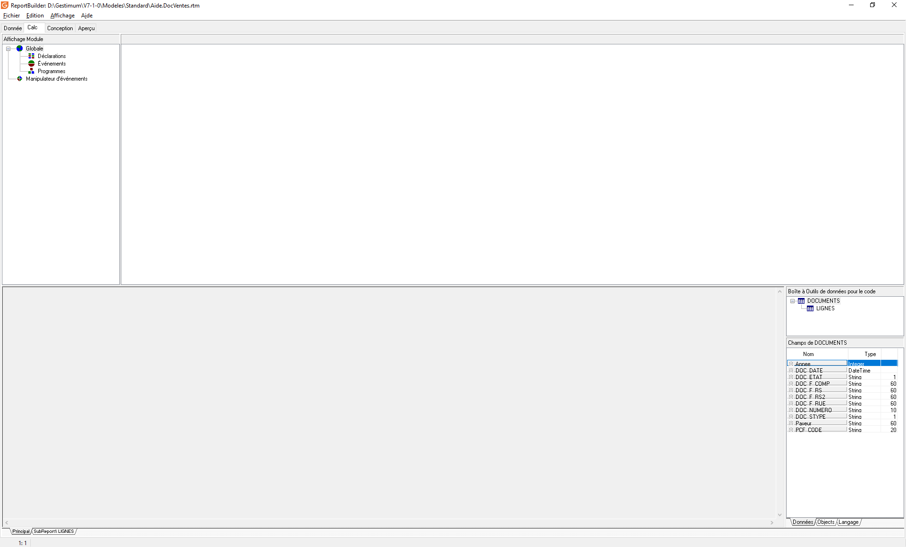
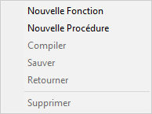
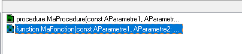

# Fonctions et procédures
Dans ReportBuilder, nous avons accès à des fonctions et procédures qui permettent de manipuler les données et qui sont découpées en plusieurs catégories  :


 


* Les fonctions de chaînes de caractères qui ne travaillent que sur des chaînes de caractères
* Les fonctions de conversion qui permettent de changer le type de données
* Les fonctions de formatage qui permettent de mettre en forme les données
* Les fonctions de dates qui ne travaillent qu'avec les dates
* Les fonctions mathématiques qui permettent de faire des calculs
* Les fonctions utilitaires
* Les fonctions Gestimum


## Fonctions de chaînes de caractères


| Nom | Déclaration | Description | Exemple | Résultat |
|---|---|---|---|---|
| Capitalize    | ```function Capitalize(const S: String): String;```                | Met en majuscule la 1ère lettre de la chaîne           | ``Value := Capitalize('rambouillet');`` | Rambouillet |
| CompareText   | ```function CompareText(const S1, S2: string): Integer;```         | Compare deux chaînes par valeur ordinale sans sensibilité à la casse. CompareText compare S1 et S2 et renvoie 0 s'ils sont égaux. Si S1 est supérieur à S2, CompareText renvoie un entier supérieur à 0. Si S1 est inférieur à S2, CompareText renvoie un entier inférieur à 0. | ``a = CompareText('rambouillet', 'rambouillet');`` <br>``b = CompareText('versaille', 'rambouillet');`` <br>``c = CompareText('rambouillet', 'versaille');``| a = 0 <br>b = 1 <br>c = -1 |
| Copy          | ```function Copy(S: String; Index, Count: Integer): String;```     | Renvoie une sous-chaîne d'une chaîne. <br>S est une expression de type chaîne. <br>Index et Count sont des expressions de type entier. <br>Copy renvoie une sous-chaîne contenant Count caractères en partant de l' Index. <br>Si Index est supérieur à la longueur de S, Copy renvoie une chaîne  vide. <br>Si Count spécifie plus de caractères que ceux disponibles, seuls les caractères compris entre S[Index] et la fin de S sont renvoyés. | ``Copy('rambouillet', 1, 4);`` | ramb |
| Delete        | ```procedure Delete(var S: String; Index, Count: Integer);```      | Supprime des caractères dans une chaîne. <br>S est une expression de type chaîne. <br>Index et Count sont des expressions de type entier. <br>Delete supprime une sous-chaîne contenant Count caractères en partant de l'Index. <br>Si Index est supérieur à la longueur de S, Delete ne supprimera aucun caractère. <br>Si Count spécifie plus de caractères que ceux disponibles à partir de l'Index, le reste de la chaîne sera supprimés. <br>Si Count est inférieur ou égal à zéro, aucun caractère ne sera supprimé. | ``var`` <br>  ``S: string;`` <br>``begin`` <br>``  S := 'rambouillet';`` <br>``  Delete(S, 3, 2);`` <br>``end;`` | raouillet |
| Insert        | ```procedure Insert(Source: String; var S: String; Index: Integer);``` | Insert une sous-chaîne dans une chaîne au début d'une position spécifique | ``var`` <br>``  ChaineDestination: string;``<br>``begin``<br>``  ChaineDestination := ' rambouillet';``<br>``  Insert('78120', ChaineDestination, 1);``<br>``end;`` | 78120 rambouillet |
| Length        | ```function Length(S: String): Integer;```|Renvoie le nombre de caractère de la chaîne passée en paramètre. | ``Value := Length('rambouillet');`` | 16 caractères |
| LowerCase     | ```function LowerCase(const S: String): String;```                  | Renvoie une chaîne de caractère en minuscule | ``Value := 'RAMBOUILLET';`` | rambouillet |
| Pos           | ```function Pos(Substr: String; S: String): Integer;```            | Retourne la position de la première occurrence de la sous-chaîne Substr dans la chaîne S | ``Value := Pos('b','rambouillet');`` | 4 |
| ShowMessage   | ```procedure ShowMessage(const Msg: string);```                    | Affiche un message lors de l'exécution                |               | |
| UpperCase     | ```function UpperCase(const S: String): String;```                  | Met une chaîne de caractère en majuscule | ``Value := 'rambouillet';`` | RAMBOUILLET |


## Fonctions de conversion


| Nom             | Déclaration                                        | Description                                 |
|-----------------|----------------------------------------------------|---------------------------------------------|
| CurrToStr       | ```function CurrToStr(Value: Currency): String;```  | Transforme une valeur monétaire en chaîne   |
| DateTimeToStr   | ```function DateTimeToStr(aDateTime: DateTime): String;``` | Transforme une date et une heure en chaîne |
| DateToStr       | ```function DateToStr(aDate: Date): String;```      | Transforme une date en chaîne               |
| FloatToStr      | ```function FloatToStr(Value: Extended): String;``` | Transforme un chiffre à virgule en chaîne   |
| IntToStr        | ```function IntToStr(Value: Integer): String;```    | Transforme un entier en chaîne              |
| StrToCurr       | ```function StrToCurr(const S: String): Currency;``` | Transforme une chaîne en valeur monétaire   |
| StrToDate       | ```function StrToDate(const S: String): Date;```    | Transforme une chaîne en date               |
| StrToDateTime   | ```function StrToDateTime(const S: String): DateTime;``` | Transforme une chaîne en date et heure  |
| StrToFloat      | ```function StrToFloat(const S: String): Extended;``` | Transforme une chaîne en nombre à virgule  |
| StrToIntDef     | ```function StrToIntDef(const S: String; Default: Integer): Integer;``` | Transforme une chaîne en entier avec renvoi de Default en cas d'erreur |
| StrToInt        | ```function StrToInt(const S: String): Integer;```   | Transforme une chaîne en entier             |
| StrToTime       | ```function StrToTime(const S: String): Time;```     | Transforme une chaîne en heure              |
| TimeToStr       | ```function TimeToStr(aTime: Time): String;```       | Transforme une heure en chaîne              |


## Fonctions de formatage

| Nom            | Déclaration                                                                           | Description                                         | Exemple                                              | Résultat            |
|----------------|---------------------------------------------------------------------------------------|-----------------------------------------------------|------------------------------------------------------|---------------------|
| FormatCurr     | ```function FormatCurr(const Format: String; Value: Currency): String;```              | Renvoie un chiffre formaté sous forme de chaîne      | ```Value := FormatCurr('#,##0.0 $', 1234.567)```     | 1 234.6 €     |
| FormatDateTime | ```function FormatDateTime(const Format: String; aDateTime: DateTime): String;```      | Renvoie une date formatée sous forme de chaîne       | ```var maDate: TDateTime;```<br>```begin```<br>```maDate := StrToDateTime('17/05/2018 15:41');```<br>```Value := FormatDateTime('dddd dd mmmm yyyy hh:mm', maDate);``` | jeudi 17 mai 2018 15:41 |
| FormatFloat    | ```function FormatFloat(const Format: String; Value: Extended): String;```              | Renvoie un chiffre formaté sous forme de chaîne      | ```Value := FormatFloat('#,##0', 1234.567)```        | 1 235         |
| FormatMaskText | ```function FormatMaskText(const EditMask: String; const Value: String): String;```     | Formate une chaîne avec un masque d'édition          | ```Value := FormatMaskText('00.00.00.00.00;0;*', '0134840984')``` | 01.34.84.09.84 |
| FormatString   | ```FormatString(const EditMask: String; const Value: String): String;```                | Formate une chaîne avec un masque d'édition          | ```Value := FormatMaskText('00.00.00.00.00;0;*', '0134840984')``` | 01.34.84.09.84 |


## Fonctions de dates


| Nom             | Déclaration                                                              | Description                                                       | Exemple                                          | Résultat       |
|-----------------|--------------------------------------------------------------------------|-------------------------------------------------------------------|--------------------------------------------------|----------------|
| CurrentDate     | ```function CurrentDate: Date;```                                        | Retourne la date courante                                         | ``var`` <br>``  DateDuJour: TDate;``<br>``begin`` <br>``  DateDuJour := CurrentDate;`` <br>``end;``                | 17/05/2018     |
| CurrentDateTime | ```function CurrentDateTime: DateTime;```                                | Retourne la date et l'heure courante                               |``var`` <br>``  DateDuJour: TDateTime;``<br>``begin`` <br>``  DateDuJour := CurrentDateTime;`` <br>``end;``| 17/05/2018 14:49:50 |
| CurrentTime     | ```function CurrentTime: DateTime;```                                    | Retourne l'heure courante                                          | ``var`` <br>``HeureDuJour: Time;``<br>``begin`` <br>``HeureDuJour  := CurrentTime;`` <br>``end;``| 14:49:50       |
| DayOfWeek       | ```function DayOfWeek(aDate: DateTime): Integer;```                      | Retourne le jour de la semaine en fonction de l'index suivant :    |``var`` <br>``   maDate: TDateTime``<br>``begin`` <br>``  maDate := StrToDateTime('17/05/2018 15:41');`` <br> ``  Value := DayOfWeek(maDate));`` <br>``end;`` | 5              |
| DecodeDate      | ```procedure DecodeDate(aDate: DateTime; var Year, Month, Day: Integer);``` | Renvoie les différentes parties d'une date sous forme d'entier       | ``var`` <br>``   maDate: TDateTime``<br> ``Jour: Integer;`` <br>``Mois: Integer;`` <br>``Annee: Integer;`` <br>``begin`` <br>``  maDate := StrToDateTime('17/05/2018');`` <br> ``DecodeDate(maDate, Annee, Mois, Jour);`` <br>``end;``     | 2018 <br>05<br> 17  |
| DecodeTime      | ```procedure DecodeTime(aTime: DateTime; var Hour, Min, Sec, MSec: Integer);``` | Renvoie les différentes parties d'une heure sous forme d'entier   | ``var`` <br>``  monHeure: Time;`` <br>``  Heure: Integer;`` <br> ``  Minute: Integer;`` <br>``  Seconde: Integer;`` <br>``MilliSeconde: Integer;`` <br>``begin`` <br>``  monHeure := StrToTime('14:53:48:02');`` <br>``  DecodeTime(monHeure, Heure, Minute, Seconde, MilliSeconde);`` <br>``end;`` | 14 <br> 53 <br> 48 <br> 2 |
| EncodeDate      | ```function EncodeDate(Year, Month, Day: Integer): DateTime;```         | Transforme des entiers en date                                     | ``var`` <br>``   maDate: TDateTime``<br> ``Jour: Integer;`` <br>``Mois: Integer;`` <br>``Annee: Integer;`` <br>``begin`` <br>``Jour := 17;`` <br>``Mois := 5;`` <br>``Annee := 2018;`` <br>``  maDate := EncodeDate(Annee, Mois, Jour);`` <br>``end;``        | 17/05/2018     |
| EncodeTime      | ```function EncodeTime(Hour, Min, Sec, MSec: Integer): DateTime;```     | Transforme des entiers en heure                                    | ``var`` <br>``  monHeure: Time;`` <br>``  Heure: Integer;`` <br> ``  Minute: Integer;`` <br>``  Seconde: Integer;`` <br>``MilliSeconde: Integer;`` <br>``begin`` <br>``  Heure := 11;`` <br> ``  Minute := 45;`` <br>``  Seconde := 12;`` <br>``MilliSeconde := 0;`` <br>``  monHeure :=  EncodeTime(Heure, Minute, Seconde, MilliSeconde);`` <br>``end;`` | 11:45:12.0000  |


## Fonctions mathématiques


| Nom      | Déclaration                                                  | Description                                                     |
|----------|--------------------------------------------------------------|-----------------------------------------------------------------|
| ArcTan   | ```function ArcTan(X: Extended): Extended;```                 | Donne la valeur en radians de l'arc tangent d'un nombre          |
| Cos      | ```function Cos(X: Extended): Extended;```                    | Calcule le cosinus d'un angle                                    |
| Cosh     | ```function Cosh(X: Extended): Extended;```                   | Calcule le cosinus hyperbolique d'un angle                       |
| Cotan    | ```function Cotan(X: Extended): Extended;```                  | Calcule la cotangente d'un angle.                                |
| Exp      | ```function Exp(X: Extended): Extended;```                    | Renvoie l'exponentielle de X.                                    |
| Frac     | ```function Frac(X: Extended): Extended;```                   | Renvoie la partie fractionnaire d'un nombre réel.                |
| Int      | ```function Int(X: Extended): Extended;```                    | Renvoie la partie entière d'un nombre réel                       |
| IntPower | ```function IntPower(Base: Extended; Exponent: Integer): Extended;``` | Calcule la puissance intégrale d'une valeur de base.      |
| Ln       | ```function Ln(X: Extended): Extended;```                     | Renvoie le logarithme naturel d'une expression réelle.           |
| Power    | ```function Power(Base, Exponent: Extended): Extended;```     | Élève Base à n'importe quelle puissance d'Exponent.              |
| Round    | ```function Round(X: Extended): Integer;```                   | Renvoie la valeur de X arrondie au nombre entier le plus proche |
| Sin      | ```function Sin(X: Extended): Extended;```                    | Renvoie le sinus de l'angle en radians.                          |
| Sqr      | ```function Sqr(X: Extended): Extended;```                    | Renvoie le carré d'un nombre.                                    |
| Sqrt     | ```function Sqrt(X: Extended): Extended;```                   | Renvoie la racine carrée de X.                                   |
| Tan      | ```function Tan(X: Extended): Extended;```                    | Renvoie la tangente de X, exprimée en radians                    |
| Tanh     | ```function Tanh(X: Extended): Extended;```                   | Calcule la tangente hyperbolique de X                            |
| Trunc    | ```function Trunc(X: Extended): Integer;```                   | Tronque un nombre réel en entier                                 |


## Fonctions utilitaires


| Nom | Déclaration | Description |
|---|---|---|
| MessageBeep | ``procedure MessageBeep;`` | Déclenche un son sur le PC |
| ShowMessage | ``procedure ShowMessage(const Msg: string);`` | Affiche un message |


## Fonctions Gestimum


Voici le tableau demandé avec 3 colonnes, en mettant le contenu de la colonne 2 entre les balises `` :

| Nom                      | Déclaration                                                         | Description                                                 |
|--------------------------|---------------------------------------------------------------------|-------------------------------------------------------------|
| AlignGroupFooter         | ``procedure AlignGroupFooter(AGroupFooter: TppGroupFooterBand);``    | Permet d'aligner horizontalement la bande du bas (Footer) par rapport aux bandes du modèles |
| AlignGroupFooterOn       | ``procedure AlignGroupFooterOn(AGroupFooter: TppGroupFooterBand; ABeforeGroupFooter: TppGroupFooterBand);`` | Permet d'aligner horizontalement la bande du bas (Footer) par rapport à une autre bande bas, par exemple celle d'un groupe |
| CalculerTVAPied          | ``procedure CalculerTVAPied(const ANumeroDocument: string; AListeMontantsHT, AListeTauxTVA, AListeMontantsTVA: TStringList; const AFormatMontants, AFormatTaux: string);`` | Permet de récupérer le tableau de TVA qui est dans l'onglet pied du document |
| CanShowTableReference    | ``function CanShowTableReference(const AID: string): Boolean;``     | Permet de savoir si on peut voir des lignes des tables de référence en fonction de leurs ID |
| ContainsText             | ``function ContainsText(const AText, ASubText: string): Boolean;`` | Permet du savoir si un chaîne contient une autre chaîne    |
| CreateDrawLine           | ``function CreateDrawLine(AReport: TppReport; const ATop: Integer): TppDrawLine;`` | Créer un objet ligne |
| CreateDrawShape          | ``function CreateDrawLine(AReport: TppReport): TppDrawLine;``       | Créer une objet forme                                       |
| CreateGroup              | ``function CreateGroup(AReport: TppReport; ADataPipeline: TppDataPipeline; const ABreakName: string): TppGroup;`` | Créer un groupe                                           |
| CreateSubReport          | ``function CreateSubReport(const ASubReportFileName: string; AReport: TppReport; ABand: TppBand): TppSubReport;`` | Créer un sous-rapport                                   |
| FileExists               | ``function FileExists(const AFileName: string): Boolean;``          | Permet de vérifier l'existence d'un fichier                  |
| GetApplicationTitle      | ``function GetApplicationTitle: string;``                           | Renvoie le titre de l'application                           |
| GetDefaultPageFooterTemplate | ``function GetDefaultPageFooterTemplate: string;``                | Renvoie le rapport à utiliser par défaut pour présenter le pied de page |
| GetDefaultPageHeaderTemplate | ``function GetDefaultPageHeaderTemplate: string;``                | Renvoie le rapport à utiliser par défaut pour présenter l'entête de page |
| GetDefaultTitleTemplate  | ``function GetDefaultTitleTemplate: string;``                       | Renvoie le rapport à utiliser par défaut pour présenter le titre |
| GetEcheancesAnterieures  | ``procedure GetEcheancesAnterieures(const ANumeroDocument, ASousTypeDocument: string; AListeEcheancesAnterieures: TStringList; const AFormatMontant: string);`` | Permet de récupérer les échéances qui ont été générées sur les documents antérieurs au document actuel |
| GetFieldDisplayValue     | ``function GetFieldDisplayValue(const ATableName, AFieldName, AFieldValue: string): string;`` | Renvoie la description d'une des valeurs possibles d'un champ |
| GetReportsFolderPath    | ``function GetReportsFolderPath: string;``                          | Renvoie le chemin du dossier de stockage des modèles d'impression |
| GetTableReferenceDescription | ``function GetTableReferenceDescription(const AID: string): string;`` | Renvoie la description d'une table de la base de données  |
| InpuBox                  | ``function InpuBox(const ACaption, APrompt, ADefault: string): string;`` | Affiche un fenêtre permettant de récupérer de éléments saisis par l'utilisateur |
| LeftStr                  | ``function LeftStr(const AText: string; const ACount: Integer): string;`` | Renvoie la partie gauche d'une chaîne                   |
| LoadSubReport            | ``function LoadSubReport(ASubReport: TppSubReport; const AFileName: string): Boolean;`` | Permet de charger le contenu d'un sous-rapport        |
| RightStr                 | ``function RightStr(const AText: string; const ACount: Integer): string;`` | Renvoie la partie droite d'une chaîne                   |
| SelectFromTableAsInteger | ``function SelectFromTableAsInteger(const AFieldName, ATableName, AWhere: string): Integer;`` | Renvoie sous forme d'entier le résultat d'une requête de sélection dans la base de données |
| SelectFromTableAsString  | ``function SelectFromTableAsString(const AFieldName, ATableName, AWhere: string): string;`` | Renvoie sous forme de chaîne le résultat d'une requête de sélection dans la base de données |
| StartsText               | ``function StartsText(const AText, ASubText: string): Boolean;``    | Test si une chaîne commence par une chaîne donnée            |
| UpdateTable              | ``function UpdateTable(const AScript: string): Integer;``           | Permet l'exécution de n'importe quel script SQL               |
| UpperCaseFirst           | ``function UpperCaseFirst(const S: string): string;``               | Renvoie une chaîne avec la première lettre en majuscule     |
| VarToBool                | ``function VarToBool(const AValue: Variant): Boolean;``             | Renvoie un boolean avec la valeur False quand le paramètre de la fonction est à null |
| VarToCurr                | ``function VarToCurr(const AValue: Variant): Currency;``            | Renvoie un chiffre à zéro quand le paramètre de la fonction est à null |
| VarToDate                | ``function VarToDate(const AValue: Variant): TDate;``                | Renvoie une date à zéro quand le paramètre de la fonction est à null |
| VarToDateTime            | ``function VarToDateTime(const AValue: Variant): TDateTime;``        | Renvoie une date et une heure à zéro quand le paramètre de la fonction est à null |
| VarToFloat               | ``function VarToFloat(const AValue: Variant): Double;``              | Renvoie un double à zéro quand le paramètre de la fonction est à null |
| VarToInt                 | ``function VarToInt(const AValue: Variant): Integer;``               | Renvoie un entier zéro quand le paramètre de la fonction est à null |
| VarToStr | ``function VarToStr(const AValue: Variant): string;``                | Renvoie une chaîne vide quand le paramètre de la fonction est à null |


## Fonctions et procédures personnelles


ReportBuilder permet de se créer ses propres fonctions et procédures dans un modèle. Cela permet par exemple d'alléger du code ou d'éviter de répéter du code.


 


Pour créer une fonction ou une procédure, il faut passer l'affichage sur Module et sélectionner Programmes.


 





 


Ensuite, on fait un clic-droit dans la zone blanche sur la droite pour avoir accès au menu de création d'une fonction ou d'une procédure.


 





 


* Nouvelle fonction


 


 


* Nouvelle procédure


 


 


Il faut ensuite modifier la zone de déclaration de la fonction ou de la procédure dans le cadre en bas. On pourra indiquer le nom de la fonction ou de la procédure ainsi que le nom de chaque paramètre et leur type. Dans le cas d'une fonction, il faut indiquer le type de données qu'elle doit retourner.


 


 


La liste des fonction et procédure vient alors s'enrichir .


 





 


Une fois la déclaration effectuée, il faut définir le contenu en restant bien dans la zone begin...end.


 


La fonction ci-dessous retournera le 2e paramètre si celui-ci est plus grand le 1er paramètre sinon elle retourne le 1er paramètre.


 

````
function MaFonction(const AParametre1, AParametre2: string): string;


begin


  if AParametre1 < AParametre2 then


    Result := AParametre2


  else


    Result := AParametre1;


end;
````

 


La procédure ci-dessous affiche un message avec la 2e paramètre si celui-ci est plus grand le 1er paramètre sinon elle affiche le 1er paramètre.


 

````
procedure MaProcedure(const AParametre1, AParametre2: string);


begin


  if AParametre1 < AParametre2 then


    ShowMessage(AParametre2)


  else


    ShowMessage(AParametre1);


end;
````

