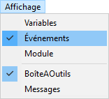
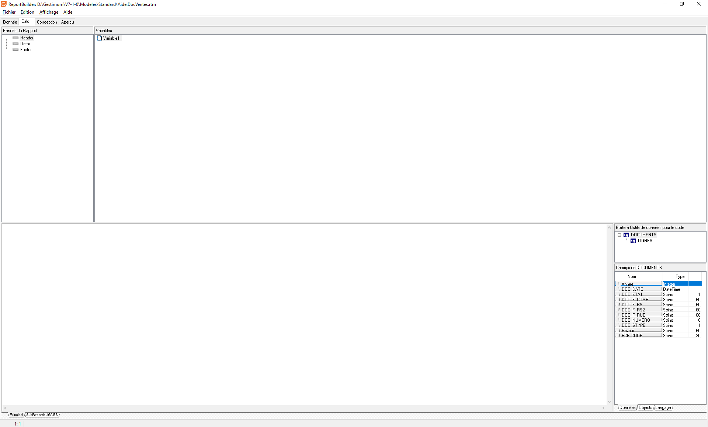
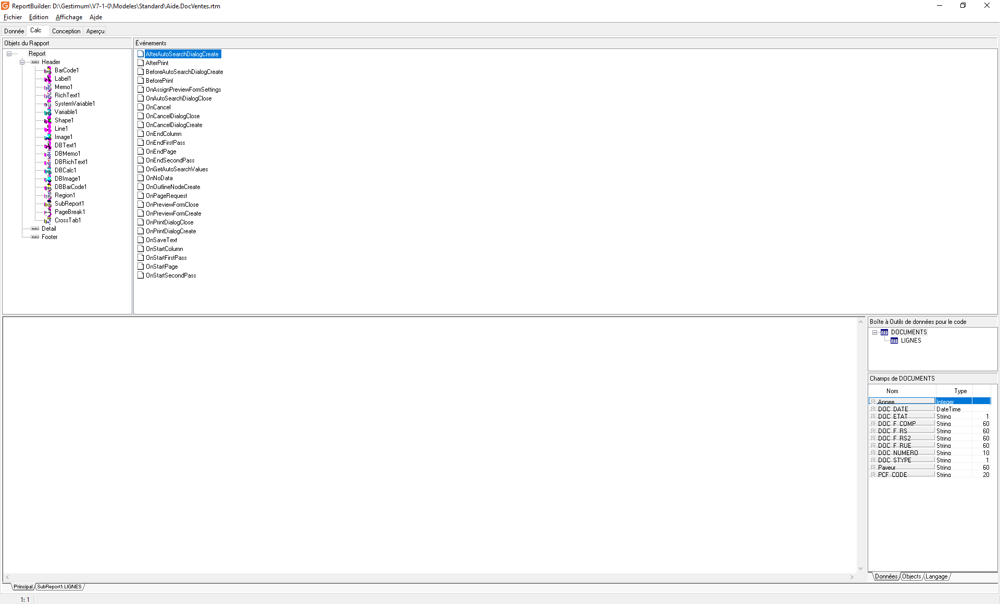
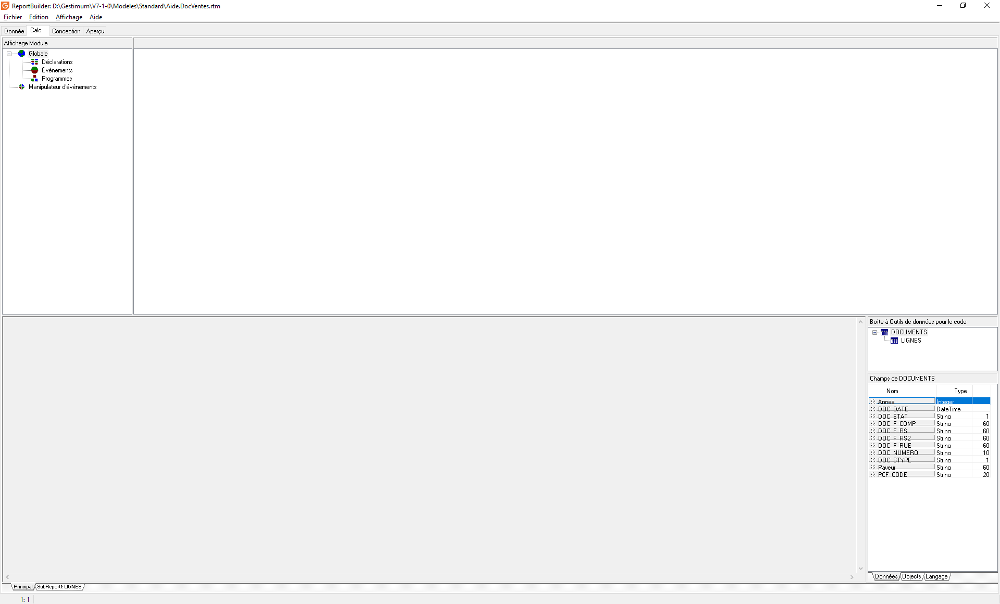

# Onglet "Calculs"
L'onglet "Calculs" permet de manipuler les données des vues pour faire des calculs, des mises en forme conditionnelles ...

 

Il existe 3 modes de visualisations de cette onglet : Variables, Evénements, Module. Pour en changer, il suffit d'aller dans le menu Affichage et de sélectionner le mode de visualisation voulu.

 

## Variables

On retrouve tous les objets de type "Variable" créés dans l'onglet "Conception" et classés par bande.

 

## Événements

Dans l'arborescence de gauche, on visualise les différentes bandes ainsi que tous les objets qui y sont rattachés.

 

Dans la partie de droite, on retrouve tous les [événements](Evenements.md) de la vie du modèle et qui sont différents sur chaque élément.

 

## Module

L'affichage "Module" permet d'accéder au bas niveau du modèle.

 

On peut ainsi :

* + déclarer des [variables et constantes](VariablesConstantes.md) communes à tout le modèle et utilisables partout
	+ travailler sur les événements de création (OnCreate) et de destruction (OnDestroy) du modèle
	+ créer des "programmes" qui sont soit des [fonctions](FonctionsProcedures.md) soit des [procédures](FonctionsProcedures.md). La différence entre les 2 est que la fonction renvoie une donnée et l'autre pas
	+ voir et modifier tout le code qui est fait dans les objets de type "Variable" ou dans les événements

 

