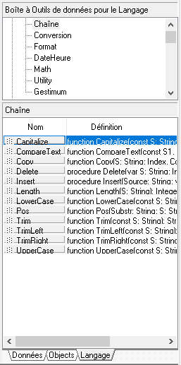

# Principes de base
Le langage de programmation utilisé pour développer dans un modèle d'impression ReportBuilder est le langage RAP (Report Application Programming).


 


C'est un langage dérivé du langage Pascal Objet.


 


Les bases de ce langage sont reconnues dans ReportBuilder. Elles peuvent être trouvées dans l'onglet "Langage" de la boîte à outils en bas à droite :


 





 


Les éléments de Delphi qui ne sont pas supportés par ReportBuilder sont :


* les classes
* les tableaux
* les enregistrements
* les types énumérés


### Types de données


Dans ReportBuilder, nous pouvons utiliser les types de données suivants :


 


| Types de données | Description |
|---|---|
| Boolean | pour stocker une valeur qui ne prend que 2 états True ou False |
| Currency | pour stocker un nombre de type monétaire avec 4 décimales |
| Double | pour stocker un nombre à virgule flottante avec une précision pouvant aller jusqu'à 15 décimales |
| Extended | pour stocker un nombre à virgule flottante avec une précision pouvant aller jusqu'à 19 décimales |
| Integer | pour stocker un nombre entier (sans décimales) |
| Single | pour stocker un nombre à virgule flottante avec une précision pouvant aller jusqu'à 7 décimales |
| Char | pour stocker un seul caractère |
| String | pour stocker une chaîne de caractères |
| Date | pour stocker une date sans l'heure |
| DateTime | pour stocker une date avec l'heure |
| Time | pour stocker l'heure |
| Color | pour stocker une couleur |
| Variant | pour stocker une donnée sans la typer |


### Opérateurs


Nous avons les opérateurs suivants :


 


| Action | Opérateur|
|---|---|
| pour assigner une valeur | := |
| pour faire des associations de type Boolean | and, not, or, xor |
| pour faire des calculs mathématiques | -, +, \*, /, div, mod |
| pour faire des relations | <, <=, <>, =, >, >= |
| pour concaténer des chaînes de caractères | + |


### Structures conditionnelles


On a accès à des structures conditionnelles du langage Pascal permettant de tester une donnée pour par exemple déclencher un calcul ou mettre un objet en forme.


 


La plus utilisé est "if...then...else", qui se traduit par "Si ma condition est vrai Alors on fait quelque chose Sinon on fait autre chose". Le "Sinon" n'est pas obligatoire mais il est fortement recommandé de prévoir un cas de retour.


 


On peut faire par exemple :


 

```
if Variable = 50 then


  Value := Variable \* 1.05


else


  Value := Variable \* 1.20;

```
 


Dans le cas où l'on aurait plusieurs opérations à faire entre chaque instruction, il faudra alors mettre un "begin...end" et mettre un point virgule à la fin de chaque ligne.


 


Par exemple :


 

```
if Variable = 50 then


begin


  Variable := Variable - 10;


  Value := Variable \* 1.05;


end


else


begin


  Variable := Variable - 5;


  Value := Variable \* 1.20;


end
```

 


On peut aussi enchaîner les tests avec plusieurs if.


 


Par exemple :


 

```
if Variable = 50 then


  Value := Variable \* 1.05


else if Variable = 40 then


  Value := Variable \* 1.10


else


  Value := Variable \* 1.20;
```

 


Pour tester plusieurs conditions, il faut les encadrer par des parenthèses et mettre un "and" (et) ou un "or" (ou) pour les enchaîner. Il n'est pas nécessaire de mettre une parenthèse quand la condition est sur un Booléen.


 


Par exemple :


 

```
if (Variable = 50) and (Variable = 60) then


  Value := Variable \* 1.05


else if Variable = 40 then


  Value := Variable \* 1.10


else


  Value := Variable \* 1.20;
```

 


Si on a plusieurs valeurs à tester au lieu d'enchaîner les if...then, on peut utiliser une structure case...of.


 


Par exemple :


 

```
case Variable of


  50 : Value := Variable \* 1.05;


  60 : Value := Variable \* 1.06;


  40 : Value := Variable \* 1.10;


  else Value := Variable \* 1.20


end
```

### Boucles


En langage Delphi, une boucle est une structure de contrôle qui dirige des processus répétitifs dans un programme. Une boucle permet de répéter un certain nombre de fois un bloc de code.


 


Il existe trois structures pour faire une boucle :


* for
* repeat until
* while


 


La boucle for spécifie à l'avance le nombre de répétition grâce a une variable de contrôle. Cette variable s'incrémentera ou se décrémentera suivant ce que l'on veut faire. Par exemple, on peut  faire une boucle qui fera 5 itérations comme ci-dessous :


 

```
for I := 1 to 5 do


begin


  ...


end;
```

 


La boucle while exprime une condition de continuation de la boucle. Les répétitions s'arrêtent quand la condition devient fausse. Par exemple, si on veut aller jusqu'à 5 itérations :


 

```
I := 1;


while I <= 5 do


begin


  ...


  I := I + 1;


end;
```

 


La boucle repeat until contient également une expression conditionnelle de contrôle mais la boucle se poursuit jusqu'a ce que la condition devienne vraie.


 

```
I := 1;


repeat


  ...


  I := I + 1;


until I = 5;
```

