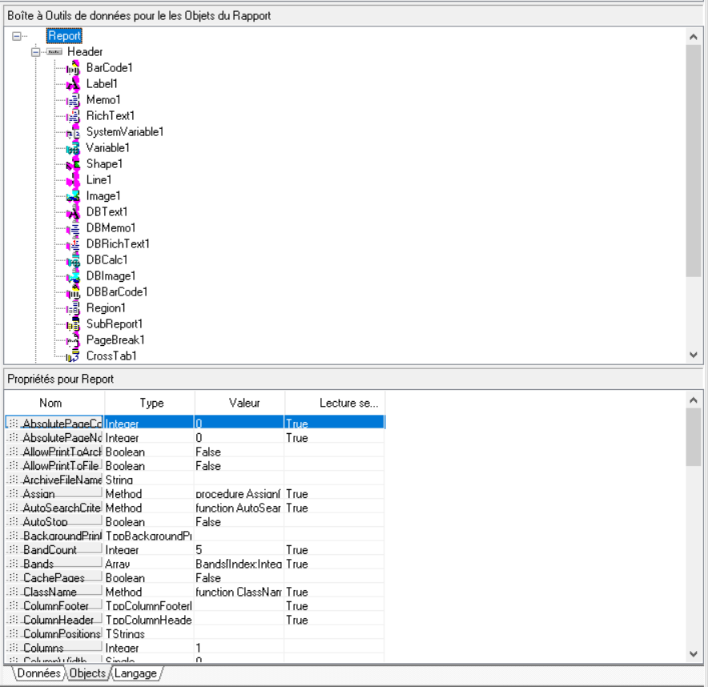
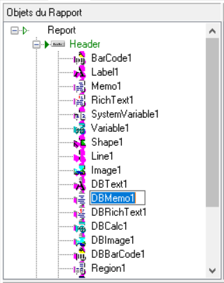
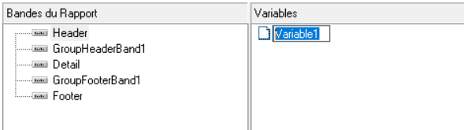

# Propriétés des objets

## Qu'est-ce qu'une propriété ?

Une propriété définit un attribut d'un objet.

 

Par exemple pour un objet "Text", il y a une propriété "Bold" qui va définir si le texte de l'objet sera en gras.

## Comment connaître les différentes propriétés des objets ?

Dans la boîte à outils en bas à droite, il y a un onglet "Objects".

 

On retrouvera dedans tous les objets du rapport et en sélectionnant un objet, on voit l'ensemble des propriétés qui lui sont rattachées.

 

 

Les colonnes contiennent les valeurs suivantes :

* type => le type de l'objet
* valeur => la valeur par défaut de l'objet
* lecture seule => si l'objet peut être modifié

## Comment changer une propriété ?

Pour modifier une propriété, il faut indiquer le nom de l'objet suivi d'un point et du nom de la propriété (par exemple : DBText1.Visible)

Ensuite pour affecter une valeur, il faut faire comme pour une variable en faisant bien attention au type de la propriété.

 

Par exemple, on peut faire :

 

var

  Type: string;

  Font: TFont;

begin

  Type := LIGNES.GetFieldValue('LIG\_TYPE');

 

  { Sous-Total }

  if (Type = 'x') then

  begin

    DBLigLib.Font.Bold := True;

    DBText17.Font.Bold := True;

  end

 

  { Total }

  begin

    DBLigLib.Font.Bold := True;

    DBLigLib.Font.Size := 10;

    DBText17.Font.Bold := True;

    DBText17.Font.Size := 10;

  end

 

  { Autres types de lignes }

  begin

    DBLigLib.Font.Bold := False;

    DBLigLib.Font.Size := 9;

    DBText17.Font.Bold := False;

    DBText17.Font.Size := 9;

  end;

end;

 

On modifie 2 propriétés (Size et Bold) des objets DBLigLib et DBText17 en fonction de type de ligne de document. Ici les 2 objets sont de même type mais l'un a le nom par défaut donné par ReportBuilder, l'autre a été renommé. Il est conseillé de renommer tous les objets sur lesquelles on va travailler.

 

Pour changer le nom, il faut faire une double clic lent sur un objet pour avoir accès en modification à son nom.

 

* Avec l'affichage Événements

 

 

* Avec l'affichage Variable

 

