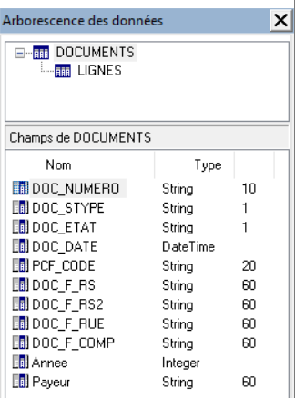

# Barres d'outils

Pour afficher ou enlever de nouvelle barre d'outils, il faut aller dans le menu Affichage puis Barre d'outils.

 

 

Les barres d'outils gèrent les éléments suivants :

 

| Barre d'outils | Objets | Objectif |
|---|---|---|
|  | Statiques | Mettre des textes, des images, des formes fixes |
|  | Dynamiques | Afficher des données provenant des vues |
|  | Organisation | Regrouper les objets dans des régions  Créer des sous-rapports notamment pour les vues qui sont liées à une autre  Provoquer des sauts de page  Créer un tableau croisé |
|  |   | Afficher les différents objets présents dans le modèle |
|  |   | Afficher toutes les vues de l'onglet Données ainsi que les champs qu'elles contiennent.Les vues sont hiérarchisées en fonction des liaisons faites entre elle. |
|  |   | Créer, ouvrir et enregistrer un modèle  Gérer la mise en page, imprimer et voir l'aperçu  Couper, copier et coller |
|  |   | Gérer les formes et les traits |
|  |   | Gérer les alignements et les espaces entre les objets |
|  |   | Mettre en forme les zones de texte et gérer les différentes niveaux des objets |
|  |   | Agrandir les objets |
|  |   | Déplacer les objets |

 

Dans le menu Affichage, on peut aussi décider d'afficher les règles qui encadre la zone de travail.

 

 

L'unité de mesure par défaut est le millimètre. Pour la changer il suffit de faire un clique droit sur une des règles et dans sélectionner une autre dans celles disponibles. Attention ce changement d'unité s'applique à tout le paramétrage du modèle notamment aux [options de mise en page](../OptionsMisePage/OptionsMisePage.md).

 

