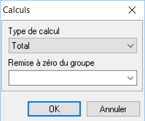
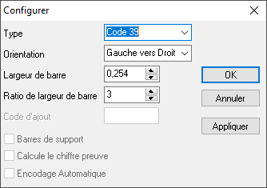

# Objets dynamiques

Les objets dynamiques sont tous les éléments qui sont associés à des champs des vues construites dans l'onglet "Données".

 

Vous avez la possibilité d'ajouter les objets suivants :

 

| Nom | Icône | Description | Visualisation |
| DBText |  | Texte limité à 255 caractères |  |
| DBMemo |  | Texte illimité avec une seule mise en forme |  |
| DBRichText |  | Texte illimité avec la possibilité d'appliquer une mise en forme sur chaque mot |  |
| DBCalc |  | Variable |  |
| DBImage |  | Image |  |
| DBBarCode |  | Code-barres |  |

 

Pour affecter un champ d'une vue à un objet, vous devez d'abord sélectionner la vue puis le champ dans les menus déroulant se trouvant sur la même ligne que les outils de mise en forme.

 

* Sélection de la vue

 

 

* Sélection du champ

 

## DBText

|  | * Amener vers l'avant / Envoyer vers l'arrière => Agir sur la superposition
* Mise en forme auto => Faire en sorte que la taille de l'objet s'adapte au contenu
* Vide si zéro => ne pas afficher le zéro (seulement pour les champs chiffrés)
* Format d'affichage => formater les données en fonction d'un masque (Par exemple pour une date dd/mm/yyyy)
* Position => Déplacer finement l'objet dans la bande et gérer la taille de l'objet
* ImprimeSurDépassement => Réimprimer le champ sur ma page suivante en cas de changement de page
* RéimprimerSurSubséquentes => Permet de réimprimer la valeur contenu du champ lorsque l'on change de page et quand l'option SupprimerValeursRépétées est activée
* RemiseAZéroDuGroupe => Permet de réafficher la valeur lors d'un changement de groupe lorsque l'option SupprimerValeursRépétées est activée
* DéplacerAvecParent => Déplacer l'objet avec la bande
* SupprimerValeursRépétées => Le contenu ne sera affiché qu'une seule fois. Par exemple dans les lignes d'un document, s'il y a plusieurs fois le même code article, seul le premier sera affiché/imprimé
* Transparent => Rendre transparent le champ
* Visible => Rendre le champ invisible à l'impression
* Retour à la ligne sur mot => Revenir à la ligne sur un mot entier (Attention il faut que l'objet soit configuré pour afficher 2 lignes)
 |

## DBMemo

|  | * Amener vers l'avant / Envoyer vers l'arrière => Agir sur la superposition
* AutoAffichage => La valeur de la propriété AutoDisplay détermine s'il faut afficher automatiquement le contenu d'un objet BLOB dans un champ de base de données dans un objet DBMemo ou DBImage.
* Retour à la ligne sur caractère => Adapter le retour à la ligne
* Justification forcée => Forcer l'alignement sur Justifier
* Conserver ensemble => Faire en sorte que toute la zone reste sur la même page
* Position => Déplacer finement l'objet dans la bande
* ImprimerSurDépassement => Réimprimer le champ sur ma page suivante en cas de changement de page
* DéplacementRelatifA => Déplacer l'objet par rapport à un autre
* DéplacerAvecParent => Déplacer l'objet avec la bande
* Étirer => Augmenter la hauteur de l'objet en fonction du contenu
* SupprimerValeursRépétées => Le contenu ne sera affiché qu'une seule fois. Par exemple dans les lignes d'un document, s'il y a plusieurs fois le même code article, seul le premier sera affiché/imprimé
* Transparent => Rendre transparent le champ
* Visible => Rendre le champ invisible à l'impression
 |

## DBRichText

|  | * Amener vers l'avant / Envoyer vers l'arrière => Agir sur la superposition
* Conserver ensemble => Faire en sorte que toute la zone reste sur la même page
* Position => Déplacer finement l'objet dans la bande
* ImprimerSurDépassement => Réimprimer le champ sur ma page suivante en cas de changement de page
* DéplacementRelatifA => Déplacer l'objet par rapport à un autre
* DéplacerAvecParent => Déplacer l'objet avec la bande
* Étirer => Augmenter la hauteur de l'objet en fonction du contenu
* Transparent => Rendre transparent le champ
* Visible => Rendre le champ invisible à l'impression
 |

## DBCalc

Pour configurer le calcul, il faut cliquer sur "Calculs" dans le menu contextuel de l'objet. Dans la nouvelle fenêtre, il faut sélectionner le type de calcul et s'il doit se réinitialiser à chaque changement de groupe.

 

 

Les types de calcul disponible sont :

* Compte : on compte le nombre d'occurrence présent dans le champ
* Total : on fait une somme de tous les éléments du champ sélectionné.
* Minimum : on affiche le minimum
* Maximum : on renvoie le maximum
* Moyenne : on fait la moyenne de tous les éléments du champ sélectionné

 

 

|  | * Amener vers l'avant / Envoyer vers l'arrière => Agir sur la superposition
* Mise en forme auto => Faire en sorte que la taille de l'objet s'adapte au contenu
* Vide si zéro => ne pas afficher le zéro
* Calculs => Ouvrir l'éditeur de formule
* Format d'affichage => formater les données en fonction d'un masque (Par exemple #,##0.00)
* RegarderEnAvant => Cette option permet de mettre le contenu avec la valeur la plus récente lors de la génération de l'impression
* Position => Déplacer finement l'objet dans la bande et gérer la taille de l'objet
* ImprimeSurDépassement => Réimprimer le champ sur ma page suivante en cas de changement de page
* RéimprimerSurSubséquentes => Permet de réimprimer la valeur contenu du champ lorsque l'on change de page et quand l'option SupprimerValeursRépétées est activée
* RemiseAZéroDuGroupe => Permet de réafficher la valeur lors d'un changement de groupe lorsque l'option
* DéplacerAvecParent => Déplacer l'objet avec la bande
* EtirerAvecParent => Augmenter la hauteur de l'objet en fonction de celle de la bande
* SupprimerValeursRépétées => Le contenu ne sera affiché qu'une seule fois. Par exemple dans les lignes d'un document, s'il y a plusieurs fois le même code article, seul le premier sera affiché/imprimé
* Transparent => Rendre transparent le champ
* Visible => Rendre le champ invisible à l'impression
* Retour à la ligne sur mot => Revenir à la ligne sur un mot entier (Attention il faut que l'objet soit configuré pour afficher 2 lignes)
 |

## DBImage

|  | * Amener vers l'avant / Envoyer vers l'arrière => Agir sur la superposition
* Mise en forme auto => Faire en sorte que la taille de l'objet s'adapte au contenu
* Centrer => Centrer l'image dans l'objet
* Dessin direct => Cette option permet de mettre le contenu avec la valeur la plus récente lors de la génération de l'impression
* Type de graphique => Permet de sélectionner le type de l'image (Jpeg, Gif, BMP)
* ConserverLeRatioVisuel => Pour éviter de déformer l'image lors du changement de taille de l'objet
* Photo => Charger l'image dans  l'objet
* Position => Déplacer finement l'objet dans la bande et gérer la taille de l'objet
* ImprimeSurDépassement => Réimprimer le champ sur ma page suivante en cas de changement de page
* DéplacerAvecParent => Déplacer l'objet avec la bande
* Étirer => Augmenter la hauteur de l'objet en fonction de celle de la bande
* Transparent => Rendre transparent le champ
* Visible => Rendre le champ invisible à l'impression
 |

## DBBarCode

Pour gérer configurer le code barre, il faut cliquer sur "Configurer" dans le menu contextuel de l'objet.

 

 

Vous aurez accès aux éléments suivants :

* le type : EAN13, EAN8, Code 39...
* l'orientation du code barre
* la largeur de chaque barre
* le ratio pour la largeur des barres

 

|  | * Amener vers l'avant / Envoyer vers l'arrière => Agir sur la superposition
* Mise en forme auto => Faire en sorte que la taille de l'objet s'adapte au contenu
* PoliceGrandeurAutomatique => Gérer la taille de la police du code barre en fonction des données
* Configurer => Appliquer la hauteur de la bande
* Position => Déplacer finement l'objet dans la bande et gérer la taille de l'objet
* ImprimeLectureHumaine => Rajouter la ligne en dessous du code barre permettant de lire la données
* ImprimeSurDépassement => Réimprimer le champ sur ma page suivante en cas de changement de page
* DéplacerAvecParent => Déplacer l'objet avec la bande
* Transparent => Rendre transparent le champ
* Visible => Rendre le champ invisible à l'impression
 |

