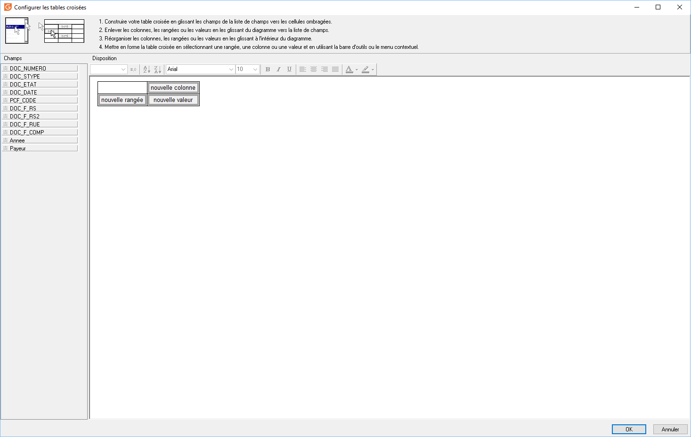

# Objets d'organisation
Les objets d'organisation permettent de structurer la conception du modèle.

 

Vous avez la possibilité d'ajouter les objets suivants :

 

| Nom | Icône | Description |
| Région |  | Permet de regrouper des objets dans un espace donné |
| Sous-rapport |  | Créer un sous-rapport qui aura sa propre mise en forme et sera rattachée à une vue. On s'en sert pour toutes les vues qui sont liées à une autre vue. |
| Saut de page |  | Force un saut de page après l'objet |
| Tableau croisé |  | Créer un tableau croisé avec les données d'une vue |

## Région

|  | * Amener vers l'avant / Envoyer vers l'arrière => Agir sur la superposition
* Conserver ensemble => Faire en sorte que toute la zone reste sur la même page
* HauteurParent => Appliquer la hauteur de la bande
* LargeurParent => Appliquer la largeur de la page Â
* Position => Déplacer finement l'objet dans la bande et gérer la taille de l'objet
* ImprimeSurDépassement => Réimprimer le champ sur ma page suivante en cas de changement de page
* DéplacementRelatifA => Déplacer l'objet par rapport à un autre objet
* DéplacerAvecParent => Déplacer l'objet avec la bande
* Étirer => Augmenter la hauteur de l'objet en fonction du contenu
* EtirerAvecParent => Augmenter la hauteur de l'objet en fonction de celle de la bande
* Transparent => Rendre transparent le champ
* Visible => Rendre le champ invisible à l'impression
 |

## Sous-rapport

|  | * Amener vers l'avant / Envoyer vers l'arrière => Agir sur la superposition
* Enfant / Fixé / Section => Le sous-rapport peut avoir les relations suivantes avec le rapport principal
	+ Enfant : Le sous-rapport est imprimé jusqu'à la fin, en utilisant la largeur des composants du sous-rapport en tant que largeur de page et en s'étirant sur plusieurs pages jusqu'à la fin de l'impression.
	+ Fixé : Une seule page s'imprime en fonction des dimensions et de la position du composant de sous-rapport.
	+ Section : Le sous-rapport s'imprime en tant que section distincte, démarrant une nouvelle page au début et finissant la dernière page à la fin. Les propriétés de mise en page du sous-rapport sont utilisées pour déterminer la taille de la page et les paramètres de l'imprimante.
* Déroulement => Cette propriété s'applique aux sous-rapports dont l'option Enfant est cochée. Lorsqu'elle est affectée, cette propriété indique l'objet qui, lorsqu'il est cliqué, entraîne la régénération de la page en cours dans le formulaire Aperçu avant impression avec le sous-rapport développé.
* Afficher Tout => ???
* Conserver ensemble => Faire en sorte que toute la zone reste sur la même page
* NouveauTravaild'Impression => Lorsque l'option Section est cochée, cette propriété détermine si un nouveau travail d'impression est démarré lorsque le sous-rapport est envoyé à l'imprimante. Cette propriété peut être utilisée lorsqu'une partie d'un rapport doit être imprimée sur une imprimante distincte. Si vous devez modifier les paramètres de l'imprimante pour une section donnée, vous pouvez le faire sans démarrer un nouveau travail d'impression. Définissez simplement la valeur des propriétés dans les options de mise en page  (Orientation, Format du papier ...) et ces paramètres seront appliqués lors de l'impression du rapport.
* MiseEnPageParent => Utiliser les options de mise en page du modèle principal
* LargeurParent => Appliquer la largeur de la page
* Position => Déplacer finement l'objet dans la bande
* ImprimerSurDépassement => Réimprimer le champ sur ma page suivante en cas de changement de page
* RemiseàZéroNumérodePage => Les numéros de page du sous-rapport sont indépendant du principal et sont remis à zéro. Cette propriété n'est activée que lorsque l'option Section est cochée.
* DéplacementRelatifA => Déplacer l'objet par rapport à un autre
* DéplacerAvecParent => Déplacer l'objet avec la bande
* Traverser toutes les données => Cette propriété s'applique aux sous-rapports dont l'option Fixé est cochée. Lorsque cette propriété est cochée, elle indique que le sous-rapport continuera à imprimer (imprimer sur des pages supplémentaires dans la même position exacte) jusqu'à ce que toutes les données soient traversées. Par défaut, le sous-rapport de type fixe tronque les données (c'est-à-dire imprime une fois par bande, mais ne déborde pas si toutes les données ne peuvent pas tenir dans l'espace du sous-rapport).
* Visible => Rendre le sous-rapport invisible à l'impression
 |

## Saut de page

|  | * Amener vers l'avant / Envoyer vers l'arrière => Agir sur la superposition
* Position => Déplacer finement l'objet dans la bande
* ImprimerSurDépassement => Réimprimer le champ sur ma page suivante en cas de changement de page
* DéplacementRelatifA => Déplacer l'objet par rapport à un autre
* DéplacerAvecParent => Déplacer l'objet avec la bande
* Étirer => Augmenter la hauteur de l'objet en fonction du contenu
* Visible => Rendre le champ invisible à l'impression
 |

## Tableau croisé

Vous pouvez utiliser un composant tableau croisé lorsque vous souhaitez afficher des valeurs calculées dans un format de grille multidimensionnel.

 

Vous pouvez définir trois types de dimensions : Colonnes, Lignes et Valeurs.  Pour définir une dimension, vous devez d'abord affecter une vue à l'objet.

 

Vous pouvez ensuite sélectionner des champs du pipeline de données en tant que valeurs de dimension. Cela se fait en cliquant avec le bouton droit sur l'objet  et en sélectionnant l'option Configurer.

 

Il faut ensuite faire glisser les champs de la vue soit :

- sur "nouvelle colonne" ou sur "nouvelle ligne" pour les données non chiffrées (exemple une raison sociale en ligne et une année en colonne)

- sur "nouvelle valeur", pour les données chiffrées (par exemple des quantités ou le champ Montant Net).

 

 

 

|  | * Amener vers l'avant / Envoyer vers l'arrière => Agir sur la superposition
* Configurer => Permet de paramétrer le tableau croisé
* Dessin => Par défaut à l'option est cochée. Elle détermine si le tableau croisé sera réellement rendu dans le rapport.

Il est parfois utile de désactiver le dessin et d'utiliser le composant tableau croisé pour fournir des calculs dans un rapport.
Par exemple, vous pouvez placer un objet de tableau croisé dans la bande de titre, le configurer pour calculer un total puis, dans l'événement AfterCalc, transférer le résultat du calcul de la matrice vers un libellé ou un composant de variable. Cela créerait l'effet d'un total de "deux passes" sans exiger que la propriété Report.PassSettting soit définie sur deux passes.
Une autre raison pour désactiver le rendu natif du tableau croisé est de fournir les informations de la matrice dans un format différent du style de rendu standard. Pour les tableaux croisés simples, définir Draw to False et utiliser l'événement AfterCalc est un moyen facile d'accomplir cela.
Remarque: Définir Draw sur False empêche le rendu du tableau croisé. Définir Visible sur False empêche le tableau croisé de générer et de restituer. Par conséquent, vous devrez vous assurer que la propriété Visible est définie sur True si vous avez l'intention d'utiliser les techniques décrites ci-dessus.* Pagination => Cette propriété détermine l'ordre dans lequel les tableaux croisés qui correspondent à une seule page seront imprimés. Ce sont les valeurs possibles :
	+ Côté puis bas : Imprime toutes les pages en haut de la matrice, puis imprime la "rangée" suivante de pages, etc., etc. jusqu'à ce que la matrice soit complètement imprimée.
	+ Bas puis côté : Imprime toutes les pages sur le côté de la matrice, puis imprimez la colonne suivante des pages, etc., etc. jusqu'à ce que la matrice soit complètement imprimée.
* LargeurParent => Appliquer la largeur de la page
* Position => Déplacer finement l'objet dans la bande et gérer la taille de l'objet
* ImprimeSurDépassement => Réimprimer le tableau croisé sur la page suivante en cas de changement de page
* DéplacementRelatifA => Déplacer le tableau croisé par rapport à un autre objet
* DéplacerAvecParent => Déplacer le tableau croisé avec la bande
* Étirer => Augmenter la hauteur de l'objet en fonction de celle de la bande
* Style => Cette propriété détermine l'apparence du tableau croisé. Il existe 2 styles "Standard" et "Libellés répétées".

Le style "Libellés répétées" force le tableau croisé à réimprimer les libellés de ligne et de colonne appropriées lorsqu'un tableau croisé ne tient pas sur une seule page.* Visible => Rendre le tableau croisé invisible  à l'impression
 |

