# Objets statiques
Les objets statiques sont tous les éléments dont le contenu sera fixe et ne changera pas en fonction des données.

 

Vous avez la possibilité d'ajouter les objets suivants :

 

| Nom | Icône | Description | Visualisation |
|---|---|---|---|
| Label | 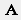 | Texte limité à 255 caractères | 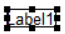 |
| Memo | 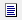 | Texte illimité avec une seule mise en forme | 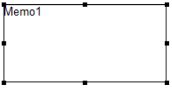 |
| RichText | 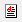 | Texte illimité avec la possibilité d'appliquer une mise en forme sur chaque mot | 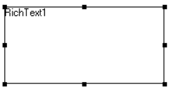 |
| Variable système | 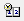 |   | 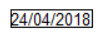 |
| Variable | 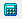 |   | 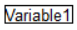 |
| Image |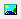  |   |  |
| Forme et trait | 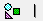 |   |  |
| Code-barres | 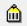 |   | 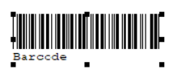 |

## Label

La zone de saisie du label 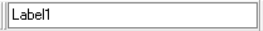 se situe dans la barre où vous retrouverez également les éléments pour le mettre en forme.

 

Dans le menu contextuel du label, vous pourrez :

 

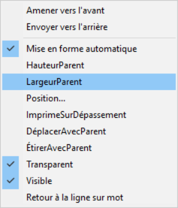

* Amener vers l'avant / Envoyer vers l'arrière => Agir sur la superposition
* Mise en forme auto => Faire en sorte que la taille de l'objet s'adapte au contenu
* RegarderEnAvant => Cette option permet de mettre le contenu avec la valeur la plus récente lors de la génération de l'impression
* HauteurParent => Appliquer la hauteur de la bande
* LargeurParent => Appliquer la largeur de la page
* Position => Déplacer finement l'objet dans la bande et gérer la taille de l'objet
* ImprimeSurDépassement => Réimprimer le champ sur ma page suivante en cas de changement de page
* DéplacerAvecParent => Déplacer l'objet avec la bande
* EtirerAvecParent => Augmenter la hauteur de l'objet en fonction de celle de la bande
* Transparent => Rendre transparent le champ
* Visible => Rendre le champ invisible à l'impression
* Retour à la ligne sur mot => Revenir à la ligne sur un mot entier (Attention il faut que l'objet soit configuré pour afficher 2 lignes)

## Memo

Pour saisir le contenu d'un objet mémo, il faut passer par le menu contextuel et cliquer sur Lignes. Vous aurez ainsi accès à la fenêtre d'édition. Via celle-ci, vous pouvez aussi soit charger un fichier texte soit enregistrer le texte dans un fichier pour une utilisation ultérieure.

 

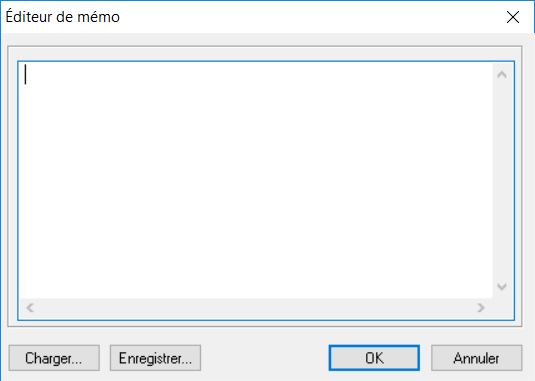

 

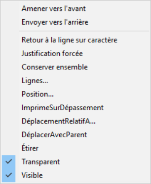

* Amener vers l'avant / Envoyer vers l'arrière => Agir sur la superposition
* Retour à la ligne sur caractère => Adapter le retour à la ligne
* Justification forcée => Forcer l'alignement sur Justifier
* Conserver ensemble => Faire en sorte que toute la zone reste sur la même page
* Lignes => Éditer les lignes
* Position => Déplacer finement l'objet dans la bande
* ImprimerSurDépassement => Réimprimer le champ sur ma page suivante en cas de changement de page
* DéplacementRelatifA => Déplacer l'objet par rapport à un autre objet
* DéplacerAvecParent => Déplacer l'objet avec la bande
* Étirer => Augmenter la hauteur de l'objet en fonction du contenu
* Transparent => Rendre transparent le champ
* Visible => Rendre le champ invisible à l'impression

## Texte enrichi

Pour saisir des données dans un objet de type texte enrichie, il faut cliquer sur "Edition dans le menu contextuel de la zone.

 

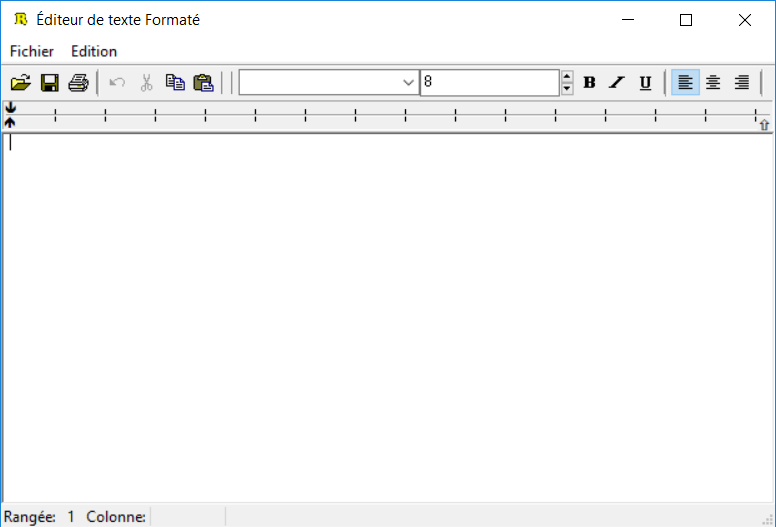

 

Dans le menu contextuel, vous avez accès aux éléments suivants :

 

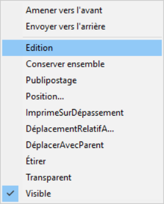

* Amener vers l'avant / Envoyer vers l'arrière => Agir sur la superposition
* Edition => Éditer le contenu de l'objet
* Conserver ensemble => Faire en sorte que toute la zone reste sur la même page
* Publipostage => Permet remplacer des éléments dans le texte par des données d'une vue
* Position => Déplacer finement l'objet dans la bande
* ImprimerSurDépassement => Réimprimer le champ sur ma page suivante en cas de changement de page
* DéplacementRelatifA => Déplacer l'objet par rapport à un autre
* DéplacerAvecParent => Déplacer l'objet avec la bande
* Étirer => Augmenter la hauteur de l'objet en fonction du contenu
* Transparent => Rendre transparent le champ
* Visible => Rendre le champ invisible à l'impression

## Variable système

L'objet "Variable système"   permet d'afficher des éléments tel que la date du jour, le numéro de page, le nombre total de pages... Pour sélectionner le type de données que vous voulez afficher, il faut déployer le menu déroulant qui se trouve sur le même niveau que les icônes de mise en forme.

 

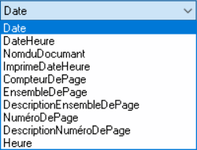

 

Le menu contextuel :

 

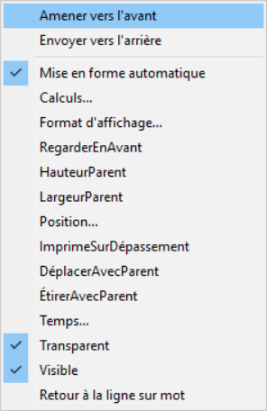

* Amener vers l'avant / Envoyer vers l'arrière => Agir sur la superposition
* Mise en forme auto => Faire en sorte que la taille de l'objet s'adapte au contenu
* Format d'affichage => Gérer le format d'affichage de la donnée. Par exemple : avoir la date avec le mois en toute lettre
* RegarderEnAvant => Cette option permet de mettre le contenu avec la valeur la plus récente lors de la génération de l'impression
* HauteurParent => Appliquer la hauteur de la bande
* LargeurParent => Appliquer la largeur de la page
* Position => Déplacer finement l'objet dans la bande et gérer la taille de l'objet
* ImprimeSurDépassement => Réimprimer le champ sur ma page suivante en cas de changement de page
* DéplacerAvecParent => Déplacer l'objet avec la bande
* EtirerAvecParent => Augmenter la hauteur de l'objet en fonction de celle de la bande
* Transparent => Rendre transparent le champ
* Visible => Rendre le champ invisible à l'impression
* Retour à la ligne sur mot => Revenir à la ligne sur un mot entier (Attention il faut que l'objet soit configuré pour afficher 2 lignes)

## Variable

On peut aussi insérer un objet "Variable"  qui via un éditeur de formule ou depuis l'onglet Calculs, permet d'insérer du texte qui changera en fonction d'une condition ou de faire des calculs avec des données remontées dans une vue.

 

Pour en savoir, vous pouvez consulter le chapitre sur l'[onglet Calculs](../../OngletCalculs/OngletCalculs.md)

 

Pour ouvrir l'éditeur de formule depuis l'onglet conception, vous devez cliquer sur Calculs dans le menu contextuel.

 

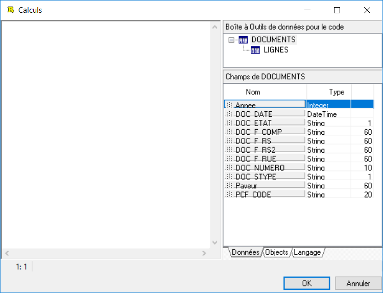

 

Le menu contextuel :

 

* Amener vers l'avant / Envoyer vers l'arrière => Agir sur la superposition
* Mise en forme auto => Faire en sorte que la taille de l'objet s'adapte au contenu
* Calculs => Ouvrir l'éditeur de formule
* RegarderEnAvant => Cette option permet de mettre le contenu avec la valeur la plus récente lors de la génération de l'impression
* HauteurParent => Appliquer la hauteur de la bande
* LargeurParent => Appliquer la largeur de la page
* Position => Déplacer finement l'objet dans la bande et gérer la taille de l'objet
* ImprimeSurDépassement => Réimprimer le champ sur ma page suivante en cas de changement de page
* DéplacerAvecParent => Déplacer l'objet avec la bande
* EtirerAvecParent => Augmenter la hauteur de l'objet en fonction de celle de la bande
* Temps => ...
* Transparent => Rendre transparent le champ
* Visible => Rendre le champ invisible à l'impression
* Retour à la ligne sur mot => Revenir à la ligne sur un mot entier (Attention il faut que l'objet soit configuré pour afficher 2 lignes)

## Image

Il existe un objet  permettant d'insérer des images dans le modèle.

 

Pour sélectionner une image à afficher dans le modèle, vous devez cliquer sur "Photo" et rechercher l'image que vous voulez mettre. Elle sera ensuite stockée dans le modèle, cela peut donc augmenter la taille du modèle.

 

Le menu contextuel :

 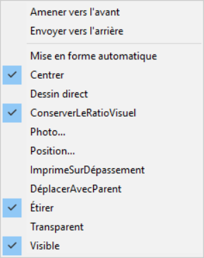

* Amener vers l'avant / Envoyer vers l'arrière => Agir sur la superposition
* Mise en forme auto => Faire en sorte que la taille de l'objet s'adapte au contenu
* Centrer => Centrer l'image dans l'objet
* Dessin direct => Cette option permet de mettre le contenu avec la valeur la plus récente lors de la génération de l'impression
* ConserverLeRatioVisuel => Pour éviter de déformer l'image lors du changement de taille de l'objet
* Photo => Charger l'image dans  l'objet
* Position => Déplacer finement l'objet dans la bande et gérer la taille de l'objet
* ImprimeSurDépassement => Réimprimer le champ sur ma page suivante en cas de changement de page
* DéplacerAvecParent => Déplacer l'objet avec la bande
* Étirer => Augmenter la hauteur de l'objet en fonction de celle de la bande
* Transparent => Rendre transparent le champ
* Visible => Rendre le champ invisible à l'impression

## Forme et trait

Les objets Formes et Traits  servent à rajouter des éléments de décoration dans le modèle.

 

Pour sélectionner la forme que vous voulez afficher, il faut déployer le menu déroulant qui se trouve sur le même niveau que les icônes de mise en forme.

 

 

 

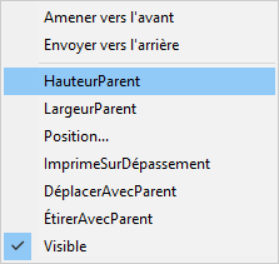

* Amener vers l'avant / Envoyer vers l'arrière => Agir sur la superposition
* HauteurParent => Appliquer la hauteur de la bande
* LargeurParent => Appliquer la largeur de la page
* Position => Déplacer finement l'objet dans la bande et gérer la taille de l'objet
* ImprimeSurDépassement => Réimprimer le champ sur ma page suivante en cas de changement de page
* DéplacerAvecParent => Déplacer l'objet avec la bande
* EtirerAvecParent => Augmenter la hauteur de l'objet en fonction de celle de la bande
* Visible => Rendre le champ invisible à l'impression

 

Pour sélectionner le positionnement du trait sur l'objet, il faut déployer le menu déroulant qui se trouve sur le même niveau que les icônes de mise en forme.

 

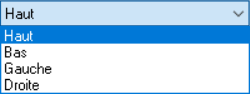

 

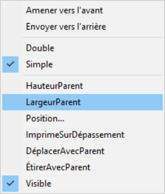

* Amener vers l'avant / Envoyer vers l'arrière => Agir sur la superposition
* Double / Simple => Permet de faire un trait simple ou double
* HauteurParent => Appliquer la hauteur de la bande
* LargeurParent => Appliquer la largeur de la page
* Position => Déplacer finement l'objet dans la bande et gérer la taille de l'objet
* ImprimeSurDépassement => Réimprimer le champ sur ma page suivante en cas de changement de page
* DéplacerAvecParent => Déplacer l'objet avec la bande
* EtirerAvecParent => Augmenter la hauteur de l'objet en fonction de celle de la bande
* Visible => Rendre le champ invisible à l'impression

## Code-barres

L'objet servira à mettre un code de barre statique . Attention lors de la saisie, il faudra bien respecter la norme de code barre choisi.

 

La zone de saisie du code barre se trouve sur le même niveau que les icônes de mise en forme.

 

 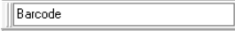

 

Pour gérer configurer le code barre, il faut cliquer sur "Configurer" dans le menu contextuel de l'objet.

 

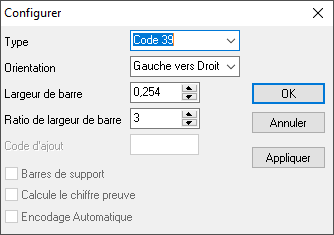

 

Vous aurez accès aux éléments suivants :

* le type : EAN13, EAN8, Code 39...
* l'orientation du code barre
* la largeur de chaque barre
* le ratio pour la largeur des barres

 

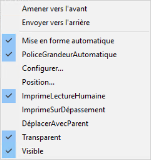

* Amener vers l'avant / Envoyer vers l'arrière => Agir sur la superposition
* Mise en forme auto => Faire en sorte que la taille de l'objet s'adapte au contenu
* PoliceGrandeurAutomatique => Gérer la taille de la police du code barre en fonction des données
* Configurer => Appliquer la hauteur de la bande
* Position => Déplacer finement l'objet dans la bande et gérer la taille de l'objet
* ImprimeLectureHumaine => Rajouter la ligne en dessous du code barre permettant de lire la données
* ImprimeSurDépassement => Réimprimer le champ sur ma page suivante en cas de changement de page
* DéplacerAvecParent => Déplacer l'objet avec la bande
* Transparent => Rendre transparent le champ
* Visible => Rendre le champ invisible à l'impression

