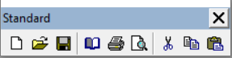

# Options de mise en page

Dans les options de mise en page, on peut sélectionner l'imprimante, le format du papier, l'orientation et le bac à papier à utiliser lors de l'impression du rapport.

 

La fenêtre des options de mise en forme est accessible :

 

* soit par le menu Fichier | Mise en forme Page... :

 

 

* soit par le bouton  de la barre d'outils "Standard" :

 

## Imprimante

 

| Option | Description |
|---|---|
| Imprimante | Permet de définir l'imprimante à utiliser.   La liste est construite à partir des imprimantes connectées au poste. Attention, lors de l'impression sur un PC ne possédant pas l'imprimante sélectionnée, le modèle utilisera l'imprimante par défaut |
| Nom du document | Permet de nommer le document.  Cette option peut ensuite être utiliser via une variable systèmes ou dans l'onglet Calcul |
| Copies | Permet de définir le nombre de copies (d'exemplaires) lors de l'impression.  Par défaut : 1 |
| Copies assemblées | Permet de garder la liaison entre les pages.  Par exemple, un document générant 10 pages, si l'option est cochée et que l'on a plusieurs copies, alors le modèle imprimera les 10 pages avant de générer une nouvelle copie. |
| Recto Verso | Permet de définir si l'impression se fera recto verso et sur quel bord |

## Format du papier

 

| Option | Description |
|---|---|
| Format du papier | Permet de définir le format Papier (A4, A5 ...) |
| Largeur | Permet de définir la largeur de la feuille. |
| Hauteur | Permet de définir la hauteur de la feuille |
| Orientation | Permet de définir le sens d'impression |

## Alimentation du papier

 

| Option | Description |
|---|---|
| Tiroir | Permet de sélectionner le tiroir de l'imprimante sélectionner dans l'onglet Imprimante |

## Mise en forme

 

 

| Option | Description |
|---|---|
| Colonnes | Permet de spécifier le nombre de colonnes du modèle.  On se sert de cette option pour l'impression d'étiquette où l'on va définir de colonne d'étiquette que doit contenir une planche |
| Largeur des colonnes | Permet de donner une largeur au colonne.
Par exemple la largeur d'une étiquette |
| Positions des colonnes | Définit la position des colonnes par rapport au bord gauche |
| Cheminement de colonne | Permet de définir le sens de l'impression des colonnes |
| Espacement des rangées | Définit l'espacement entre chaque ligne des colonnes |

## Marges

On définit les marges du document exprimées dans l'unité utilisé dans le modèle (par défaut le millimètre).

 

