# Assistant de requête

Dans l'assistant, la première étape est de sélectionner une table qui sera la table de base de la requête.

## Table principale

## 

 

Pour faire basculer une table dans les tables sélectionnés, vous pouvez soit faire un double clic sur la table souhaitée, soit la mettre en surbrillance et cliquer sur le bouton 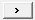.

## Tables liées

Dès que la première table est sélectionnée, l'outil met en gras les tables qui ont une clé commune et qui peuvent avoir une jointure entre elles.

 

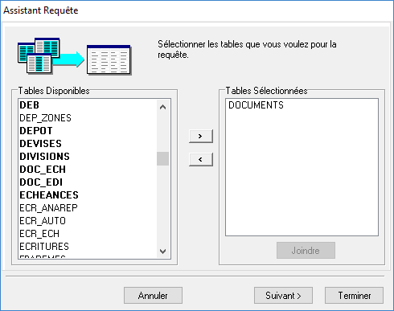

 

Si on sélectionne dans notre exemple la table des dépôts, la jointure avec la table des documents se fera sur le code dépôt.

 

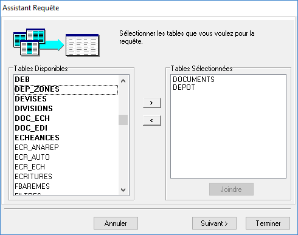

 

Pour consulter ou modifier le type de jointure, et le champ utilisé, il faut sélectionner la table DEPOT et cliquer sur le bouton Joindre.

 

Par défaut le logiciel fera une jointure de type "Extérieure gauche" et utilisera la clé étrangère DEP\_CODE de la table DOCUMENTS.

 

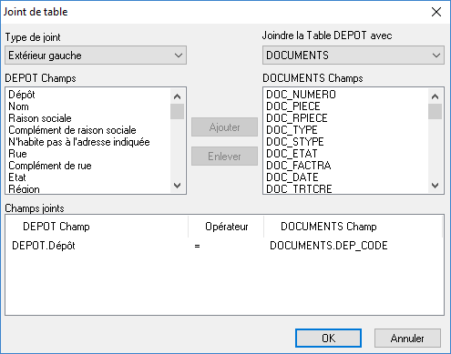

 

Pour en savoir plus sur les différentes jointures SQL, vous pouvez vous rendre à cette page : [Les jointures SQL](../JointuresSQL/JointuresSQL.md)

### Remarque

Il ne faut pas faire à l'intérieur d'une vue une liaison entre 2 tables qui ont une relation 1..n.

 

En effet cela va avoir pour effet de multiplier les lignes de la table d'origine par le nombre de ligne de la table jointe.

 

Par exemple, il ne faut pas faire de jointure entre la table des lignes et la table des documents car on peut avoir la relation 1 document qui contient n lignes.

 

Il faut à la place faire une vue pour les documents et une vue pour les lignes, on peut ainsi faire un [lien entre les deux](../LiensEntreVues/LiensEntreVues.md).

## Champs

A l'étape suivante, vous pouvez sélectionner les champs qui seront utilisés dans le modèle.

 

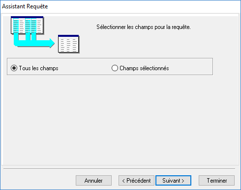

 

Il est recommandé de ne pas sélectionner "Tous les champs" mais seulement ceux qui seront utilisés.

 

Si vous laissez la sélection sur "Tous les champs", vous aurez alors tous ceux de toutes les tables sélectionnées.

 

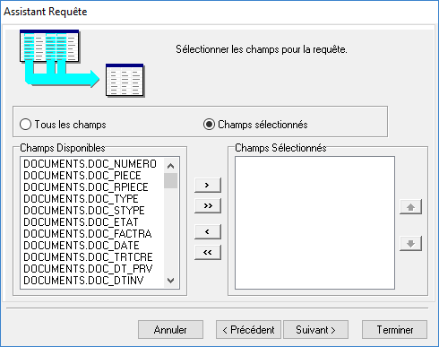

 

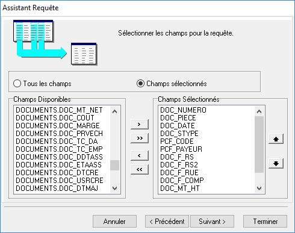

## Calculs

A la page suivante, vous pouvez faire des calculs dans la requête SQL qui sera générée.

 

Attention, ces calculs vont nécessiter de faire des groupes sur tous les champs qui ne seront pas utilisés dans une fonction :

 

| Compter | COUNT |
| Somme | SUM |
| Maximum | MAX |
| Minimum | MIN |
| Moyenne | AVG |

 

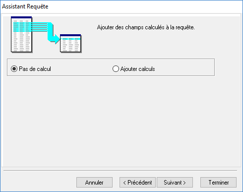

 

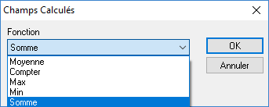

 

Pour en savoir plus sur ces fonctions, vous pouvez vous référer à la documentation officielle : <https://docs.microsoft.com/fr-fr/sql/t-sql/functions/aggregate-functions-transact-sql>

## Groupes

A l'étape suivante, vous allez pouvoir définir les groupes (la clause GROUP BY)

 

Par exemple dans un document, vous allez pouvoir grouper les lignes par code article ou encore par famille article.

 

Lors de l'impression, l'utilisateur ne verra que les données groupées.

 

On verra par la suite que l'on peut aussi faire des groupes dans la conception du modèle.

 

Il faut juste se poser la question : est-ce que l'on veut faire travailler le serveur pour grouper les données ou bien le poste qui fera l'impression.

 

Une piste pour répondre est de savoir si on aura un gros volume de données ou pas. Dans le 1er cas il vaut mieux laisser le serveur SQL Server faire le travail.

 

Attention, tous les champs sélectionnés qui ne sont pas dans le groupe, devront être dans une fonction d'agrégation.

 

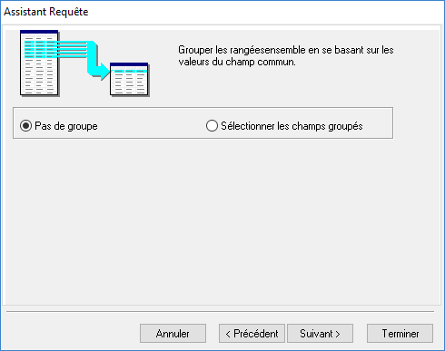

## Critères de recherche

Ensuite après avoir défini les groupes, on peut rajouter des critères de recherche (la clause WHERE).

 

Gestimum ERP va renseigner dynamiquement ces critères, en fonction de la fenêtre à partir de laquelle ReportBuilder est lancé. 

 

On ne pourra pas supprimer ces critères car ils seront réinjectés à chaque fois.

 

Nous pouvons par contre venir en rajouter d'autres, par exemple définir qu'un modèle ne s'imprimera que pour une famille de clients donnée, ou que pour un dépôt donné.

 

Pour créer un nouveau critère, il faut faire comme suit :

 

* sélectionner "Définir les critères de recherche"

 

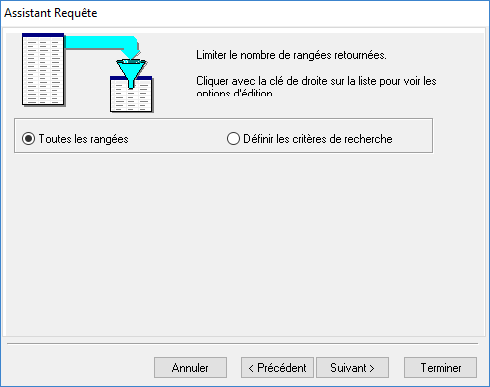

 

* faire un clic droit dans le cadre blanc et cliquer sur "Insérer un critère"

 

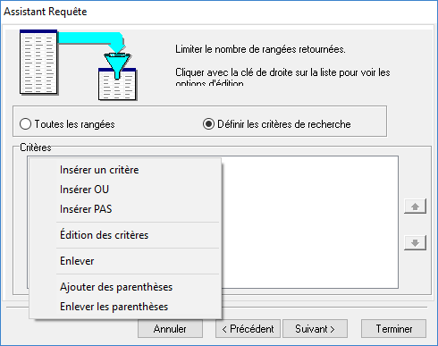

 

* sélectionner le champ qui servira de filtre ainsi que le type d'opérateur et la valeur à utiliser

 

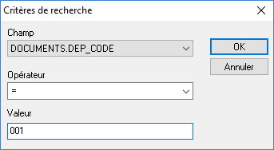

## Tri

Ensuite nous allons pouvoir soit garder l'ordre de tri naturel soit en forcer un (clause ORDER BY).

 

Par exemple dans les lignes d'un document, on a un tri en fonction de l'ordre d'insertion des lignes, on pourra venir faire un tri par type d'article.

 

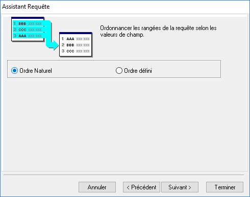

## Nom de la requête

A la fin de l'assistant, vous avez la possibilité de nommer la vue, et :

* soit retourner dans l'onglet Données
* soit voir les données qui seront renvoyées par la requête
* soit modifier la requête à l'aide du [Concepteur de requêtes](../ConcepteurRequete/ConcepteurRequete.md)

 

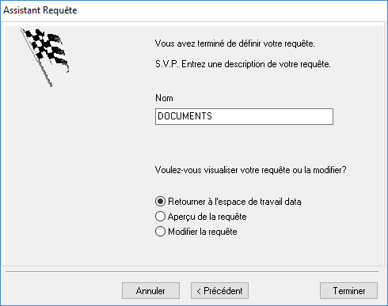

## Résultat

Dans l'espace de travail, vous devez avoir maintenant cette vue qui apparaît.

 

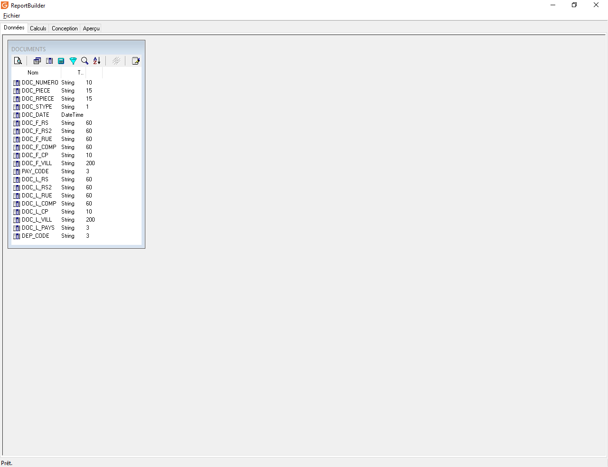

 

Les icônes dans l'entête de la vue correspondent aux différents onglets du concepteur, avec en plus 2 icônes.

 

|  | Aperçu : il permet de visualiser les données qui sont remontées par la vue |
|  | Onglet Tables |
|  | Onglet Champs |
|  | Onglet Calculs |
|  | Onglet Groupe |
|  | Onglet Recherche |
|  | Onglet Tri |
|  | [Lien vers une autre vue](../LiensEntreVues/LiensEntreVues.md) |
|  | Onglet SQL |

