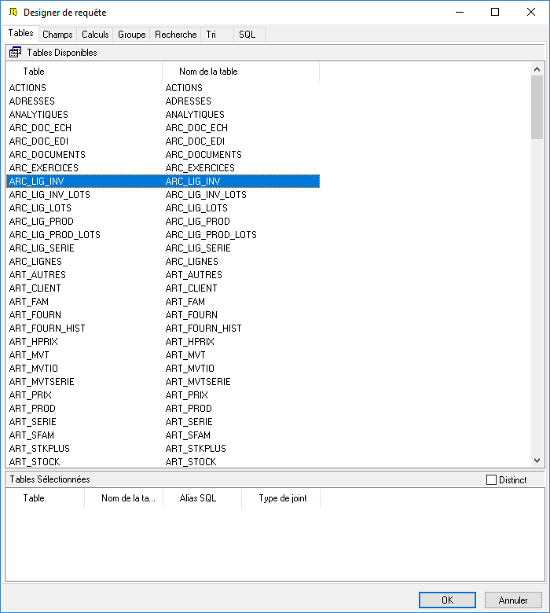
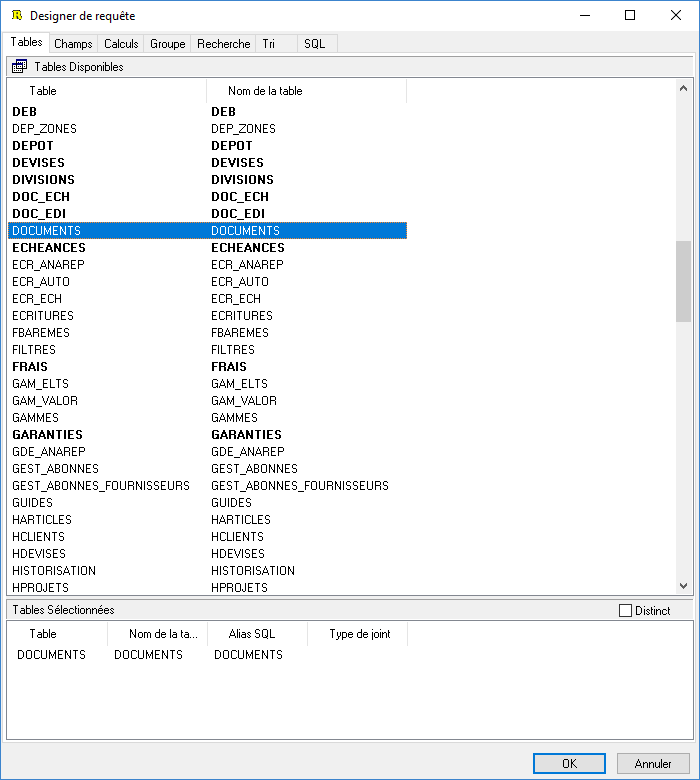
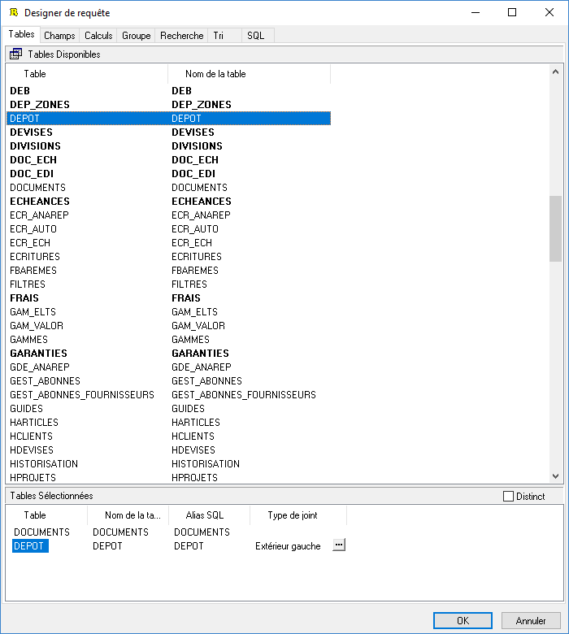
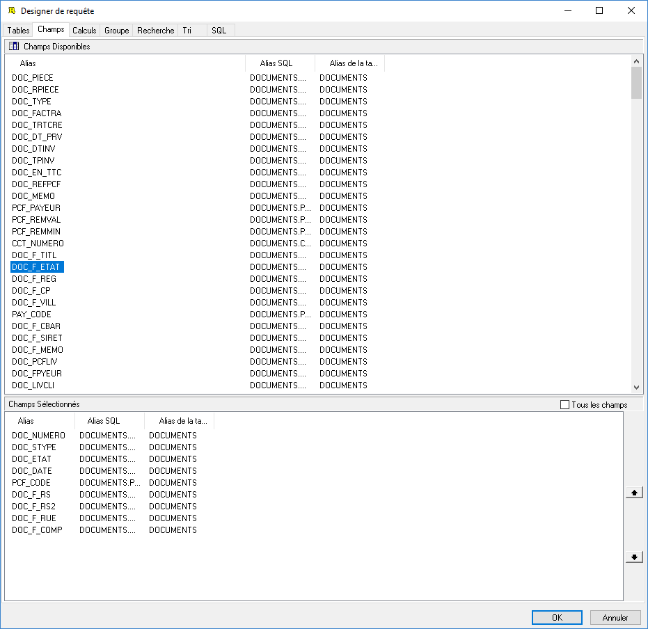
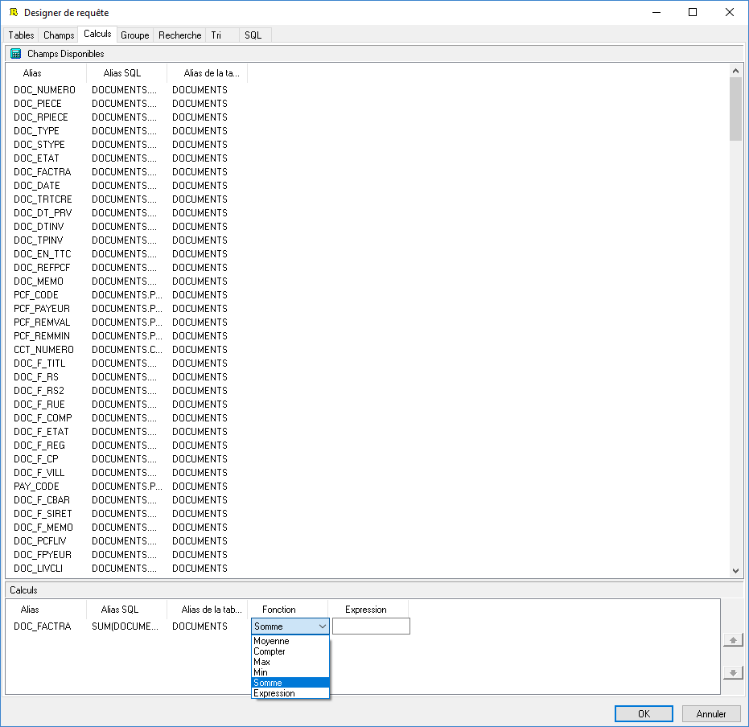
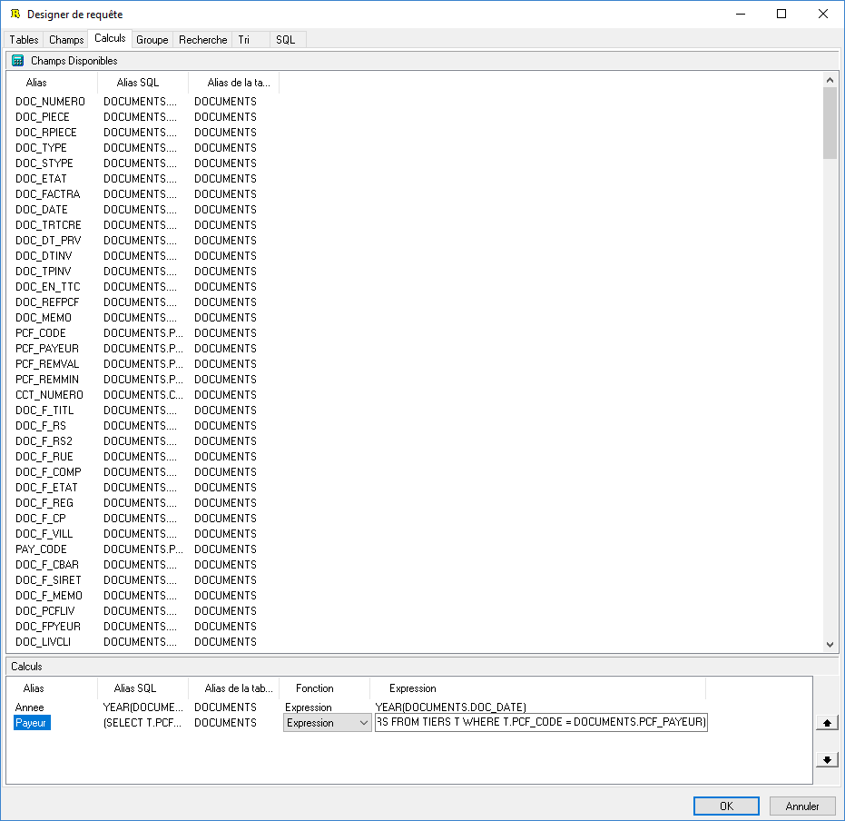
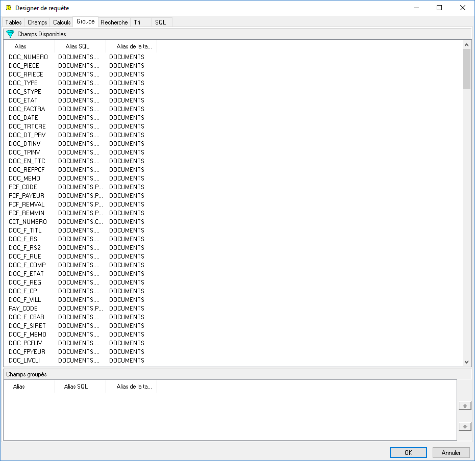
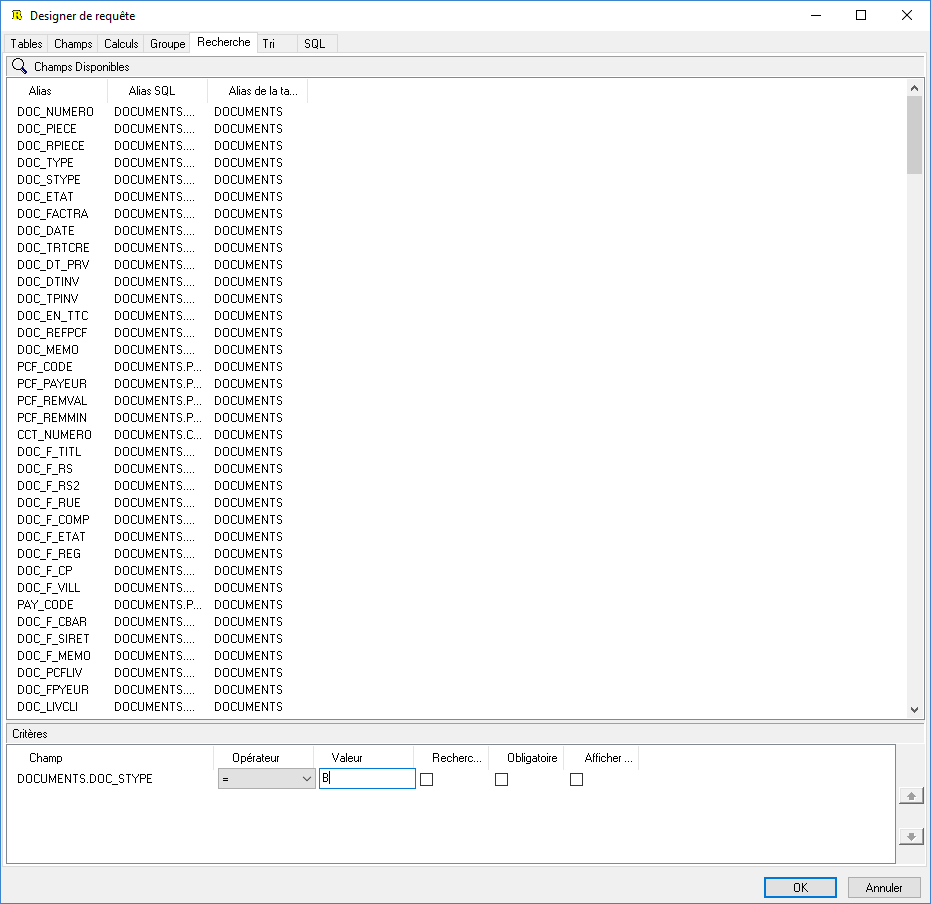
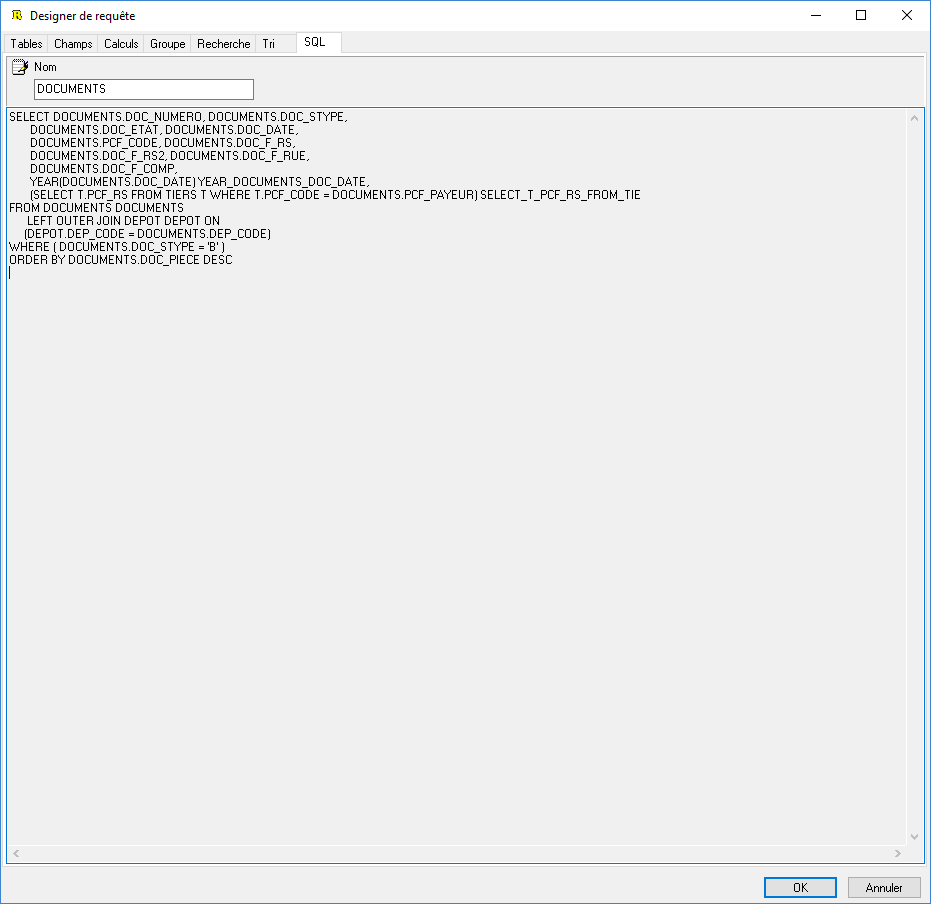
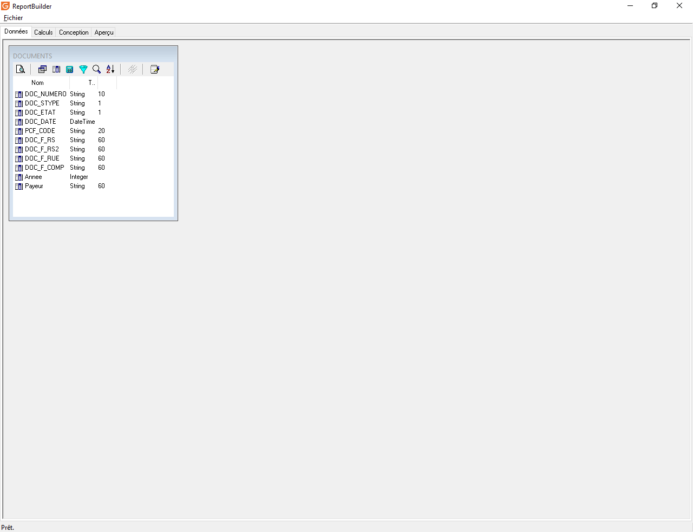

# Concepteur de requêtes

Le concepteur de requêtes va reprendre toutes les étapes de l'assistant mais sous forme d'onglets entre lesquels on peut se déplacer directement.

 

Cela permet ainsi de sauter une étape ou de revenir facilement en arrière.

## Tables

 

Lorsque vous allez sélectionner votre 1ère table, le générateur d'état mettra en gras toutes les tables qui peuvent être liées à celle sélectionnée. Il rajoutera des possibilités de liaison à chaque nouvelle sélection.

 

 

 

Par défaut ReportBuilder fait des jointures "Extérieur gauche" sur les champs clés des tables. Par exemple ici, la jointure est faite avec le code dépôt de la table DOCUMENTS et celui de la table DEPOT

 

 

Pour en savoir sur les différentes jointures SQL, vous pouvez vous rendre sur cette page : [Les jointures SQL](../JointuresSQL/JointuresSQL.md)

 

Remarque : Il ne faut pas faire à l'intérieur d'une vue une liaison entre 2 tables qui ont une relation 1..n. En effet cela va avoir pour effet de multiplier les lignes de la table d'origine par le nombre de ligne de la table jointe. Par exemple, il ne faut pas faire de jointure entre la table des lignes et la table des documents car on peut avoir la relation 1 document qui contient n lignes. Il faut à la place faire une vue pour les documents et une vue pour les lignes, on peut ainsi faire un [lien entre les deux](../LiensEntreVues/LiensEntreVues.md).

## Champs

L'onglet Champs permet de rajouter des champs des tables sélectionnées à la vue.

 

Il ne faut pas cliquer sur "Tous les champs" car cela sélectionnera tous les champs de toutes les tables et cela alourdira la requête SQL et donc la remontée de données pour rien.

 

## Calculs

Sur l'onglet Calculs, vous avez la possibilité de faire des calcules dans la requête SQL qui sera générée. Attention, les calcules suivants vont nécessiter de faire des groupes sur tous les champs qui ne seront pas utilisés dans une fonction :

 

| Compter | COUNT |
| Somme | SUM |
| Maximum | MAX |
| Minimum | MIN |
| Moyenne | AVG |

 

Pour en savoir plus sur ces fonctions, vous pouvez vous référer à la documentation officielle : <https://docs.microsoft.com/fr-fr/sql/t-sql/functions/aggregate-functions-transact-sql>

 

 

Vous avez la possibilité aussi de faire des calculs de type "Expression". Avec ce type, vous pouvez utiliser toutes les fonctions SQL (par exemple, faire un YEAR(DOCUMENTS.DOC\_DATE)) d'un SELECT et vous pouvez aussi faire des sous-select.

 

## Groupes

L'onglet Groupe permet de définir la clause GROUP BY de la requête SQL. Par exemple dans un document, vous allez pouvoir grouper les lignes par code article ou encore par famille article. Lors de l'édition, l'utilisateur ne verra que les données groupés. On verra par la suite que l'on peut aussi faire des groupes dans la conception du modèle. Il faut juste se poser la question : est-ce que l'on veut faire travailler le serveur pour grouper les données ou bien le poste qui fera l'impression. Une piste pour répondre est de savoir si on aura un gros volume de données ou pas, dans le 1er cas il vaut laisser le serveur faire le travail. Attention, tous les champs sélectionnés qui ne sont pas dans le groupe, devront être dans une fonction d'agrégation.

 

## Recherche

L'onglet Recherche permet de définir les critères de filtre de la requête SQL (clause WHERE).

 

Gestimum ERP va renseigner par défaut ces critères en fonction de la fenêtre où vous êtes.

 

On ne pourra pas supprimer ces filtres car ils seront rechargés à chaque fois.

 

Nous pouvons par contre venir en rajouter d'autres, par exemple définir qu'un modèle ne s'imprimera qu'avec une famille de client ou que pour un dépôt donné.

 

## Tri

L'onglet Tri va permettre de changer l'ordre de tri des données. Par exemple dans les lignes d'un document, on a un tri en fonction de l'ordre d'insertion des lignes, on pourra venir faire un tri par type d'article par exemple.

 

## SQL

Le dernier onglet SQL permet de visualiser la requête SQL générée automatiquement par ReportBuilder.

 

Dans cette onglet, vous avez la possibilité de nommer la vue.

 

Attention, il ne faut pas faire clic-droit puis "Edition de SQL" car dans ce cas là, Gestimum ne sera plus en mesure d'injecter les filtres dans le modèle.

 

## Résultat

Dans l'espace de travail, vous devez avoir maintenant cette vue qui apparaît.

 

 

Les icônes dans l'entête de la vue correspondent aux différents onglets du Designer avec en plus 2 icônes.

 

|  | Aperçu : il permet de visualiser les données qui sont remontées par la vue |
|  | Onglet Tables |
|  | Onglet Champs |
|  | Onglet Calculs |
|  | Onglet Groupe |
|  | Onglet Recherche |
|  | Onglet Tri |
|  | [Lien vers une autre vue](../LiensEntreVues/LiensEntreVues.md) |
|  | Onglet SQL |

