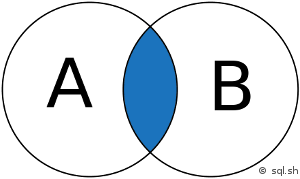
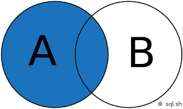
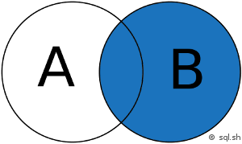
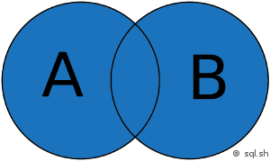

# Jointures SQL
## Types

Nous avons la possibilité de faire 4 types de jointures SQL dans ReportBuilder :

 

| Interne | INNER JOIN |
| Extérieure gauche | LEFT OUTER JOIN |
| Extérieure droit | RIGHT OUTER JOIN |
| Extérieure plein | FULL OUTER JOIN |

## Jointure interne

Elle retourne les enregistrements quand la condition entre les 2 tables est vraie. C’est l’une des jointures les plus communes.

 

## Jointure extérieure gauche

Elle retourne tous les enregistrements de la table de gauche même si la condition n'est pas vérifiée dans l'autre table.

 

 

## Jointure extérieure droite

Elle retourne tous les enregistrements de la table de droite même si la condition n'est pas vérifiée dans l’autre table.

 

 

## Jointure extérieure pleine

Elle retourne les résultats quand la condition est vraie dans au moins une des 2 tables.

 

 

## Sources

[https://sqlpro.developpez.com/cours/sqlaz/jointures/#LII-B](https://sqlpro.developpez.com/cours/sqlaz/jointures#LII-B)

<http://sql.sh/cours/jointures>

