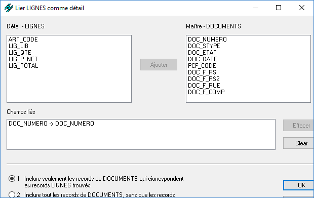
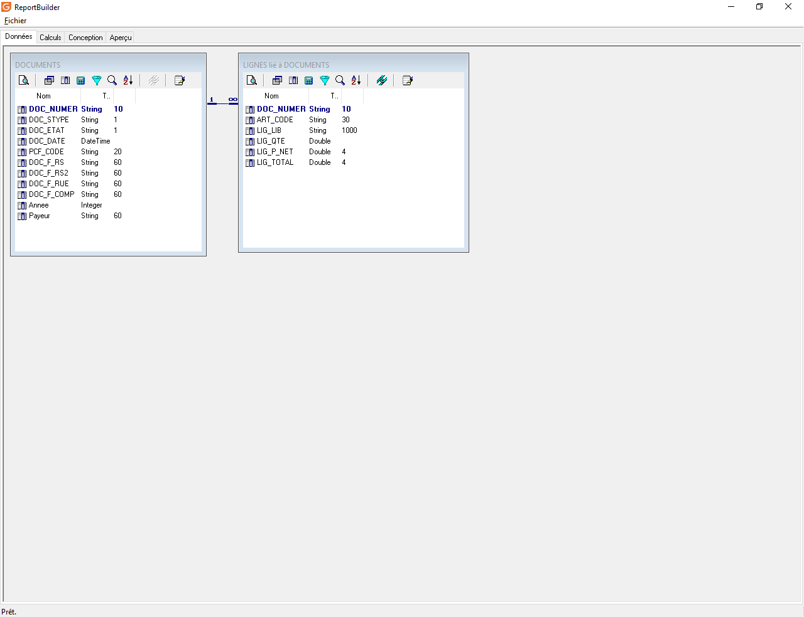

# Liens entre les vues

Quand on est dans l'espace de travail de l'onglet Données, on peut lier les vues entre elles et ainsi créer une relation 1..n entre les données.

 

Pour créer le lien, il faut cliquer sur l'icône "Lien" de la vue qui sera asservie à une autre vue.

 

 

Par défaut, ReportBuilder proposera une liaison sur les champs identiques entre les 2 vues, ici par exemple sur le champ DOC\_NUMERO qui est présent dans la vue LIGNES et DOCUMENTS.

 

Il faut sélectionner le choix 2 pour éviter de filtrer la vue maître en fonction des données de la vue jointe.

 

 

Dans l'espace de travail, on aura une visualisation sur la relation entre les vues.

 

