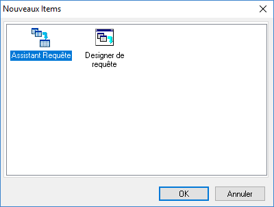

# Onglet "Données"

L'onglet Données vous permet de créer des requêtes d'extraction de données dans les différentes tables de la base de données de Gestimum ERP.

 

Pour créer une requête, il faut cliquer sur le menu Fichier | Nouveau.

 

Ensuite, il y a 2 méthodes : soit utiliser l'[assistant de requête](AssistantRequete/AssistantRequete.md), soit utiliser le [concepteur de requêtes](ConcepteurRequete/ConcepteurRequete.md)

 

 

L'assistant va suivre un certain nombre d'étapes avant de générer la vue.

 

Le concepteur permet de créer une vue en allant à l'essentiel, qui est de sélectionner une table et un champ.

 

Attention lors de la création de la 1ère vue, il est important de sélectionner la table qui correspond à la fenêtre d'impression dans laquelle on est.

Par exemple dans la liste des documents de vente, il faut partir de la table DOCUMENTS. Cela permet au logiciel d'envoyer les filtres de la fenêtre d'impression au modèle.

