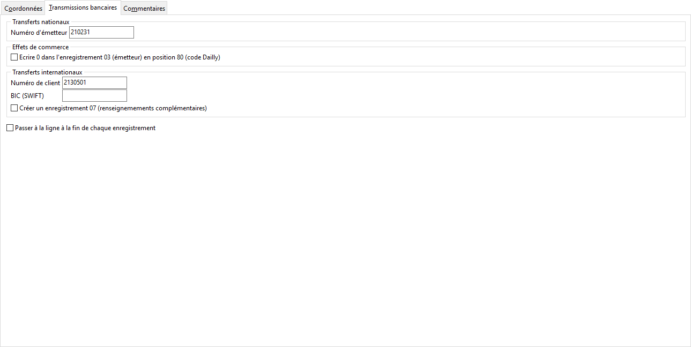

# Transmissions bancaires

## Transferts nationaux

N° d’émetteur

## Effets de commerce

## Transferts internationaux

Numéro de client

Swift (BIC)

Passer à la ligne à la fin de chaque enregistrement

