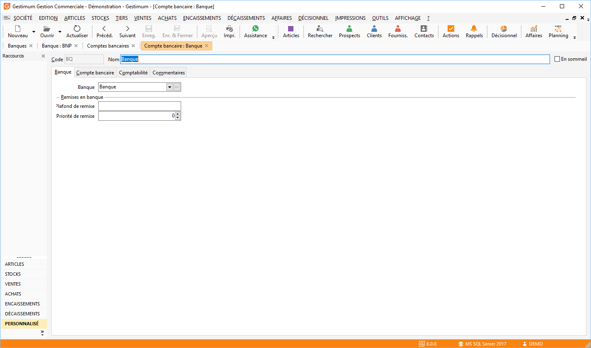

# Compte bancaire

La fiche est composée d’un code, d’un nom en entête de la fiche, ainsi que de quatre onglets : [Banque](CompteBancaireBanque.md), [Compte bancaire](ComtpeBancaireCompteBancaire.md), [Comptabilité](CompteBancaireComptabilite.md), [Commentaires](CompteBancaireCommentaires.md).

 

