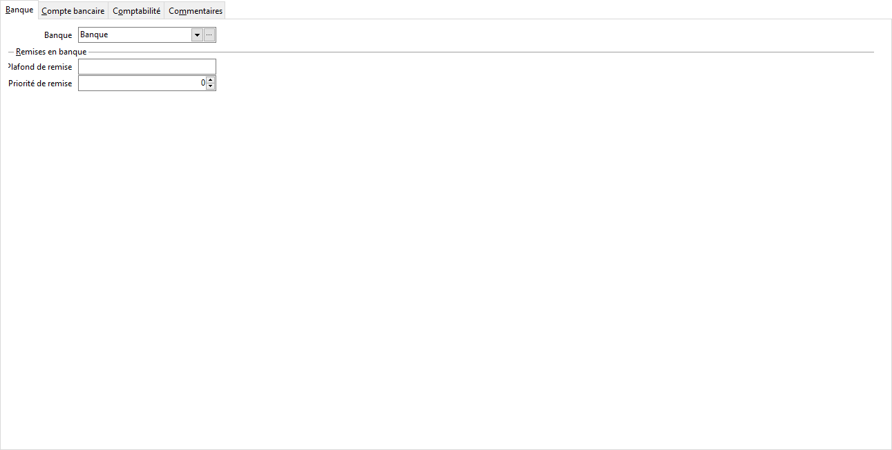

Banque

# Banque

Vous pouvez associer un code banque existant. Il n’est pas obligatoire.

# Remises en banque

## Plafond de remise

Permet de limiter le montant remis en banque.

## Priorité de remise

Permet d'indiquer l'ordre dans lequel la répartition des règlements se fera dans l'outils de "Règlements et remise" de la liste des échéances.

