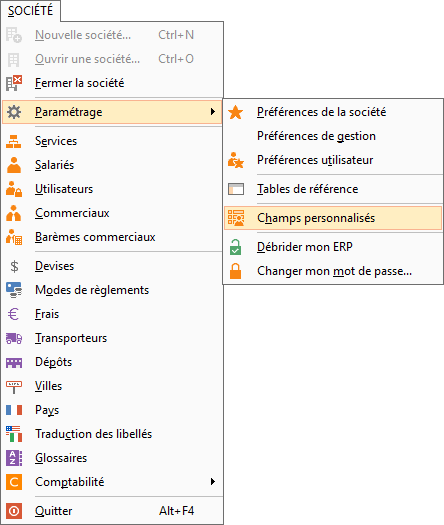

# Création d'un champ personnalisé

## Menu

Pour accéder au paramétrage des champs personnalisés, il faut ouvrir le menu SOCIETE | Paramétrage| Champs personnalisés.

 

## Fonctionnalité

Dans la fenêtre de paramétrage des champs personnalisés, vous devez ensuite sélectionner la fonctionnalité dans laquelle vous voulez créer ou modifier des champs personnalisés :

 

## Création d’un champ personnalisé

Il faut ensuite saisir le nom du champ personnalisé (exemple "Frais") le libellé qui sera repris dans la fonctionnalité.

 

Un champ est défini par :

* son nom
* son type
* sa taille
* son entête

 

La présentation des champs personnalisés dans l’onglet correspondant seront triés d’après la colonne " Nom ", le libellé doit être explicite car il s’affiche dans la fenêtre.

 

Le type du champ dépend de l'information à saisir ou à sélectionner :

* Case à cocher : Pour définir un champ de type "Case à cocher"
* Lien : permet de lier une image ou bien un document
* Date : Un champ de type Date sera automatiquement formaté avec les barres séparatrices jour/mois/année et un accès au calendrier
* Champs à saisir : Pour définir un champ à saisir, il faut sélectionner au choix : Texte, Texte illimité, Montant, Nombre entier, Nombre à virgule
* Liste déroulante : Pour définir un champ de type Liste déroulante, il faut sélectionner "Texte" puis préciser les "valeurs possibles" qui apparaîtront dans la liste, séparées par un point virgule (;)
* Table : permet de lier au champ une table existante (exemple lier la table article à votre champ personnalisé), cette fonctionnalité est susceptible de générer de fort ralentissements dans les ouvertures de fiches en fonction des paramétrages de filtres (exemple remonter la table des contacts dans un champs personnalisé sur les adresses de tiers, on va multiplier le nombre de contacts par le nombre d'adresses présentes dans la fiche tiers)

 

A la validation des champs personnalisés, le logiciel réorganise l'ensemble des tables qui ont été modifiées et met à jour le dictionnaire des titres de colonnes.

 

Lorsque vous utilisez un champ personnalisé comme filtre d’une liste et que vous supprimez ce filtre, un message d’avertissement vous informe des incohérences que cela va produire.

 

Pour en savoir plus sur les [champs personnalisés de type formule](../4/ChampsPersonnalisesCalcules.md).

